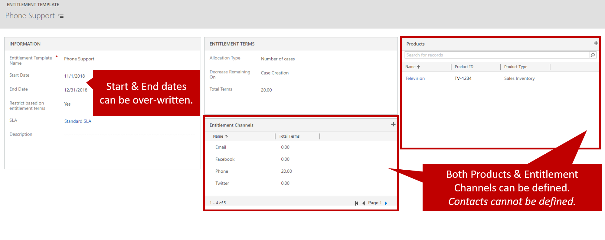

Because entitlements can cover a wide variety of scenarios, you might find it easier to create and define entitlement templates. Templates help you create new entitlement records by prefilling some of the more common data.

There are many scenarios where entitlement templates can be useful. Here are some examples:

- You want to create a standard service template that serves as a baseline, and that can be used to create entitlements for customers.
- You want to use automation. An entitlement template offers more options than a specific entitlement.

Entitlement templates just prefill some of the data when entitlement records are first created. They don't keep the data synced. Therefore, if you change a template, the change doesn't affect any existing entitlements that were based on that template. Also, entitlement templates aren't activated or inactivated. After a template is created, it's available for users to select.

## Defining entitlement templates

To create entitlement templates, go to **Settings** \> **Service Management**, and then, in the **Template** section, select **Entitlement Templates**. The only information that's required for a template is the name. You can fill in the rest of the information as you require.

Another advantage of using templates is that you can predefine channel terms and products. But as for most records in Microsoft Dynamics 365, you can't add channel terms or products until you first save the template.

Because entitlement templates aren't customer-specific, you can't select a customer for a template. A customer will be selected only when an entitlement is created from the template. Additionally, because templates aren't customer-specific, you can't define contacts on a template. Contacts must be defined on the actual entitlement that's created for a customer.

After the template is saved, you can use it to create new entitlements. Select **New** on the command bar, then select **From template**, and then select a template in the list that's provided. All necessary information will be prefilled in the new entitlement record, based on the template that you selected.

> [!VIDEO https://www.microsoft.com/videoplayer/embed/RE2ITLh]
