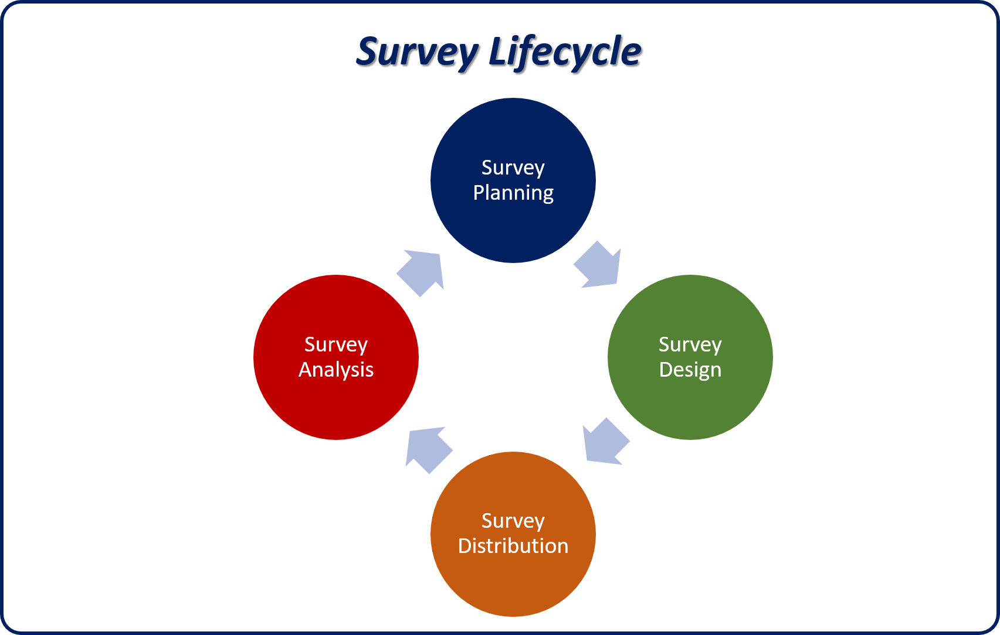

The opinions and overall satisfaction of customers play a huge role in the health of an organization. With so many companies competing for customers, an unhappy customer can easily decide just to go somewhere else. It's often said that it takes 12 positive experiences to make up for one negative experience that a customer has with a company. The reality is that if a customer has one negative experience with you, it will probably be his or her *last* experience with you. Today's customers are much less tolerant of bad service and much more vocal about bad experiences. And the power of social media means that it won't take long for one negative comment about your organization to reach thousands (or even millions) of other customers.

Now, more than ever, organizations need to engage with their customers as often as possible. But they also need to capture meaningful information from those engagements. The Microsoft Dynamics 365 Voice of the Customer solution lets organizations create and send surveys to customers, so that they can get valuable feedback about their products or services.

Surveys can be distributed, and customers can take them on a phone, tablet, or computer. The survey responses can then be stored in Dynamics 365, together with other Dynamics 365 data. When a customer takes a survey, Dynamics 365 records can be created automatically, based on the feedback.

You can take advantage of Voice of the Customer in many parts of your organization. Here are just a few examples:

- **Customer service**

    - Send a customer satisfaction survey when cases are resolved.
    - Engage with customers about their overall satisfaction with the organization.

- **Sales**

    - Send a satisfaction survey when a deal is closed.
    - Send a post-event survey to gauge satisfaction with an event.

Voice of the Customer has several components that can help you create and distribute surveys. Here are some of the key components:

- **Surveys:** Voice of the Customer provides a complete survey designer that includes a robust design engine, options for managing the distribution of surveys, and survey settings like unsubscribe options and survey scoring options.
- **Images and themes:** Add customer logos and color schemes that match and help promote your brand.
- **Survey responses and feedback:** Capture and analyze survey responses and customer feedback.
- **Response routing:** Route survey respondents to specific sections or questions, based on their answers to previous questions. Trigger the creation of Dynamics 365 records and notifications based on survey responses.
- **Survey outcomes:** Drive outcomes like lead creation, based on survey responses.
- **Dashboards and reports:** Analyze captured survey data and drive actions by using dashboards and reports.

## Survey lifecycle

Voice of the Customer surveys go through different stages, from the definition and analysis of requirements, to analysis of the responses that you get back from your surveys. During each stage in the survey lifecycle, there are multiple tasks that can be done.

The following image shows a typical lifecycle for a survey.

Here's an explanation of the different stages:

1. **Survey planning:**

    - Analyze the needs and requirements of the respondents.
    - Decide on the types of questions that you want to include in the survey.

2. **Survey design:**

    - Create a new theme, as required.
    - Upload your company logo, as required.
    - Create the survey, and add questions to it.
    - Preview the survey.
    - Translate the survey, as required by the respondents.
    - Publish and test the survey.

3. **Survey distribution:**

    - Distribute the survey to anonymous or non-anonymous respondents.
    - Create a workflow to automate survey invitations, as required.

4. **Survey analysis:**

    - View survey responses.
    - Create and analyze reports.
