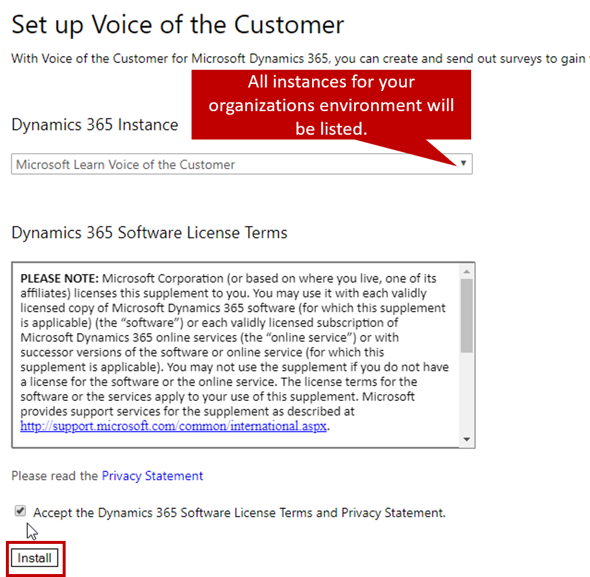
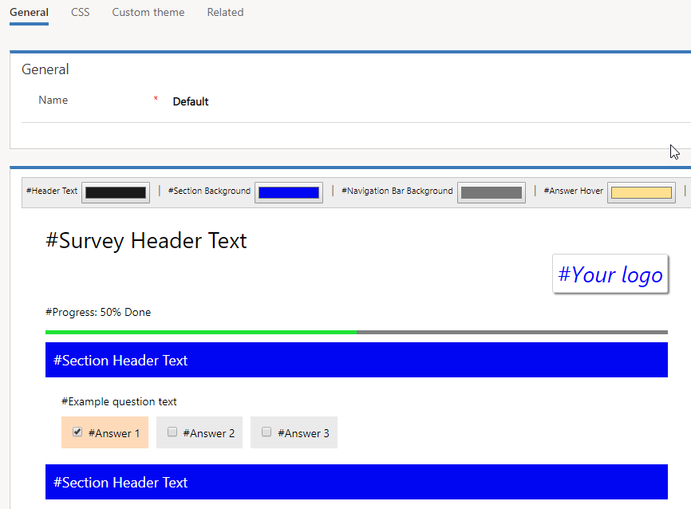

Before an organization can start using Voice of the Customer surveys to engage with its customers, it must install Voice of the Customer. Voice of the Customer is a free add-on solution that can be installed in any instance of Microsoft Dynamics 365 version 9.0 or higher. To install the solution in your organization, you must have system admin rights.

## Installing the solution

Dynamics 365 instances can be managed through the [Microsoft Power Platform Admin center](https://admin.powerplatform.microsoft.com).

After you sign in to the Admin center, expand **Admin centers**, and select **Microsoft Dynamics 365 Customer Engagement**. Then select **Applications** \> **Voice of the Customer**, and select **Manage** to start the setup process. Specify the instance that you want to deploy the solution to. Then, after you accept the license terms and privacy statement, select **Install** to start installing the solution.

To monitor the progress of the installation, go back to the list of your Dynamics 365 instances, select the organization that you deployed Voice of the Customer to, and then select **Solutions**. The **Status** column shows the installation status.

> [!NOTE] 
> Published surveys aren't stored directly in Dynamics 365. Instead, they're published to a Microsoft Azure service. When Voice of the Customer is installed, a Voice of the Customer (VOC) push service user is automatically created. This user lets the Voice of the Customer Azure service authenticate with Dynamics 365 by using server-to-server (S2S) authentication. The VOC push service user is used primarily to push survey responses. It's an application user and doesn't consume any license. The survey admin role is assigned to it.

## Accessing Voice of the Customer

After the solution is installed in an organization, you can access it by using the new Voice of the Customer Unified interface app. The app includes a new experience for designing surveys and themes. It also includes a survey designer that lets survey designers easily and intuitively add, remove, and change survey pages, sections, questions, and answers.

Users who have the correct permissions can access the Voice of the Customer app from the Dynamics 365 home page or by using the Dynamics 365 app picker.

## Defining survey collateral

Before you start designing surveys, consider what collateral will be needed. Often, organizations want to brand surveys so that they include company logos or product images. They might even want to create different themes and color schemes to represent different use cases for their surveys. For example, an organization creates an unsubscribe survey that uses lots of red colors. Therefore, it's easy for respondents to see that they've been taken to a different survey.

Voice of the Customer provides two ways to tailor the look and feel of surveys that you create:

- **Images:** Upload images like company logos or product images, so that they can be added to surveys. The PNG, JPG, and GIF formats are supported.
- **Themes:** Define different themes for different types of surveys, like service surveys or sales surveys.

    - You can upload logos for a theme. (The logos must first be uploaded as images.)
    - You can define colors for header text, section backgrounds, the navigation bar background, answers that are hovered over, answers that are selected, the progress indicator, and the progress indicator background.

## Optimizing Voice of the Customer performance

Because the surveys that you create are published to an externally hosted Azure service, there's often a lot of back-and-forth traffic between Dynamics 365 and the service. The primary traffic occurs when surveys are published and when survey responses are pulled back into Dynamics 365.

To help guarantee optimal performance, we recommend that you use the following limits for Voice of the Customer:

- **Published surveys:** The maximum number of surveys that you can publish is 200.
- **Survey questions:**

    - The maximum number of questions in a survey that uses survey responses is 250.
    - If feedback is turned on for a survey, the maximum number of questions is 40.

- **Survey pages and sections:**

    - A survey should have a maximum of 25 pages.
    - A page should have a maximum of 10 sections.

- **Survey invitations that have piped data:** A maximum of 50,000 email invitations that have piped data can be sent in a 24-hour period. If this limit is exceeded, you receive an error message.
