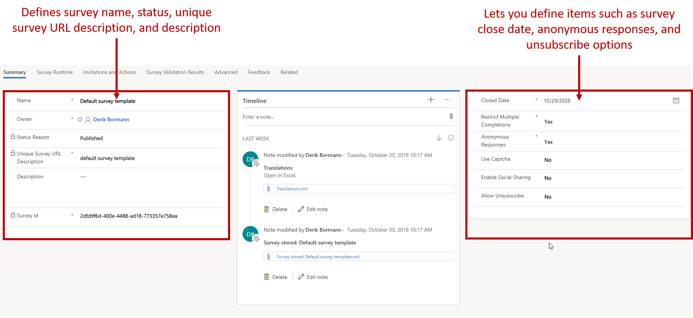
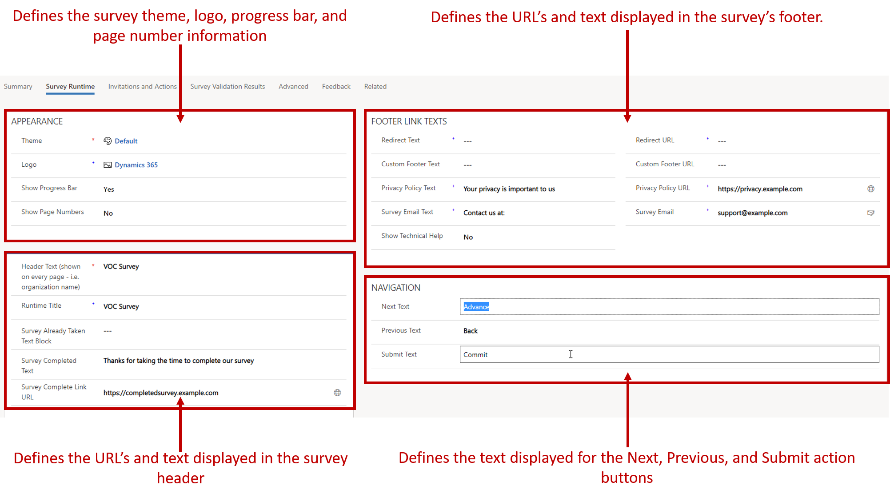
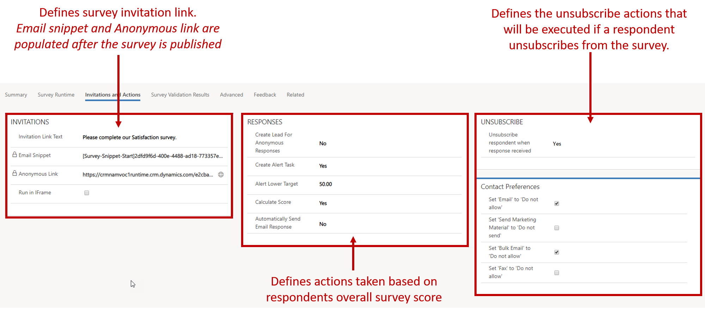

It's important to have a solid plan for setting up your surveys. Here are some best practices that you should consider before you start, to help you create meaningful surveys and gather good responses from your customers:

- **Define an objective:** A well-defined objective lets you properly plan for your survey. It also helps you identify the results that you expect from your customers. To pick the right questions for your survey, you must know how you'll use the responses.
- **Keep the survey as short as possible:** If you create a survey that takes a long time to finish, you might reduce your response rate.
- **Create a logical flow of questions:** Make sure that your survey has a logical flow of questions, to keep the respondents interested in the survey.
- **Organize the survey:** Group the related questions in a section, and put related sections on a single page.
- **Ask one question at a time:** Make sure that you ask only one question at a time, to keep your respondents focused. Avoid asking questions that are vague or don't communicate your intent. Keep the objective of your questions clear to respondents.
- **Preview and test the survey:** After you create your survey, always preview it so that you can check the overall flow and catch any mistakes. After you publish the survey, test it to make sure that respondents can easily find and open it.
- **Mention expectations in the survey invitation:** In the survey invitation, mention the estimated time that's required to finish the survey, and give a brief overview. This information will help respondents submit their input within the expected timeframe.

After you've considered these best practices, the next step is to consider what types of questions will provide the best chance of capturing the information that you need. By selecting the correct question types, you'll help guarantee that the appropriate reports can easily consume the data.

For more information about the question types that are available, see [Decide the question type](https://docs.microsoft.com/dynamics365/customer-engagement/voice-of-customer/plan-survey#decide-the-question-type).

## Designing surveys

Voice of the Customer provides a design experience that makes it easy for survey designers to design the survey pages, sections, and questions. It also makes it easy to define the types of responses that are captured, provide unsubscribe options, and make specific actions available based on the respondent's answers to questions.

For every survey that's created, the application provides three pages. Each page has a specific function in the design and administration of the survey:

- **Survey:** Use this page to define the details of the survey. For example, you can define survey themes and logos, survey titles, header and footer information, unsubscribe details, and any redirect URLs that are needed.
- **Designer:** This page is the primary design interface for creating surveys. Here, you can add survey pages, sections, and questions. This page also provides more advanced options. For example, you can personalize survey questions, link questions together, define question scoring, and format how questions are presented.
- **Dashboard:** This page provides analytical information about the survey. This information includes the number of survey invitations that have been sent, survey response data, and actions that have been initiated based on the survey.

## Working with the Survey page

As was mentioned earlier, the **Survey** page is where you define the details of the survey. For example, you can define the themes and images that will be used. You can also define more advanced details, like the actions that can be triggered based on responses. This page has several tabs. Each tab provides specific information that you can edit as needed.

Let's examine some of these tabs in more detail.

### Summary tab

The **Summary** tab is where you define most of the basic information about the survey, like the survey name and description. You can also specify how the survey can be taken.

Here are some of the key fields that you'll set on the **Summary** tab:

- **Closed Date:** Enter the date when respondents will no longer be able to take the survey.
- **Restrict Multiple Completions:** Specify whether the same respondent should be prevented from taking the survey more than one time.
- **Anonymous Responses:** Specify whether the survey will accept responses from respondents who aren't currently set up in Dynamics 365.
- **Use Captcha:** Specify whether respondents must enter text that's shown on the screen. (Captcha text is usually required only for anonymous surveys.)
- **Enable Social Sharing:** Turn on social sharing for scale questions, so that respondents can share positive results via selected social media.
- **Allow Unsubscribe:** Specify whether to include a link that respondents can use to unsubscribe from the survey.

#### More about unsubscription

If you set the **Allow Unsubscribe** field to *Yes*, you need to supply additional information to help guarantee that the unsubscription is processed correctly. For example, respondents who decide to unsubscribe from a survey are typically taken to an unsubscribe survey that captures information like their reasons for unsubscribing. Therefore, you must make sure that you provide the following information:

- **Unsubscribe survey:** Select the unsubscribe survey that respondents will be redirected to. (Required)
	- You must create and publish the unsubscribe survey before it can be selected.

- **Unsubscribe link text:** Specify the text that's used for the link that takes respondents to the unsubscribe survey.

Additionally, when a respondent who is a Dynamics 365 contact unsubscribes, the survey can update his or her preferences for allowed contact methods (**Allow email**, **Allow mailings**, and so on). You can set up this behavior on the **Invitations and Actions** tab.

### Survey Runtime tab

The **Survey Runtime** tab lets you define the visual elements that will be applied to the survey at runtime. It includes different sections that help you personalize what respondents will see when they take the survey:

- **Appearance:** Define items that affect the survey's visual appearance, like the theme and logo. You can also specify whether a progress indicator is shown.
- **Navigation:** Define custom text for specific survey navigation actions, like when respondents select the **Next**, **Previous**, and **Submit** buttons.
- **Header and footer links and URLS:** Define the text that appears in the survey's header and footer at runtime. Examples include text and links for a custom completion page or a privacy policy, or a "contact us" email link.

### Invitations and Actions tab

The **Invitations and Actions** tab lets you define distribution links and URL information. You can also set up actions that can be triggered from the survey itself. For example, if a respondent's score for a customer satisfaction survey falls below a specific value, like *50*, a task can be generated and assigned to a satisfaction representative. In that way, the representative can follow-up with the customer.

The **Invitations and Actions** tab includes three sections:

- **Invitations:** Use the **Invitation Link Text** field to customize the text that's used for the invitation link. After the survey is published, the **Email Snippet** and **Anonymous Link** fields are filled in. The URLs in these fields can be included in emails and on webpages to distribute the survey.
- **Responses:** Set up the creation of Dynamics 365 records based on survey responses:

    - **Create Lead For Anonymous Responses:** Specify whether to capture information and generate a new lead in Dynamics 365 for any respondent who takes the survey but isn't currently a lead, account, or contact in Dynamics 365. (The survey must be set up to accept anonymous responses.)
    - **Create Alert Task:** Specify whether to create an alert task for the survey owner if the customer satisfaction score equals or is less than the value in the **Alert Lower Target** field.
    - **Alert Lower Target:** Define the customer satisfaction score that will trigger an alert task. (The **Create Alert Task** field must be set to *Yes*.)
    - **Calculate Score:** Specify whether to automatically calculate the survey score based on the scoring setup of individual questions. (Scoring models must be defined for individual questions in the survey.)
    - **Automatically Send Email Responses:** Specify whether to automatically send an email response.

- **Unsubscribe:** Define whether contact preferences on the Dynamics 365 record should be updated when a respondent unsubscribes from the survey. Set the following fields to specify which preferences to update:

    - Set 'Email' to 'Do not allow'
    - Set 'Send Marketing Material' to 'Do not allow'
    - Set 'Bulk Email' to 'Do not allow'
    - Set 'Fax' to 'Do not allow'

### Feedback tab

The **Feedback** tab is used when you want to capture the responses for a survey in a custom Feedback entity that's associated with that specific survey.

#### More about survey responses vs. feedback

When you design a survey, consider how you want to handle the responses that come back as the survey is taken. You can specify whether a survey uses survey responses or feedback:

- **Survey responses:** Responses are stored in a Survey response table. (Default option)
	- This option is best used for surveys that have a limited shelf life, like the survey for a product offering or a product testing survey. Most surveys will use survey responses.

- **Feedback:** Responses are stored in a custom entity for that survey.
	- This option is best used for surveys that run longer or that will rarely change, like a customer satisfaction survey that will be sent after cases are resolved.

> [!IMPORTANT]
> A survey can use either survey responses or feedback. It can't use both.
> 
> When you create a survey, you need to consider which items you want to set up on it. If you use external links, like links to privacy policies, make sure that all the pages exist before you link a survey to them.

For more information about creating surveys, see [Create or edit a survey](https://docs.microsoft.com/dynamics365/customer-engagement/voice-of-customer/design-basic-survey#create-or-edit-a-survey).
