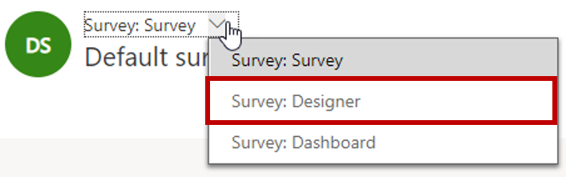
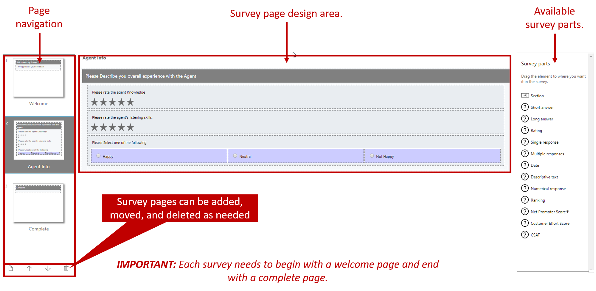

After you've decided on the basic settings for your survey, like the survey runtime information, it's time to design the actual survey. The design of the survey is done on the **Designer** page. To open this page, select *Survey: Designer* in the drop-down list. The survey designer is a drag-and-drop interface that makes it easy to define the specific pages, sections, and questions that will be used in the survey.

By default, each survey begins with three pages:

- **Welcome:** The first page that's shown when respondents take the survey. Typically, this page includes the survey title, welcome text, and additional overview information that might be helpful for respondents.
	- The **Welcome** page must always be the first page of a survey.

- **Page:** An actual survey page that respondents will interact with. It usually includes questions. It can also include components that might be helpful to respondents as they take the survey.

- **Complete:** The final page that's shown to respondents. Typically, this page includes "thank you" text and wrap-up information. It might also provide some redirect links to a product page or something similar.
	- The **Complete** page must always be the last page of a survey.

You can add, reorder, and delete survey pages. To add pages, select the **New page** button in the lower-left corner of the survey designer. When you add a new page, you must enter a name for it. After a page is added, you can move it around in the survey as needed. But the **Welcome** page must always be the first page in the survey, and the **Complete** page must always be the last page.

You can customize both the **Welcome** and **Complete** pages as needed, so that they include different elements.

A page can include multiple survey parts. Survey parts are pre-created survey elements that make it easier to add specific capabilities to your surveys. They can be used for survey questions, page sections, actions like uploading files, and so on. After a survey part has been added, you can customize it.

The following table lists just some of the types of survey parts that are available.

| Survey part type                   | Description |
|------------------------------------|-------------|
| Section                            | Add a new section to the page. |
| Short answer/Long answer           | Add a single-line or multiple-line text box to capture responses. |
| Rating                             | Add a rating response. The ratings can use stars, flags, or faces. |
| Single response/Multiple responses | Let respondents select one answer or multiple answers. |
| Ranking                            | Set up a question, and let respondents rank the responses. |
| Net Promoter Score                 | Define a metric about how likely respondents are to recommend the product or services to a friend. |
| Customer Effort Score              | Let respondents use a five-star scale to rate how much effort they had to put in. |
| Ratings                            | Set up lists of questions, and let respondents rate multiple items. |
| Upload file                        | Let respondents upload a file. |

> [!NOTE] 
> Editing sections, designing questions, and working with survey parts will be discussed later.

> [!VIDEO https://www.microsoft.com/videoplayer/embed/RE2JyCL]

For more information about the available types of survey parts, see [Decide the question type](https://docs.microsoft.com/dynamics365/customer-engagement/voice-of-customer/plan-survey#decide-the-question-type).
