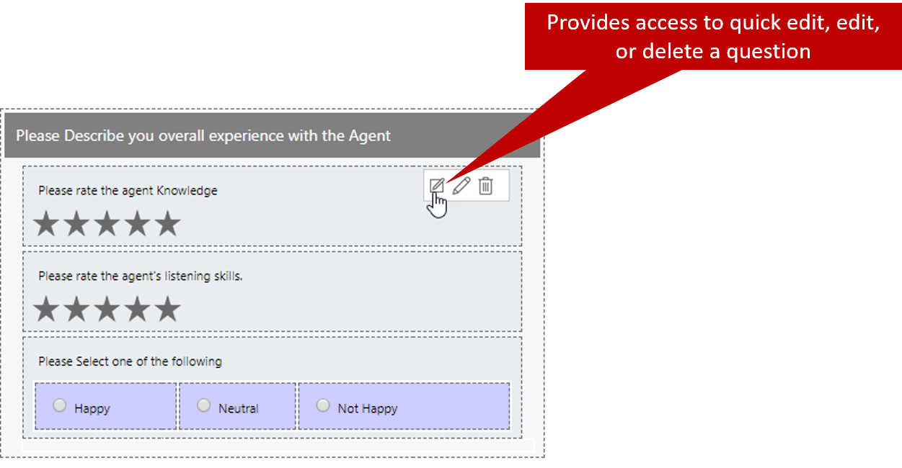
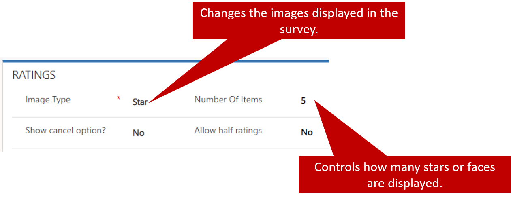
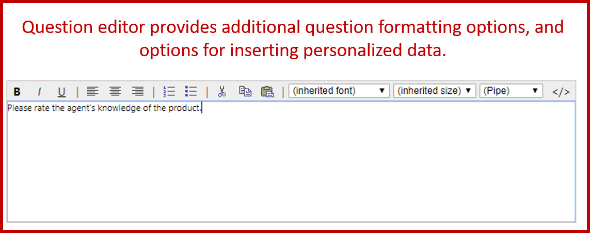

As has been mentioned, when you're designing surveys, you should always keep the specific questions that will be asked foremost in your mind. If a survey is poorly designed, respondents might start to take it but then give up, causing high abandonment rates. A poorly designed survey can even affect the data that's captured. But if a survey is well designed, fewer questions are needed, and you can be sure that the survey will capture relevant and useable data that your organization can actually do something with.

Although there's no magical formula for writing good survey questions, here are some questions that you might find it helpful to consider:

- Does this question capture the actual data that I need?
- Does it require a follow-up question to get that data?
	- If so, where is that follow-up question: on the same page, on a different page, on in a different survey?
- What's the best format to collect this data in?
- Should I include a scoring model to help drive next steps?
- Can I easily extract the data that I need for reporting purposes?
- Is this question related to other questions in either this survey or a different survey?
- Will this question be more meaningful if the data in it is personalized?
- Should the respondent's name be included?
- What about the name of the agent who helped the respondent?

While you're planning a survey, decide what the purpose of each question is and what the question will be used for. This approach will help you create a well-organized survey, decide on question placement, and maintain a consistent flow between questions. Voice of the Customer provides several question types that you can take advantage of to make sure that you get the necessary data from each question.

The following table describes the question types that are available in Voice of the Customer.

| Question type   | Description |
|-----------------|-------------|
| Check box       | The question lets the respondent select multiple answers. You can change the layout of the answer options by using the **Option layout** list. |
| CSAT            | The question captures the respondent's overall satisfaction with the product or agent, on a five-point scale. |
| Customer effort | The question captures the respondent's satisfaction based on the effort that he or she spent doing business, on a five-point scale. |
| Date            | The question asks the respondent to select a date. | 
| Drop down       | The question lets the respondent select one answer in a drop-down list. |
| Email           | The question asks a respondent to enter an email address. |
| Label           | Use this question type to describe elements on the survey page (for example, labels). |
| Long answer     | The question accepts an answer that has multiple lines. This question type can be used for verbatim comments, for example. |
| NPS             | The question captures the respondent's satisfaction based on the likelihood that he or she will recommend the product or services to a friend. |
| Numeric         | The question accepts only numerical responses. |
| Radio button    | The question lets the respondent select only one answer. You can change the layout of the answer options by using the **Option layout** list. |
| Short answer    | The question accepts a one-line answer. |
| Star rating     | The question asks the respondent to provide a rating by using stars, flags, or faces. |
| Upload file     | The question lets the respondent upload a file.<ul><li><strong>Supported file types:</strong> .png, .jpg, .gif, .doc, .docx, .pdf, .xls, .xlsx, .zip, .txt, .ppt, and .pptx</li><li><strong>Maximum file size:</strong> 5</li></ul> |
| Website         | The question asks the respondent to enter the URL of a website. |

For more information about how the different question types are shown, and for previews, see [Decide the question type](https://docs.microsoft.com/dynamics365/customer-engagement/voice-of-customer/plan-survey#decide-the-question-type).

## Adding survey parts

Survey parts represent the different visual elements that can be added to a survey. A survey part might represent a new section that you want to include on a page, or it can be an actual question that respondents will interact with.

For example, if you want to capture information about the respondent's satisfaction with a case that he or she recently submitted, you can include a section that specifically targets the agent that the respondent worked with. That section might include multiple questions about the agent's knowledge and phone etiquette.

To add questions and survey parts to specific pages in a survey, in the **Survey parts** section, select the type of survey part that you want to use, and drag it onto the page where you want to use it.

After a question has been added to a survey, you can edit it as needed. When you hover over a question, you'll see three editing options:

- **Quick edit:** Make simple inline edits to the question text.
- **Edit:** Open the question record. From there, you can make more advanced edits to the question.
- **Delete:** Remove the question from the survey.

Most times, you'll probably make minor edits to the question text. Therefore, the **Quick edit** option will suffice. But there might be times when a question requires more advanced edits that can't be done inline. For example, when you add a rating question to a survey, it uses stars by default. By opening the question record, you can make the question use faces instead of stars. You can also increase or decrease the number of items in the rating field. By default, there are five items, but maybe ten will provide a more accurate picture. Ten items might also be more in line with the scoring model that you want to use for the survey.

When you edit a question record, the actual data that you can change varies, depending on the type of question that you're working with. For example, the record for a question of the **Radio button** type (single-response option set) will show fields that are related to capturing responses. But it will also provide options for formatting the buttons. By contrast, the record for a question of the **Star rating** type will have options that are related to images and the number of items that are shown.

It's a good idea to examine each question type to learn what options are available, and what setup options can or can't be used.

Although the questions types have some important differences, there are some options that can be used, regardless of the question type:

- **Question editor:** The editor provides additional formatting options, like options for bold and italic text, justification, and lists. From here, you can also personalize a survey question by using piped data.

For more information about piped data, see [Personalize a survey](https://docs.microsoft.com/dynamics365/customer-engagement/voice-of-customer/design-basic-survey#personalize-a-survey).

- **Response mapping:** The response to the question can be mapped to specific fields in the Survey response entity. The response is then stored in the mapped fields, and is readable by reports and workflows.

For more information about response mapping, see [Store responses in a custom field by using response mapping](https://docs.microsoft.com/dynamics365/customer-engagement/voice-of-customer/analyze-survey-data#store-responses-in-a-custom-field-by-using-response-mapping).

- **Linked question:** You can link a question to another question in either the same survey or a different survey. This capability can be useful for reporting purposes.

After you've made the necessary changes to a question, save and close it. Your changes will be reflected on the survey designer page.

> [!VIDEO https://www.microsoft.com/videoplayer/embed/RE2JyCK]

For more information about creating survey questions, see [Create and add survey questions](https://docs.microsoft.com/dynamics365/customer-engagement/voice-of-customer/design-basic-survey#create-and-add-survey-questions).
