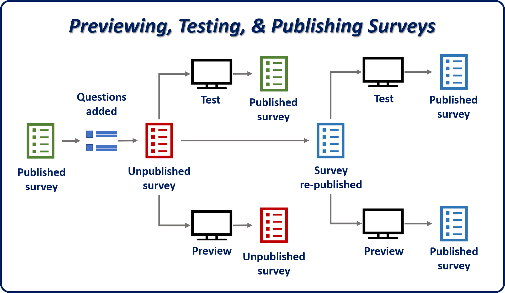

After you've finished defining the pages, sections, and questions for a survey, it's ready to be published, so that it can be distributed to respondents. Typically, you'll want to follow three steps when you're getting ready to publish a survey.

1. **Preview the survey:** Before you publish a survey, it's a good idea to preview it, to make sure that it looks and behaves the way that you want. Sometimes, because of image sizes, the types of questions, or the theme that's used, a survey doesn't behave as you expected.
2. **Publish the survey:** Publish the survey to the cloud. After a survey is published, it can be tested and then distributed to respondents.
3. **Test the survey:** After a survey is published, we recommend that you test it by going through it as respondents will. Testing is an especially good idea when the survey depends on external links, or when it links to or uses other surveys. Testing helps guarantee that respondents will have the experience that you intended. Surveys can't be tested until they're published.

You can make changes to a survey after it has been published. But your changes won't appear in the survey until you publish it again. 

> [!IMPORTANT]
> If you test a survey before you publish it again, you won't see your recent changes.

By following the steps in this order, you help guarantee that your survey will be presented correctly to respondents.

You can preview, test, and publish surveys from the **Survey**, **Designer**, or **Dashboard** page. Just select **Preview**, **Test**, or **Publish** on the command bar.

For more information about previewing, testing, and publishing surveys, see [Preview, publish, and test the survey](https://docs.microsoft.com/dynamics365/customer-engagement/voice-of-customer/design-basic-survey#preview-publish-and-test-the-survey).

## Survey distribution

After a survey is published, it's ready for distribution. During the publishing process, Voice of the Customer creates both an anonymous survey link and an email snippet link. These links are used to distribute the survey to respondents. You can view the links in the **Invitations** section of the **Invitations and Actions** tab on the **Survey** page. 

Voice of the Customer supports the following options for distributing a survey:

- **Anonymous:** The URL for the anonymous link can be copied and pasted into any medium.
    - The survey must be set up for anonymous distribution.
    - Anonymous surveys can be set up to run in IFrames. (The functionality for running in IFrames must be turned on for the survey.)
    - The survey can be set up to automatically create leads from anonymous responses.

- **Non-anonymous:** The email snippet can be copied and pasted into an email.
    - The email snippet will create a unique link that's specific to the respondent. The link won't be visible until the email is sent.
    - The email snippet can be copied by selecting the **Copy snippet** button on the command bar.

- **Run in IFrame:** The survey can run embedded in an IFrame on another webpage.
    - You can turn on this option in the **Invitations** section of the **Invitations and Actions** tab.

Depending on the distribution option that you use, there are several ways to distribute a survey. The following table describes the available methods.

|                      | Media | Trigger | Invitation piped | Responses in Dynamics 365 | Additional notes |
|----------------------|-------|---------|------------------|---------------------------|------------------|
| **Anonymous**        | Any | Any | No | Create Lead | |
| **Email templates**  | Email | Direct Email, workflow, Campaign, Email merge, Manual Email | Yes | Account, Contact, Lead, Regarding | An email template is required for each survey. | 
| **Email**            | Email | Workflow, Campaign, Quick Campaign, Manual Email | Yes (Workflows) | Account, Contact, Lead, Regarding | |
| **Invitations only** | For subsequent use with any media | Any | Yes (Workflows) | Account, Contact, Lead, Regarding | This method is useful for integration with third-party email providers. |

## Closing a survey

At some point, a survey will no longer be valid, and respondents should no longer be able to access it. When you create or edit a survey, you can predefine the closing date by setting the **Closed Date** field on the **Summary** tab. This approach works well in scenarios where the survey will have a limited shelf life, like when it supports a marketing campaign. But there might be times when a survey must be stopped immediately for some reason. In those situations, you can manually stop the survey by selecting **Stop** on the toolbar.

> [!IMPORTANT] 
> Some respondents might try to take a survey after it has been stopped, and issues might arise. When you create a survey, we recommend that you specify a redirect link that will be shown to respondents when the survey is closed or stopped, or when an error occurs. You can define redirect link text and URLs in the **Footer link texts** section of the **Survey Runtime** tab on the **Survey** page.

For more information about closing and stopping surveys, see [Close or stop a survey](https://docs.microsoft.com/dynamics365/customer-engagement/voice-of-customer/design-basic-survey#close-or-stop-a-survey).

## Deleting surveys

At some point, you might find that a survey is no longer required. Maybe it has run its course, and you want to remove it to try to free up some space. For example, six months ago, you ran a survey that was related to a product launch. You've now gathered all the necessary information about the respondents and have used that information in specific areas.

If you decide that you no longer need a survey, you can delete it.

> [!IMPORTANT] 
> When a survey is deleted, any dependent entities that are associated with it are also deleted. For example, if you set up a survey for feedback, the Feedback entity that's associated with the survey will also be deleted. Make sure that you truly no longer need a survey before you delete it.

Before a survey can be deleted, any survey responses that are associated with it must also be deleted. You won't be able to delete the survey if any survey responses remain associated with it. To access associated survey responses, go to **Related \> Survey responses** in the survey. Select all the survey responses, and then select **Delete**.

After all the associated responses are deleted, you can delete the survey by selecting **Delete** on the command bar.

Remember: After you delete a survey, you can't undo the action. Therefore, make sure that you truly no longer need a survey before you delete it.

> [!VIDEO https://www.microsoft.com/videoplayer/embed/RE2JyCI]

For more information about deleting surveys, see [Delete a survey](https://docs.microsoft.com/dynamics365/customer-engagement/voice-of-customer/design-basic-survey#delete-a-survey).
