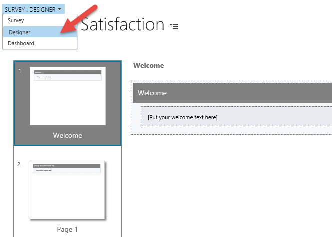
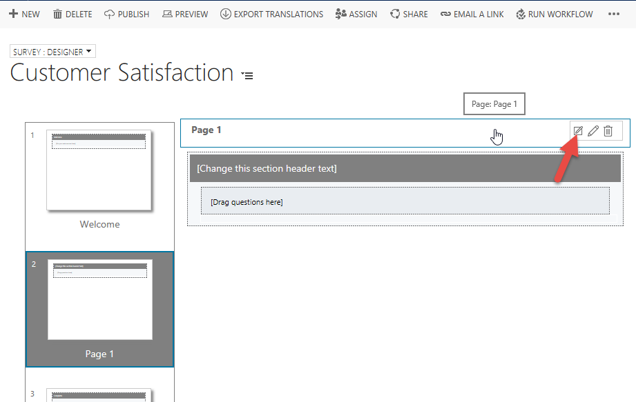
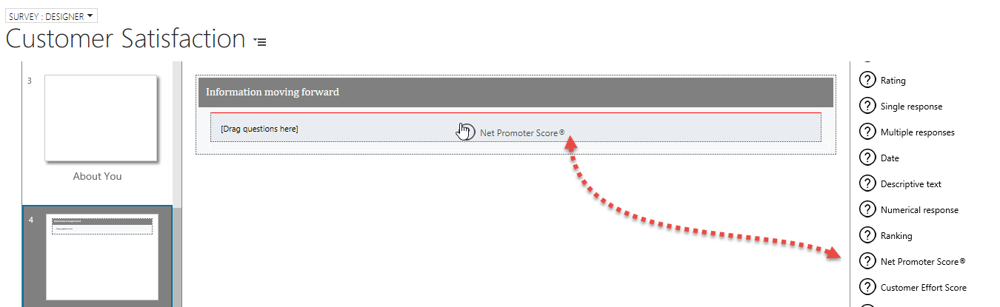
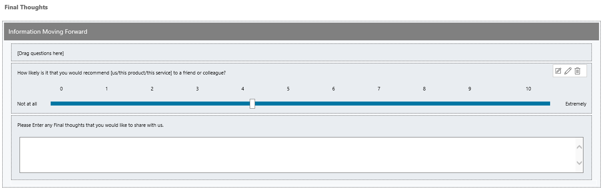
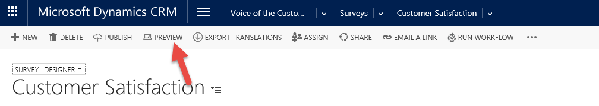
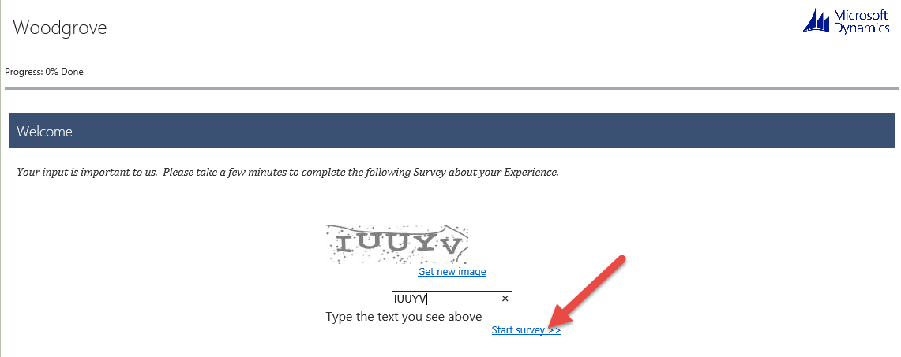

The exercises work best when you have sample data to use. Microsoft Dynamics 365 lets you add sample data as needed. If no sample data is installed in the environment that you're working in, follow these steps to install some.

1. If necessary, on the main application navigation bar, select the drop-down arrow next to **Dynamics 365**, and then select **Dynamics 365 – custom**.
2. On the navigation bar, select the drop-down arrow next to **Settings**, and then select **Data Management**.
3. Select **Sample Data**.
4. Select **Install Sample Data**.
5. Close the **Sample Data** page.

At the end of this exercise, you'll be able to perform the following tasks:

- Deploy the Voice of the Customer solution.
- Add survey collateral.
- Create surveys.
- Add survey questions.

Estimated time to finish this exercise: 30 to 45 minutes

## Exercise: Create a Voice of the Customer survey

You work for a company that provides help desk support to its customers. Lately, the company has been concerned that customer satisfaction isn't as high as it used to be. It wants to use the Dynamics 365 Voice of the Customer solution to track customer satisfaction. You've been asked to deploy the solution.

### High-level steps

1. Deploy the Voice of the Customer solution.
2. Add an image to use with the survey.
3. Create a survey theme.
4. Create a customer satisfaction survey.

### Detailed steps

#### Deploy the Voice of the Customer solution

1. Go to <https://admin.powerplatform.microsoft.com>, and sign in to the Microsoft Power platform Admin center.
2. In the Admin center site map, expand **Admin centers**.
3. Select **Dynamics 365**.
4. In the Dynamics 365 Admin center, select **Applications**.
5. Select the **Voice of the Customer** application, and then select **Manage**.
6. Select the instance to deploy Voice of the Customer to.
7. Accept the Dynamics 365 license agreement.
8. Select **Install**.

It can take 10 to 15 minutes for the solution to be installed.

9. Close the **Setup Voice of the Customer** tab.
10. In the Dynamics 365 Admin center, select **Instances**.
11. Find and select the instance that you installed Voice of the Customer to.
12. Select **Solutions**.
13. Find the Voice of the Customer solution.
14. Refresh your browser until the status is Installed. 

#### Add images and a custom theme

1. In your Dynamics 365 organization, go to **Voice of the Customer** \> **Images**.
2. Select **New** to add a new image, enter Dynamics as the name, and then select **Save** to save the image but leave it open.
3. On the **Custom Icon** tab, select the **Browse** button, and then follow these steps:

    1. Select the **dynamics\_logo** image in your student folder, and then select **Open**.
    2. Select **Submit**.

4. In the **Image Format** field, select *png*. The image will appear in the **Preview** section.
5. Go to **Voice of the Customer** \> **Themes**.
6. Select **New** to add a new theme.
7. In the **Name** field, enter Woodgrove Default.
8. Use the following codes:

    - **Header:** \#0A0A2A
    - **Section:** \#0B2161
    - **Navigation Bar:** \#1C1C1C
    - **Answer:** \#0040FF
    - **Answer:** \#819FF7
    - **Progress:** \#1C1C1C
    - **Progress Background:** \#A2A8AD

9. Select **Save and Close**.

#### Create a customer satisfaction survey

1. Go to **Voice of the Customer** \> **Surveys**.
2. Select **New**.
3. Set up the survey as shown here.

#### Summary

   | Field                         | Value                 |
   |-------------------------------|-----------------------|
   | Name                          | Customer Satisfaction | 
   | Restrict Multiple Completions | No                    |
   | Anonymous Responses           | Yes                   |
   | Use Captcha                   | Yes                   |
   | Enable Social Sharing         | Yes                   |
   | Allow Unsubscribe             | No                    |

#### Survey Runtime

   | Field         | Value                        |
   |---------------|------------------------------|
   | Theme         | Woodgrove Default            |
   | Logo          | Dynamics                     |
   | Header Text   | Woodgrove                    |
   | Runtime Title | Customer Satisfaction Survey |

  Your survey should resemble the following image.

4. Select **Save**.
5. Switch to the **Designer** page.

6. Hover over the **\[Put your welcome text here\]** text, and select the **Quick Edit** button.
7. Enter the following text: Your input is important to us. Please take a few minutes to complete the following survey about your experience.
8. Select the **Save** button. 
9. Select **Page 1**.
10. Hover over the **Page 1** heading text, and select the **Quick Edit** button.

11. Enter Call Experience, and then select the **Save** button.
12. Hover over the **\[Change this section header text\]** text, and select the **Quick Edit** button.
13. Enter Agent Experience, and then select the **Save** button.
14. Under **Survey parts**, drag the **Rating** element to your survey.
15. Enter the following text: How polite was the agent?
16. Select the **Save** button.
    - Rate the agent's knowledge
    - Rate the agent's response time
    - Rate the agent's listening skills

> [!NOTE]
> To make your survey more complete, you can add the following optional rating elements. Otherwise, move on to the next step.

17. Drag the **Short answer** element to your survey.
18. Enter the following text: Do you have any additional comments about the agent?
19. Select the **Save** button.

Your finished **Call Experience** page should resemble the following image.

20. Under the survey pages, select the **New** button.
21. Enter About You as the name, and then select **Save & Close**.
22. Change the section header text to *We would like to know more about you*, and then select the **Save** button.
23. Drag the **Ranking** element to your survey.
24. Set up the element as described here:
    - **Question:** Please rank the following items in the order of importance.
    - **Responses:**
        - Security
        - Storage
        - New Technology
  (Put each response on a separate line.)

    - **Question Layout Type:** *Question at the top, answer below*
    - **Randomize Response:** *Yes*
    - **Pick Responses:** *No*

25. Select **Save & Close**.
26. Drag the **Single rating in columns** element to your survey.
27. Set up the element as described here:
    - **Name:** Please indicate how interested you would be in the following products or services
    - **Question:** Please indicate how interested you would be in the following products or services
    - **Questions:**
        - Azure
        - SharePoint
        - Office 365
        - Yammer
        - Dynamics CRM

    - **Column Text Rotation:** Rotate 90 degrees
    - **Column Headers:**

        - Not at all
        - Neutral
        - Very Interested

28. Select the **Close** button.
29. Hover over the **\[Drag questions here\]** text, and select the **Delete** button.

   Your finished **About You** page should resemble the following image.

   

30. Add a new page after the **About You** page, and name it Final Thoughts.
31. Change the section header text to Information moving forward.
32. Drag the **Net Promoter Score** element to your survey.

32. Select **Save & Close**.
33. Drag the **Long answer** element to your survey.
34. Enter the following text: Please enter any final thoughts that you would like to share with us.
35. Select the **Save** button.
36. Hover over the **\[Drag questions here\]** text, and select the **Delete** button.

Your finished **Final Thoughts** page should resemble the following image.

#### Test and publish

1. Select **Preview** to preview the survey.

2. Enter the Captcha text, and then select **Start survey**.

3. Go through the survey.
4. When you've finished the survey, close the preview window.
5. On the command bar, select **Publish** to publish your survey.
