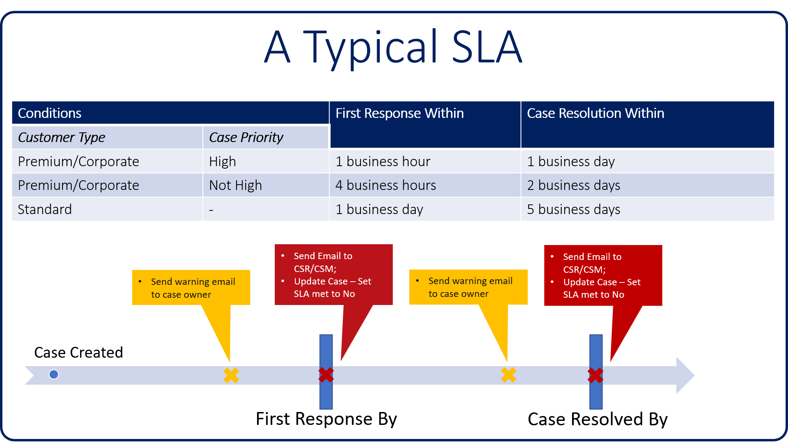

One way that customer service–based organizations track customer satisfaction and set themselves apart from other service organizations is by identifying and tracking key performance indicators (KPIs). A KPI is a measurable value that shows a company's effectiveness at achieving important business objectives. Organizations use KPIs to evaluate how successful they are at reaching their targets.

The specific KPIs that organizations track can vary widely, but there are several common KPIs that can be used to gauge success and improve customer service:

- **Customer Satisfaction Score (CSAT):** This is the most popular KPI and is generally captured by asking customers how satisfied they are with your business, product, or service.
- **Net Promoter Score (NPS):** This KPI measures the likelihood that your customers will refer you to someone else.
- **First Response Time:** This KPI measures the speed of the initial response to the customer when an issue is created.
- **Call Resolution Time:** This KPI measures how quickly you're resolving customer issues.
- **Customer Retention Rate:** This KPI measures your ability to keep your paying customers over a specific period.
- **Employee Engagement:** This KPI measures how engaged your employees are.

Although this list is by no means complete, it does offer some insight into what customer service organizations typically care about.

Microsoft Dynamics 365 for Customer Service lets you define service level agreements (SLAs) to help you meet the desired levels of service when you provide support to customers. Dynamics 365 SLAs let you track common KPIs, like First Response Time and Call Resolution Time, for every case that's submitted. You can also create custom KPIs to track business-specific items that are important to your organization.

Each SLA can be set up to model different KPIs, based on different case attributes. Each SLA will include multiple SLA detail lines that provide information about the KPI that's being tracked and the actions that are associated with it.

Each detail line defines the following information:

- **SLA KPI:** The KPI that you're measuring.

   Example: First Response By or Resolve By

- **Applicable When:** The conditions that must be met for the item to apply to the case.

   Example: A case's **Service Level** field is set to Gold, and the **Case Priority** field is set to High.

- **Success Criteria:** What successful resolution of the KPI looks like.

   Example: The **First Response Sent** field is set to Yes.

- **Success Actions:** The actions that should be taken if the KPI is met.

   Example:Update the case record to indicate that the first response was sent.

- **SLA Item Failure:** How long to wait until an item is considered failed or unmet.

   Example: No first response communication is done within one hour of case creation.

- **Failure Actions:** The actions that should be taken if the KPI isn't met.

   Example: Escalate the case to the Escalation queue, and notify the service manager.

- **SLA Item Warning:** How long to wait before sending a warning that an item is at risk of not being met.

   Example: No first response communication is done within 30 minutes of case creation.

- **Warning Actions**: The warning actions that should be taken if the KPI is at risk of not being met.

   Example: Send a reminder email to the agent who's responsible for the case.

The following image shows a typical SLA for different types of customers, based on the level of service that has been promised to them.

In this example, three conditions are defined for the SLA:

- **Customer Type** = Premium/Corporate and **Case Priority** = High:

    - First response within one business hour
    - Case resolution within one business day

- **Customer Type** = Premium/Corporate and **Case Priority** = Not High:

    - First response within four business hours
    - Case resolution within two business days

- **Customer Type** = Standard and **Case Priority** = Any:

    - First response within one business day
    - Case resolution within five business days

Based on the type of customer who submits a case and the priority of the case, the SLA takes one of these actions:

- **Send a warning email to the owner of the case if he or she is at risk of not meeting the First Response By KPI.**

    - Send an email to the customer service representative and the customer service manager if they fail to meet the First Response By KPI.
    - Update the case record by setting the **First Response Sent** field for the SLA to No.

- **Send a warning email to the owner of the case if he or she is at risk of not meeting the Resolve By KPI.**

    - Send an email to the customer service representative and the customer service manager if they fail to meet the Resolve By KPI.
    - Update the case record by setting the **Resolution** field for the SLA to No.

Additionally, Dynamics 365 SLAs can consider things like business hours and business closures when they're checking whether a KPI has been met.

For example, your organization is open from 8:00 AM to 5:00 PM, and you've promised a customer a four-hour response time. Those four hours might be based only on the hours that your organization is open. Therefore, a customer who calls in at 3:00 PM must be called back by 10:00 AM on the next business day. But a customer who's associated with a 24/7 SLA must be called back by 7:00 PM on the same day.

As an organization, it's critical that you consider all the different scenarios that you support, to make sure that you can set up and assign the correct SLA to each type of call that comes in.

Another factor that you can consider is time that's spent waiting for customers. If you've promised a customer that a case will be resolved in two hours, every minute counts. Therefore, if you spend one of the two hours waiting for the customer to get back to you with a password, you must decide whether that hour will count against the promised resolution time.

The Dynamics 365 SLA feature supports all these scenarios. Over the remainder of this module, we'll guide you through these scenarios. We'll also walk you through the process of setting up SLAs to meet specific needs.
