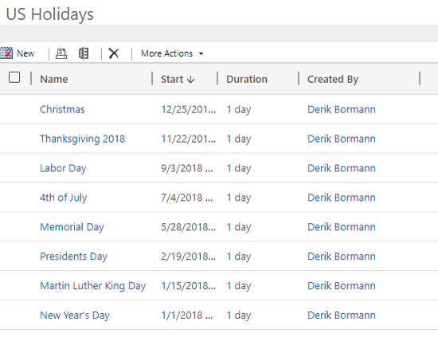
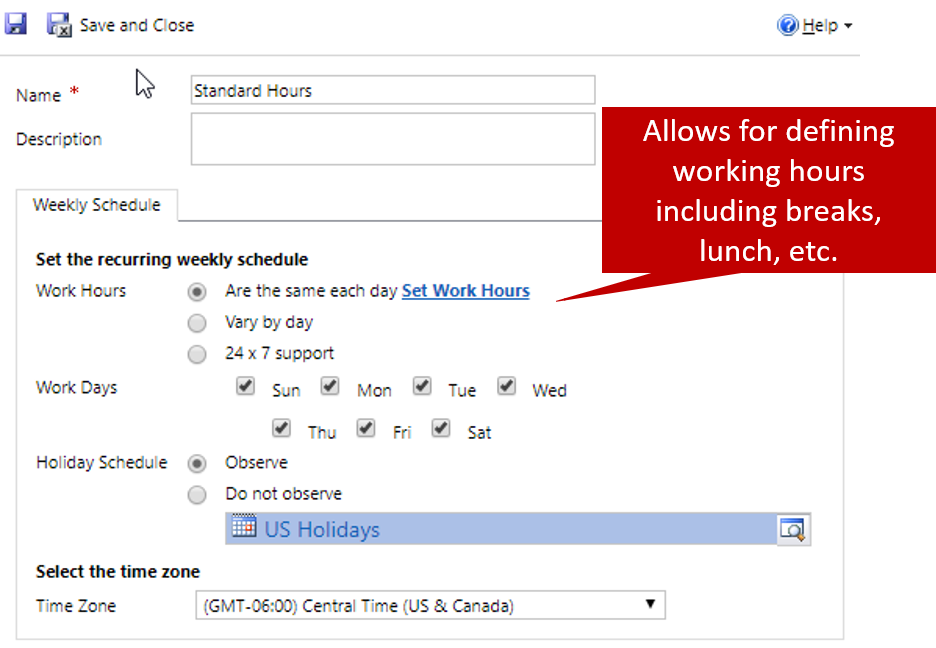

When an organization starts designing service level agreements (SLAs) to meet the requirements of key performance indicators (KPIs), it should consider the hours during which it provides support to its customers.

For example, an organization is open from Monday through Friday, from 8:00 AM to 5:00 PM. Those hours are the standard times when most of the organization's customers can call in to receive support. But a customer who has bought a support agreement might be entitled to 24/7 support.

When a case is opened, it's important to identify the hours that the case should be associated with, and to apply the correct SLA. Therefore, you must identify the different working schedules that your organization requires. Consider factors like time zone requirements and business closures for holidays.

## Holiday schedules

*Holiday schedules* let organizations to specify the holidays that they observe, and that they're typically closed on. To set up holiday schedules, go to **Settings** \> **Service Management**, and then, in the **Service Terms** section, select **Holiday Schedules**. When first you create a holiday schedule, you must assign a name to it, like *US Holidays*.

If your organization supports customers in multiple countries or regions, different holidays will be observed in each. Therefore, you must make sure that you set up the necessary holiday schedules for each country or region that you support.

After you've created a holiday schedule, you can start adding holidays to it. A holiday typically includes the following information:

- **Name:** The name of the holiday.
- **Start Date:** The start date of the holiday.
- **End Date:** The end date of the holiday.
- **Duration:** The total duration of the holiday.

For example, if your organization will be closed on New Year's Day in 2019, here's how you set up the holiday:

- **Name:** *New Year's Day 2019*
- **Start Date:** *1/1/2019*
- **End Date:** *1/1/2019*
- **Duration:** *1 Day*

You must define each holiday. Therefore, for New Year's Day, you might add New Year's Day as a holiday in 2019, 2020, 2021, and so on.

Although holidays can be added individually, many of them can be imported (for example, from a Microsoft Excel file) and associated with the appropriate holiday schedule. Holidays are generally the first thing that will be set up.

For more about defining holiday schedules, see [Create and manage holiday schedules](https://docs.microsoft.com/dynamics365/customer-engagement/customer-service/set-up-holiday-schedule).

## Customer service calendars

Next, you must set up *customer service calendars* to define the different working hours that SLAs might use. You typically define service calendars after holiday schedules, because you can associate a service calendar with a holiday schedule. To set up service calendars, go to **Settings** \> **Service Management**, and then, in the **Service Terms** section, select **Customer Service Calendars**.

When you set up customer service calendars, you can define the following properties:

- **Work Hours:** Select the specific working hours that are associated with the service calendar:

    - **Are the same each day:** Working hours can be the same every day. After you select this option, select **Set Work Hours** to define the working hours, including breaks.
    - **Vary by day:** Each day of the week will be shown. After you select this option, select the days that your organization is open, and then select **Set Work Hours** to define the working hours, including breaks, for each day.
    - **24 x 7 support:** Working hours are automatically set to 24 hours a day, seven days a week. You can't change the hours or days.

- **Work Days:** Select the days of the week that your organization is open. This option is available only if you select **Are the same each day** in the **Work Hours** field group.
- **Holiday Schedule:** Select whether the service calendar observes any holiday closures. If you select **Observe**, you can select the holiday schedule to use.
- **Time Zone:** Select the time zone for the service calendar.

Your organization will probably have multiple customer service calendars defined for it. Often, organizations have at least two service calendars:

- **Standard:** Working hours are defined as Monday through Friday, from 8:00 AM to 5:00 PM. The US holiday schedule is observed.
- **24/7:** Working hours are defined as 24 hours a day, seven day a week. No holiday schedule is observed.

You can also have calendars that represent the different countries or regions where you offer support. For example, in Dubai, the work week is typically from Sunday through Thursday. Therefore, if you're supporting customers in Dubai, you must set up an additional service calendar for Dubai and defined the work week as Sunday through Thursday.

> [!VIDEO https://www.microsoft.com/videoplayer/embed/RE2IGDJ]

For more about defining service schedules, see [Create customer service schedule and define the work hours](https://docs.microsoft.com/dynamics365/customer-engagement/customer-service/create-customer-service-schedule-define-work-hours).

After you've set up all the necessary service calendars for your organization, you can start defining SLAs in the application.
