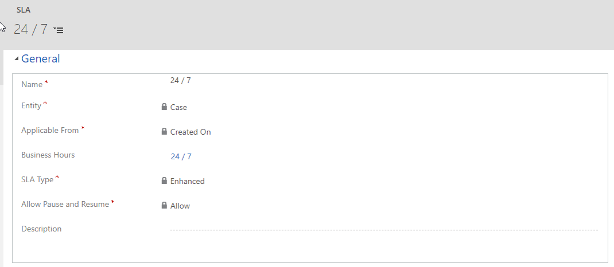

Service level agreements (SLAs) can be created to track and measure specific key performance indicators (KPIs), based on the customer and the specifics of the case. It's important to remember that SLAs aren't specific to a customer but are defined for the organization. They're applied to a customer case either by manually associating the case with a specific SLA or by attaching the case to an entitlement that's associated with a specific SLA. Additionally, a default SLA can be defined for the organization. In that way, if no SLA is defined for a case, the default SLA will be applied automatically.

To create SLAs, go to **Settings** \> **Service Management** and then, in the **Service Terms** section, select **Service Level Agreements**. When you define SLAs, consider which customer service calendar (if any) should be used. In this way, you help guarantee that all KPIs are correctly calculated, based on the working hours and holidays for the center that's servicing the customer. Often, at least one SLA is defined for each service calendar that exists for an organization.

Another key item to consider when defining an SLA is when the SLA will be applicable from.  The Applicable From field can be set to any date field associated with that entity such as Created On or Modified On.  This defines when the SLA KPI’s should start being calculated.  
  
For example:  Let’s say you want to have a SLA with a 4-hour First Response By KPI defined:   

- If you set the Applicable From field to Created On, the agent taking the case will have 4 hours from data and time the case was created on to make a first initial response with the customer.  
- If you set the Applicable From field to Modified On, then every time the case record is updated, the First Response By KPI timer will restart.
  
While using the Modified On field can be helpful in some instances, it is not an ideal trigger for tracking a First response KPI.  You need to pay close attention to what you are setting the Applicable From field to since it can have a significant impact on how KPIs are calculated.  

The following image shows an example of a 24/7 SLA.

After you define the information listed above, you can save the SLA.  Saving the SLA provides the ability to begin adding SLA detail line items to the SLA.  

> [!VIDEO https://www.microsoft.com/videoplayer/embed/RE2IGDL]
