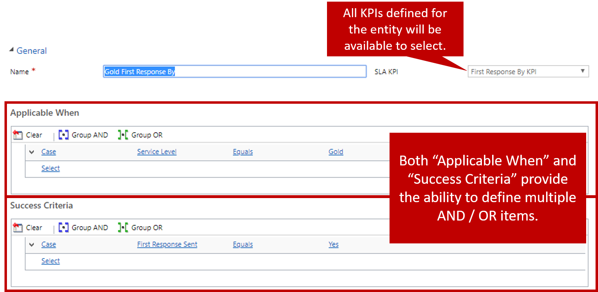
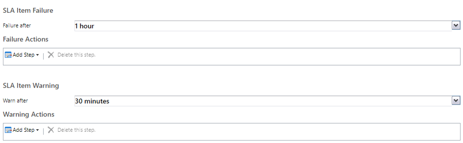
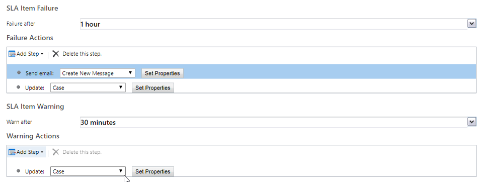
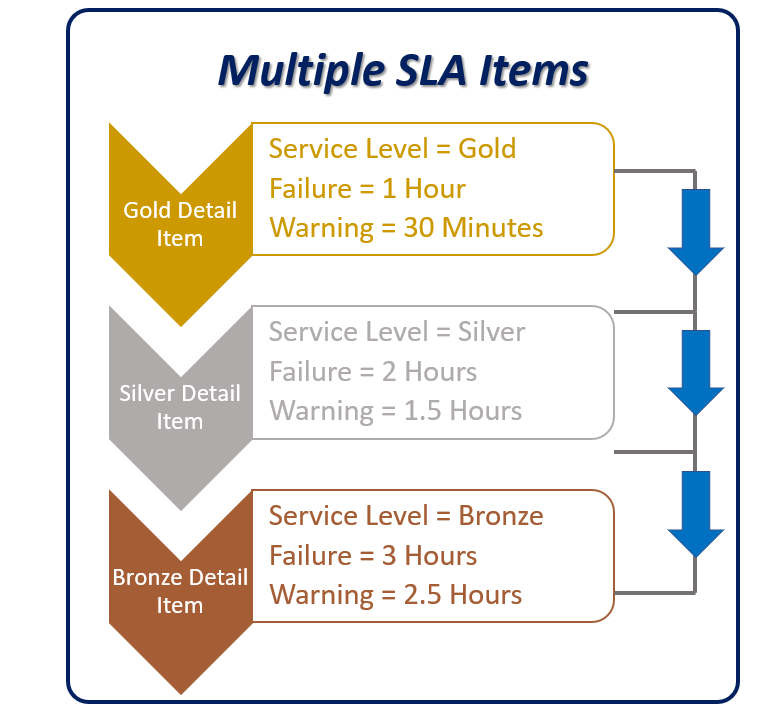

Service level agreement (SLA) details define the specific key performance indicators (KPIs) that you want to measure. They also define when a specific item should be applied. As we mentioned in the overview unit, a typical SLA will have multiple SLA detail items defined for it.

For example, a Support Contract Customer SLA might have the following SLA detail items:

- **Gold Customer – First Response By:** If **Service Level** = Gold for a case: First response within one hour
- **Gold Customer – Resolve By:** If **Service Level** = *Gold* for a case: Case resolution within four hours
- **Silver Customer – First Response By:** If **Service Level** = Silver for a case: First response within two hours
- **Silver Customer – Resolve By:** If **Service Level** = Silver for a case: Case resolution within one day
- **Bronze Customer – First Response By:** If **Service Level** = Bronze for a case: First response within four hours
- **Bronze Customer – Resolve By:** If **Service Level** = Bronze for a case: Case resolution within two business days

Each KPI that you want to track for each service level tier is added to the SLA as its own SLA detail item. To track the progress for gold customers, you define two separate detail items. For the preceding example above, a total of six detail items are defined for the whole SLA.

For each SLA detail item that you add to an SLA, you must supply the following information:

- **Name:** Enter the name of the SLA item. This field is required,
- **SLA KPI:** Select the KPI that you're measuring. By default, two KPIs are released with the Case entity: **First Response By KPI** and **Resolve By KPI**. You can define additional KPIs for the Case entity as needed.
- **Applicable When:** Defines the conditions that need to exist on the either record the SLA is running against or a related record for the specific SLA item to be applied to the record (Such as a case Service Level being set to Gold.)
	- Be aware of using field that potentially could change frequently when defining applicable when conditions.  They can potentially affect system performance.
	- Only active records are available to select as condition or action arguments.
- **Success Criteria:** Define what a successful resolution of the defined KPI looks like. For example, a resolution might be successful if a specific field on the current or related record is updated.

## SLA warnings and failures

After you've defined what successful fulfilment of the SLA detail item looks like, you must define how long the success criteria can go unmet before a warning of possible failure is set. You must also define how long the success criteria can go unmet before the item is considered to have failed. To define these behaviors, you set up the SLA item failure and SLA item warnings. Each has a time associated with it, and the times act independently of each other.

> [!IMPORTANT]
> Be aware that processing delays can occur when failure or warning time are set to less than an hour.  

## SLA actions

SLA actions are used to do a specific task, depending on whether criteria are met. Before actions can be defined, the detail item must be saved. Although actions are backed by the workflow engine, you don't have all the same options for actions that you have for traditional workflows. For example, you can't start workflows or custom actions. The options that are available are Send Email, Create Record, Update, Record, and Change status.

Three types of actions can be defined:

- **Success actions:** Define the actions that should be run if the success criteria are met.

> [!IMPORTANT]
> Success actions are available only for enhanced SLAs.

- **Failure actions:** Define the actions that should be run if the success criteria aren't met within the specified failure time.
- **Warning actions**: Defines what action(s) should be executed if the success criteria is in jeopardy of not being met within the warning time specified.

Often, the value of a specific field, like the **First Response Indicator** field, will be used as a success criterion for an SLA item. By default, the values of fields like **First Response Indicator** are automatically updated. You can automate the update of such fields by using a workflow or Microsoft Flow. For the **First Response Indicator** field, you must determine what's considered a first response. For example, an automated response email confirms that a case has been created is considered a first response? (Typically, it isn't.) Does it need to be a manually created email from the technician who's assigned to the case? Can it be a phone call, or is it something else? After you've determined these details, you can design the automations to update the necessary fields.

> [!NOTE] 
> In many cases the timer that calculates remaining time towards the First Response KPI is often determined by the First Response Indicator field.  Determining if this field needs to be manually or automatically updated will help to ensure that timer is stopped when it is supposed to be.  

For more about creating SLA details, see [Create an enhanced SLA](https://docs.microsoft.com/dynamics365/customer-engagement/customer-service/define-service-level-agreements#create-an-enhanced-sla).

## Working with multiple SLA items

When multiple SLA items are defined for a single SLA, the SLA items are evaluated in the order in which they're listed in the SLA details sub-grid. If multiple SLA items reference the same related field on a specific record, they're also evaluated in the order in which they're listed. The first SLA item that's applicable for each related field will be applied.

You can change the order that SLA items are evaluated in by using the arrow buttons in the SLA details sub-grid. If some of the SLA items have more specific criteria than others, we recommend that you put the more specific SLA items higher up in the list.

> [!VIDEO https://www.microsoft.com/videoplayer/embed/RE2IJmz]