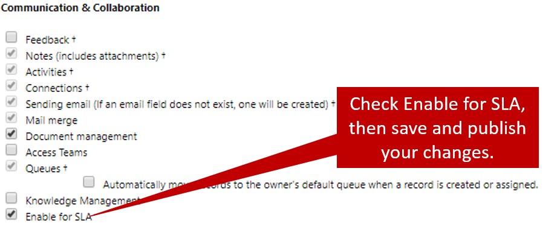
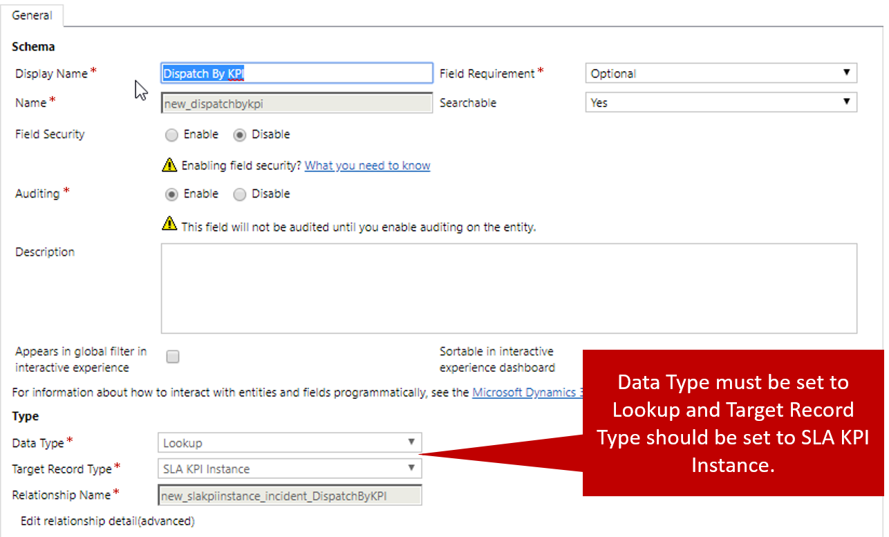
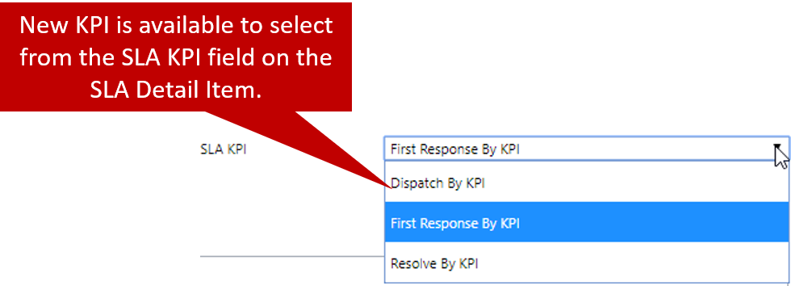

By default, the Case entity is the only entity that's set up to be used with service level agreement (SLAs). But Microsoft Dynamics 365 lets you use SLA functionality with any entity. In addition, you can define custom key performance indicators (KPIs) for any entity that's set up to be used with SLAs.

There are many scenarios where you might use SLAs with other entities in Dynamics 365. Here are some examples:

- **Leads:** Track how quickly account executives getting back to new leads.
- **Work orders:** Track how quickly work orders are being scheduled and dispatched.
- **Opportunities:** Track how quickly specific types of opportunities are being closed.

To set up an entity so that it can be used with SLAs, go to **Settings** \> **Customizations** \> **Customize the System**, and select the entity. Then, under **Communication & Collaboration**, select the **Enable for SLA** check box. Then save and publish your customizations.

For more about entities that support SLAs, see [Entities (record types) that support SLA](https://docs.microsoft.com/dynamics365/customer-engagement/customer-service/define-service-level-agreements#entities-record-types-that-support-sla).

For more about setting up entities so that they can be used with SLAs, see [Add a timer in forms to track time against enhanced SLAs](https://docs.microsoft.com/dynamics365/customer-engagement/customer-service/add-timer-forms-track-time-against-enhanced-sla).

## Creating custom KPIs

In the previous unit, we mentioned that two predefined KPIs are released with the Case entity:

- First Response By KPI
- Resolve By KPI

You can also define more KPIs for the Case entity and any other entity that has been set up to be used with SLAs.

For example, here are some custom KPIs that you might set up for the previously mentioned scenarios:

- **Lead – Initial Contact KPI:** Measure when an account executive makes his or her initial contact with a lead.
- **Work Orders – Dispatch By KPI:** Measure when a work order has been marked as scheduled.
- **Opportunity – Closed By KPI:** Measure when an opportunity has been closed.

You define custom KPIs by creating a lookup field to the SLA KPI Instance entity. This lookup field represents a one-to-many (1:N) relationship with the entity. To create a lookup field for a specific entity, go to **Settings** \> **Customizations** \> **Customize the System**, select the entity to define the KPI for, and then select fields. Then create a new lookup field for that entity, and set the lookup field to use the SLA KPI Instance entity.

For more about creating custom KPIs, see [Create SLA KPI fields](https://docs.microsoft.com/dynamics365/customer-engagement/customer-service/add-timer-forms-track-time-against-enhanced-sla#create-sla-kpi-fields).

For more about using quick view forms for the SLA KPI Instance entity, see [Create quick view forms for the SLA KPI Instance entity](https://docs.microsoft.com/dynamics365/customer-engagement/customer-service/add-timer-forms-track-time-against-enhanced-sla#create-quick-view-forms-for-the-sla-kpi-instance-entity).

After the KPI has been defined, you can use it as the KPI for any SLA items that you create for SLAs that associated with the selected entity.

> [!VIDEO https://www.microsoft.com/videoplayer/embed/RE2IM1d]
