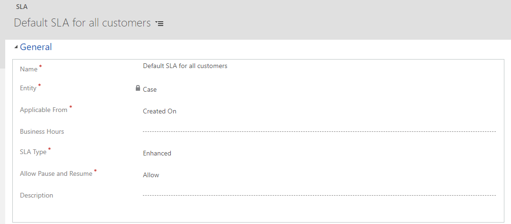
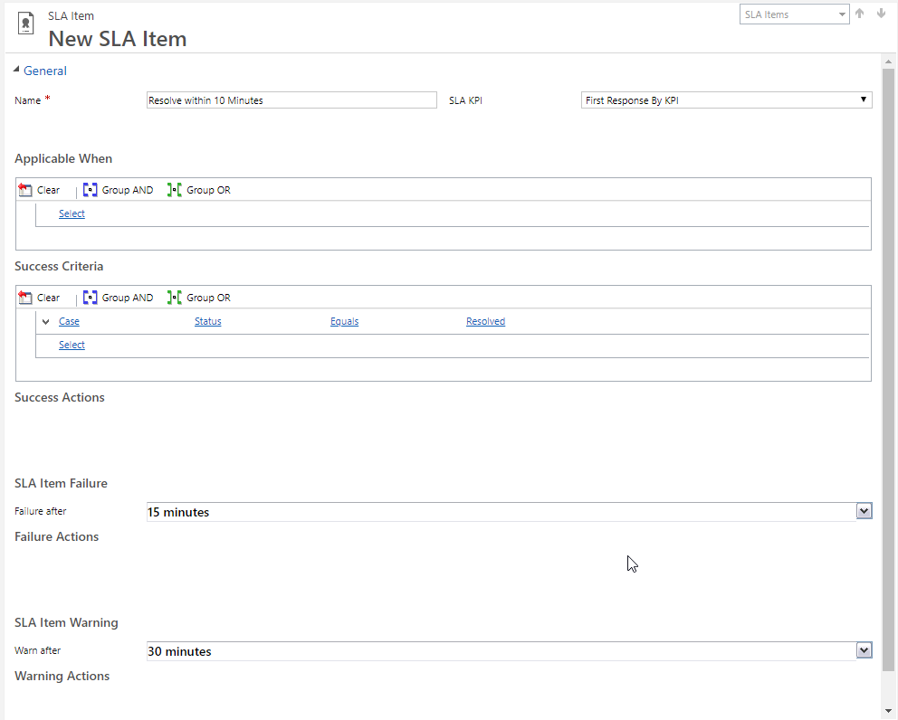
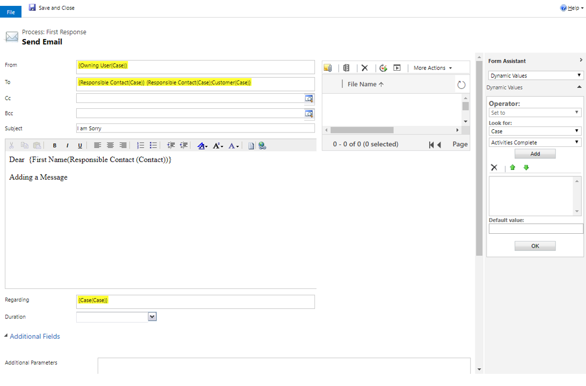

### Before we Begin

The exercises work best when you have some sample data to work with. Depending on if the environment you are
working with, you may want to install some sample data to assist with exercises. Dynamics 365 does provide the ability to add sample data as needed. If the environment you are working in does not have any sample data installed, follow the steps below to install the sample data into your environment.

### High Level Steps

### Enable Sample Data -- Detailed Steps

1. If necessary, on the main application **Navigation Bar**, click the **drop-down selector next to Dynamics 365** and then click **Dynamics 365 -- custom.**
2. **From the navigation bar, navigate to Settings \> Data Management**
3. Select **Sample Data**.
4. Click the **Install Sample Data** button.
5. Close the **Sample Data** window.

### Learning Objectives

At the end of these exercises, you will be able to accomplish the following:

-   Create a Dynamics 365 SLA
-   Define SLA Details.
-   Activate and Define an SLA as default.

Estimated time to complete this exercise: 15 to 20 minutes

### Scenario

You need to create a new Service Level Agreement for a client. The SLA must have a failure time of 2 minutes if a response is not sent right away, with a warning at the halfway mark. If the case fails, a new email needs to automatically be created and sent to inform the responsible contact that the case has indeed failed. You also need to add a Resolution Time to the SLA. Within the Resolution Details, they want you to mark the case as failed if it is not resolved within 10 minutes with a warning at the halfway mark again. After completed, set this SLA as the default and verify it works by creating a new case.

### High Level Steps

-   Create an SLA.
-   Add SLA Details.
-   Activate the SLA.
-   Set the SLA as Default.

### Detailed Steps

#### Create an SLA

1.  From the **Settings** option select **Service Management**.
2.  Select **Service Level Agreements** under the **Service Terms** section.
3.  From the **command bar**, click the **New** button to create the SLA.
4.  In the **Create SLA** window, type **Default SLA for All Customers** in the **Name** field.
5.  In the **Create SLA** window, select **Case** in the Entity field.
6.  Click **OK.**
7.  From the **SLA form**, populate the information for the following:
    -   **Name**: *Default SLA for All Customers
    -   **Applicable From**: Created On
    -   **SLA Type**: Enhanced
    -   **Allow Pause and Resume**: Allow
8.  Click **Save** up in the **command bar**.

#### Add SLA Details

1.  Within the **Case** form under the **SLA Details** section, click the **\[+\] button**.
2.  In the **New SLA Item** window, provide an item name of **First Response**.
3.  Under the **Success Criteria** section, identify what constitutes success:
    -   Click Select and select the **Case** entity.
    -   Click Select and choose **First Response Sent**.
    -   Click Select and choose **Equals**.
    -   Click Enter Value and select **Yes** as the value.

4.  Under the **SLA Item Failure** section, change the **Failure After** time to **5 minutes**.
5.  Under the **SLA Item Warning** section, change the **Warn After** time to **1 minute**.
6.  Click **Save**.
7.  Back under the **SLA Item Failure** section, indicate the **Failure Actions** by clicking **Add Step**:
    -   Choose **Send Email** and leave the **Create New Message** choice.
    -   Click the **Set Properties** button.
8.  From the **Send Email** **Properties** window, click the **From** field and dynamically populate who the email is from by doing the following:
    -   Within the **Form Assistant**, click the **first arrow** under **Look For**.
    -   Select **Case**.
    -   Click the **second arrow** under **Look For**.
    -   Select **Owning User**.
    -   Click **Add** to add the owner of the case.
    -   Click **OK** to save the **From** field.

9.  From the **Send Email** **Properties** window, click the **To** field and dynamically populate who the email is from by doing the following:
    -   Within the **Form Assistant**, click the **first arrow** under **Look For**.
    -   Select **Case**.
    -   Click the **second arrow** under **Look For**.
    -   Select **Responsible Contact**.
    -   Click **Add** to the contact responsible for the case.
    -   Click the **second arrow** under **Look For** again.
    -   Select **Customer**.
    -   Click **Add** to add the customer of the case if the Responsible Contact is blank.
    -   Click **OK** to save the **To** field.
10. Click the **Subject** field and type: I am sorry
11. Populate the **body** of the email by doing the following:
    -   Type a **salutation**: Dear
    -   Within the **Form Assistant**, click the **first arrow** under **Look For**.
    -   Select **Responsible Contact (Contact)**.
    -   Click the **second arrow** under **Look For**.
    -   Select **First Name**.
    -   Click **Add** to the first name of the contact responsible for the case.
    -   Click **OK** to save the **dynamically populated \[name\]** field in the body.
    -   Complete the **body** of the email: Adding a message...

12. Click **Save and Close** to save the **email properties**.

13. Click **Save and Close** to save the **SLA Details**.

#### Create a Resolution SLA

1.  In the **SLA Details** sub-grid, click the **plus sign (+)**.
2.  In the **Name** field, type **Resolve within 15 minutes**.
3.  Click **Save**.
4.  In the **Success Criteria**, enter the following information:
    -   Click **Select** and select the **Case** entity.
    -   Click **Select** and choose **Status**.
    -   Click **Select** and choose **Equals**.
    -   Click the **ellipsis button** and select **Resolved** as the value.
5.  In the **SLA Item Failure** to fail after **15** minutes.

#### Activate the SLA

1. From the **command bar**, click the **Activate** button.
2. Click **Activate** to confirm the activation of the SLA.
3. Set the SLA as Default. 
4. Click the **Set as Default** button in the **command bar**.

#### Validating a Case with Default Enhanced SLA

You are a Customer Service Representative and you must verify that the Enhanced Default SLA from the previous lab has been automatically applied to a newly created case.

## High Level Steps

-   Create a new case.
-   Validate the Enhanced SLA is tracking against the case.
-   Change the **First Response** by field to Yes.
-   Resolve the Case.
-   Review the status of the Enhanced SLA KPI values.

### Detailed Steps

1. If Necessary, navigate to Customer Service Hub
2. Using the Site Map, select the Wrench Icon to open cases
3. On the **Cases** menu bar, click **New Case**.
4. Enter the following information:
    -   **Case Title**: Problem with Office 365
    -   **Customer:** A. Datum Corporation (sample)
5. Click **Save**.

Validate that the Enhanced SLA is tracking against the case.

6. In the case, scroll down to the **Enhanced SLA Details** tab and expand it.

7. Validate that there is a timer for **First Response** in.

Change the **First Response** sent field to Yes.
8. Scroll down to the **Additional Details** tab and expand it.
9. Change the **First Response** sent field to **Yes**.
10. In the lower right hand corner, click the **Save** icon.

### Resolve the Case

11. In the **Ribbon**, click **Resolve Case**.
12. In the **Resolution** field, type **Issue resolved**.
13. Click **Resolve**.

Review the status of the Enhanced SLA KPI values.

14. In the browser window, click **Refresh**.
15. Scroll down to the **Enhanced SLA Details** tab and expand it.
16. Verify that the **Resolve by KPI** Status says **Succeeded**.
