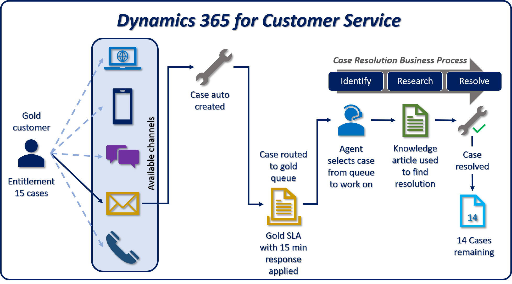

Microsoft Dynamics 365 for Customer Service offers an extensive set of features that are related to case management, to help organizations service their customers in several ways, depending on the customers' needs, the organization's service model, and other factors.

Before we begin, let's examine cases in a little more detail.

## What's a case?

A case typically represents a situation or incident that's reported by a customer and that requires a resolution. Cases are designed to track the process from the initial intake of an incident, through the remediation process, to the final resolution. From a customer service standpoint, a case can represent several items. Here are some common examples:

- **Questions:** The customer might have a specific question about a product or service. For example, a customer contacts a support agent to ask for information about the organization's insurance policy, like the deductible or benefit amounts.
- **Requests:** The customer might have a specific request, like a request for more information or some type of action. For example, a customer contacts an organization to request that someone come out to do a property inspection.
- **Issue:** The customer might be having a problem that must be fixed, like a warranty claim, a billing dispute, or a flaw in a product. For example, a customer contacts a support center because of a billing error on her mobile data plan.

Customer Service has several components that work together to provide an end-to-end case management solution that not only helps identify cases but also routes each case to the most appropriate agent who can provide guidance and resolve the case. Here are some of the most commonly used components:

- **Cases:** A case represents a single incident of service. In other words, it represents anything, in the context of a customer interaction, that requires some type of resolution or answer. Multiple cases can be associated with a single customer at any time.
- **Activities:** An activity typically represents an interaction with a customer, like a phone call. Multiple activities can be associated with a single case.
- **Entitlements:** Entitlements specify the amount of support services that a customer is entitled to. Think of them as support contracts.
- **Knowledge articles:** The knowledge base is a repository of informational articles that help customer service representatives resolve cases.
- **Queues:** A queue is a place to organize and store activities and cases that are waiting to be processed.
- **Service level agreements (SLAs):** SLAs are a way to track and define what should happen when a case is opened, like how long it should take to respond to a customer.
- **Record creation and update rules:** Record creation and update rules can be applied to different activity types to automatically create Dynamics 365 records.
- **Routing rules:** Routing rules are applied to cases to automatically route them to a specific queue or user.
- **Business process flows:** A business process flow represents a guided process that has different stages and steps that are used to resolve a specific item, like a case.

Let's look at an example that shows how all these components work together to provide an end-to-end solution.

In this example, the customer is a gold customer. The entitlement record that's associated with this gold customer specifies that the customer is entitled to open 15 cases with the organization.

- The customer can open these cases from multiple channels, including phone, a mobile app, social media, or email. (In this example, the customer has sent an email.)
- After the customer email is received, record creation rules identify who the email came from and the content of the email. This information is used to create a new case in the application.
- After the case is created, a routing rule automatically routes the case to the gold customer queue. An SLA is used to determine that initial contact with the customer must be made within 15 minutes.
- A support agent who has access to the gold queue grabs the case from the queue to work on it. This agent is now responsible for resolving the case.
- A case resolution process flow is used to guide the agent through the process of resolving the case.
- The agent finds a knowledge article that might provide a resolution to the case, emails the article to the customer, and resolves the case.
- The customer's entitlement record is updated to reflect the fact that 14 cases now remain on the customer's entitlement.

Over the remainder of this module, we'll examine, in more detail, how to work with cases in Dynamics 365. For example, you'll learn how to create cases, manage caseloads, and work with case status reason transitions. You'll also learn about scenarios for automatic case creation.
