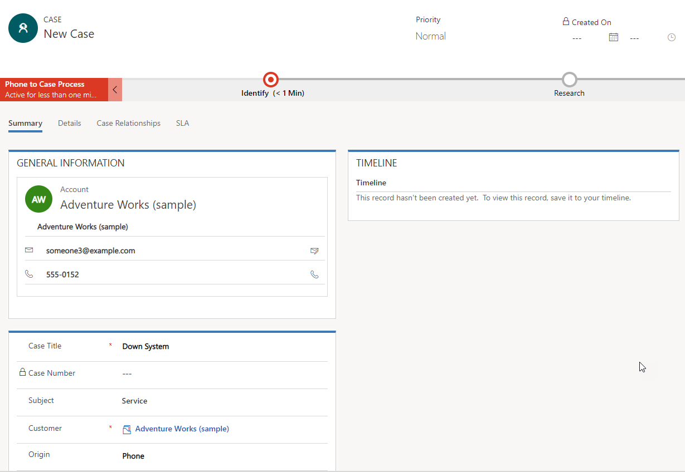
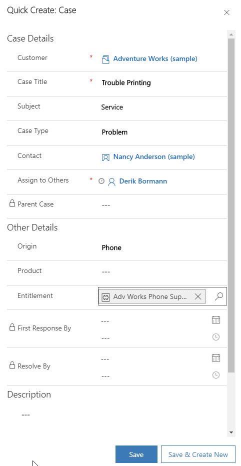
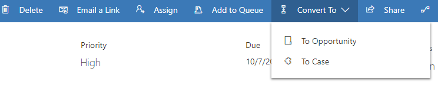
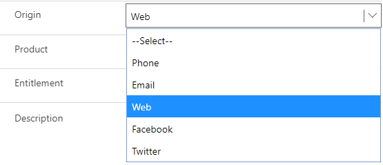

Cases can be created in multiple ways in Microsoft Dynamics 365, to accommodate the different scenarios that your organization might receive cases from. For example, cases can be created automatically, based on a social media interaction, or agents can create them manually as they take a call from someone. They can even be created through a self-service portal. When you implement a case management strategy, it's important to consider all the scenarios that your organization might support.

In Dynamics 365, cases can be captured and entered into the system in several ways, depending on the organization's specific needs (for example, through a self-service portal). Most often, though, cases are created manually or by converting an activity.

## Manual case creation

In many instances, cases must be manually entered by a service agent. As the agent enters the case, he or she captures relevant information, like the customer, point of contact, issue, and so on. There are two primary ways to manually create cases. 

### Case page

The **Case** page is the most commonly used method for entering cases into Dynamics 365. As a case is entered, the agent who's entering it specifies details about the case, like the case title, customer, case origin, and so on.

The **Case** page has all the fields that are available for the case and provides quick access to related records, like knowledge articles. The **Case** page also provides access to the active business process flow that the case uses. Many items (for example, the timeline) and access to related records aren't available until the case has been saved for the first time.

> [!NOTE]
> The case title and customer fields are required, and must be filled in before a case record can be saved.

### Quick Create: Case dialog box

The **Quick Create: Case** dialog box is a trimmed-down version of the **Case** page. It has only the most important fields for the case entity. This dialog box is used to quickly enter case information, to save time. You also use this dialog box when you're creating a case in the context of another record. For example, if you add a case directly from an account in Dynamics 365, you'll use the **Quick Create: Case** dialog box.

**Quick Create** dialog boxes can be accessed from the top navigation bar in the application, or from the related panel or an attached sub-grid on a parent record. Although a **Quick Create** dialog box isn't available by default for every entity, it's available for the case entity. Therefore, when you add a case from a related record, you use the **Quick Create: Case** dialog box.

## Converting activity records to cases

Sometimes, a case might be the result of an activity like an email, phone call, or task. For example, a support agent might receive an email request for service directly from a customer. In these situations, you can convert activities directly to Dynamics 365 case records. The record creation and update rules in Dynamics 365 are used to automatically convert specific activities to Dynamics 365 records. This conversion can also be done manually on an individual record.

> [!NOTE]
> The next unit will cover automatic creation of cases from activity records.

Out of the box, the following types of Dynamics 365 activities can be converted to cases:

- Appointments	
- Campaign Responses
- E-mails
- Faxes	
- Letters
- Phone Calls
- Service Activities
- Tasks
- Social Activities

Any custom activities that are created for an organization can also be converted to cases. For example, an organization might create a custom activity named *SMS messages* that's used to work with text messages. These activities can also be converted to cases.

From within a specific activity, select the **Convert To** button on the command bar. You can then select whether to convert the activity to an opportunity or a case.

After you select **To Case**, the **Convert to Case** page appears. This page provides more information and lets you do things like close the activity as finished.

## Channel considerations

Because so many avenues are available for customer interaction, organizations are providing more and more channels that customers can submit support cases from. The channel that a case is submitted from can influence how the case is routed or which customer support contract the case is applied to. Because this information can be critical, Dynamics 365 lets you select, directly on the case record, the specific channel that a case was received from.

> [!NOTE]
> Out of the box, Dynamics 365 includes the *Phone*, *Email*, *Web*, *Facebook*, and *Twitter* channels, as shown in the previous image. But because most organizations have different channel needs, more channels can be added.

> [!VIDEO https://www.microsoft.com/en-us/videoplayer/embed/RE2IQYA]

For more about case creation, see [Create and manage a case](https://docs.microsoft.com/dynamics365/customer-engagement/customer-service/user-guide-customer-service#create-and-manage-a-case).
