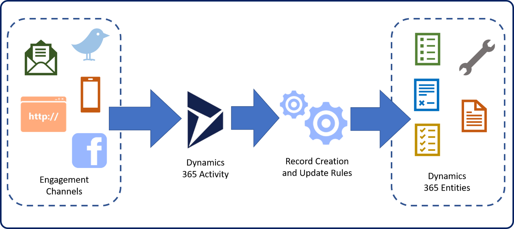
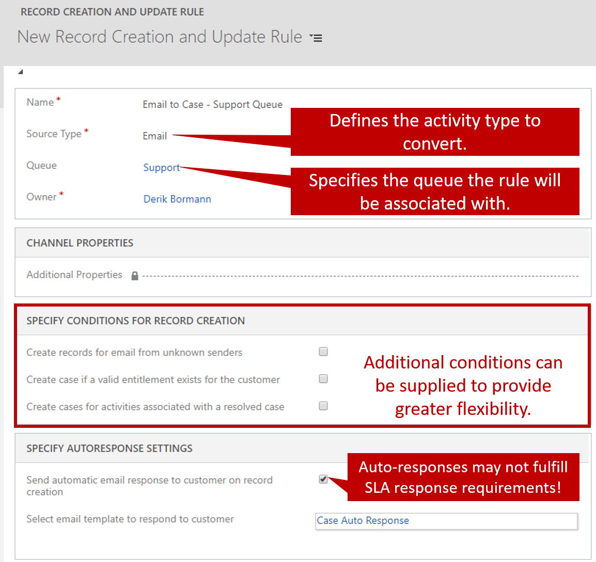
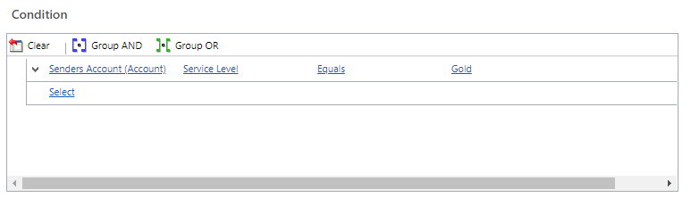
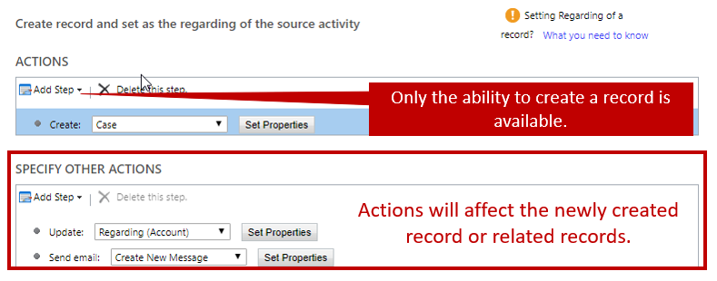
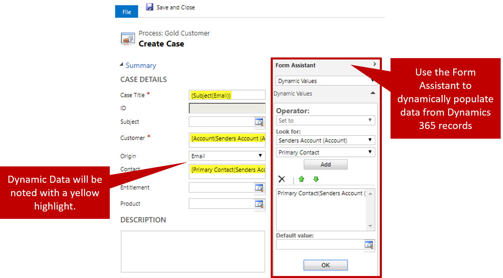
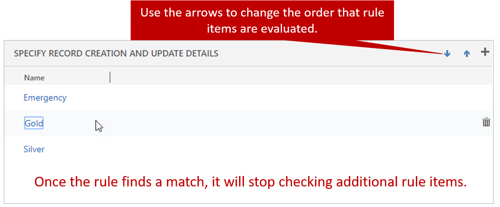

Organizations often prefer that cases be created automatically in specific instances. For example, your organization might have an email alias like `support@microsoft.com` that it uses for support requests. For any email requests that are sent to that alias, cases should be automatically created in Microsoft Dynamics 365 and associated with the customer who sent the email.

Automatic record creation and update rules in Dynamics 365 provide a foundation for consuming information from different channels, ingesting them as Dynamics 365 activities like emails or social activities, and automatically creating the appropriate Dynamics 365 records. The following image shows the basic concept.

You can access automatic record creation and update rules from **Settings \> Service management** in Dynamics 365. When you create a rule, you must define an activity source type for it. Out of the box, the following types of Dynamics 365 activities can be converted to cases:

- Appointments
- Campaign Responses
- E-mails
- Faxes
- Letters
- Phone Calls
- Service Activities
- Tasks
- Social Activities

Any custom activities that are created for an organization can also be converted by using the creation rules.

In addition to defining the source type, you can define a specific queue that the rule will monitor for items of that type. Therefore, you can define multiple rules for a single source type like email, but each rule can monitor a different queue.

Although you can create multiple rules for a single source type, it's important to remember that you can have only one active rule for the same source type and queue at any time.

For example, for a queue named *Support*, you've defined an active rule named *Email to Case* that has a source type of *E-mails*. If you create another rule named *Email to Case 2* that also has a source type of *E-mails*, the *Email to Case* rule will be inactivated when you try to activate the *Email to Case 2* rule.

The same thing occurs if you have two rules that aren't associated with any specific queue but that have the same source type. Be aware of this behavior as you design rules.

Depending on the source type, additional conditions can be changed to determine when a record will be created. Here are the options when the source type is set to *E-mails*:

- **Create records for email from unknown senders:** Cases that come from email addresses that aren't attached to a Dynamics 365 account or contact can be created automatically.
- **Create case if a valid entitlement exists for the customer:** A valid entitlement record must exist for the customer who sent the email. This condition doesn't check the specifics of the entitlement. It only checks that an entitlement exists. If a customer has multiple entitlements, a record will be created.
- **Create cases for activities associated with a resolved case:** This condition checks whether the email is related to a recently resolved case, and whether it should be treated as a new case.

This list represents just the options that are available for emails. We recommend that you check out the options that are available for other activity types, like *Social Activities*. There's also an option to define additional channel properties. This option can be helpful when you want to extract additional details from something like a social media post and use those details to fill in fields in the newly created record.

After you've defined the specifics of the rule, you must save it before you can define the creation and update details. The details are the actual rules that are evaluated and applied, based on information in the activity that's received. Multiple rule items can be defined for a single rule.

For example, an *Email to Case* rule might have the following three rule items:

- **Rule item 1:** Check whether the sender's account in Dynamics 365 is a gold customer. If it is, create a gold-level service case for the customer that has an origin of *Email*.
- **Rule item 2:** Check whether the sender's account in Dynamics 365 is a silver customer. If it is, create a silver-level service case for the customer that has an origin of *Email*.
- **Rule item 3:** Create a case that no service level is defined for and that has an origin of *Email*.

Each rule item consists of conditions and actions. You must supply a name for the rule item and save it before the conditions and actions will be available.

## Conditions

Conditions can evaluate specific contents in the activity that's being converted to a Dynamics 365 record, or in records that are related to it. For example, a condition might specify that the account or contact record that's associated with the sender of the email should be looked at. The condition can then check whether the account's service level field (**Custom Field**) is set to *Gold*. This functionality provides more flexibility, because relevant data from Dynamics 365 can also be used as criteria, in addition to the contents of the emails.

Multiple items can be specified in a single condition, and condition items can be specified as either AND or OR conditions.

## Actions

Actions have two sections. The first section just lets you create new records. This section is used in most instances where a case should be created. The second section lets you create a record, update a record, send an email, or start a child workflow. This section can be helpful when you want to facilitate additional actions after the initial case is created. These actions include updating information on the account record that the case is related to or starting a workflow that routes the case to a queue.

When records are created, you can dynamically fill in the information in the record, based on content from other records.

## How rule items are applied

Rule items are checked in the order that's defined in the rule. After the rule finds a matching rule item, it applies that rule item and stops checking for additional matches. You can control the order that rule items are checked in. Therefore, it's best to put the most specific rules first and work your way down from there.

After a rule is activated, it starts defining cases for email activities that are sent to a specific queue.

> [!VIDEO https://www.microsoft.com/videoplayer/embed/RE2IOG5]

For more about automatic record creation and update rules, see [Set up rules to automatically create or update records](https://docs.microsoft.com/dynamics365/customer-engagement/customer-service/set-up-rules-to-automatically-create-or-update-records).
