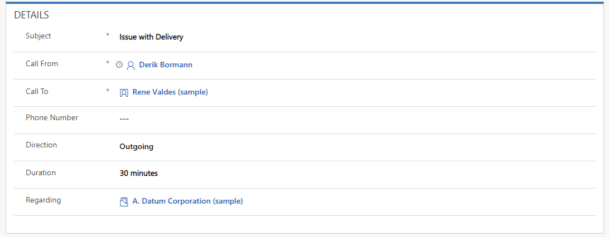
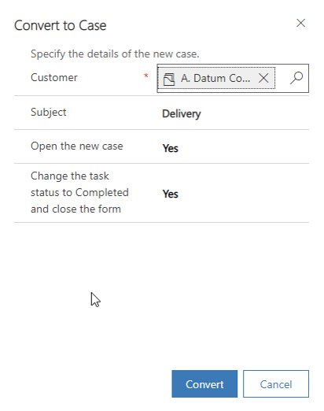
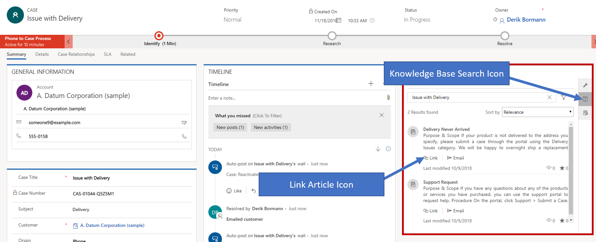

## Exercise: Create and Resolve Cases

### Before we Begin:

The Exercises work best when you have some sample data to work with. Depending on if the environment you are working with, you may want to install some sample data to assist with exercises. Dynamics 365 does provide the ability to add sample data as needed. If the environment you are working in does not have any sample data installed, follow the steps below to install the sample data into your environment.

### Enable Sample Data -- Detailed Steps:

1. If necessary, on the main application Navigation Bar, click the drop-down selector next to Dynamics 365 and then click Dynamics 365 -- custom.
2. From the navigation bar, navigate to Settings \> Data Management
3. Select Sample Data. 
4. Click the Install Sample Data button.
5. Close the Sample Data window.

### Exercise Overview

Dynamics 365 for Customer Service enables an organization to service their customers in many ways depending on the specific needs of the customer, the organizations service model, and other determining factors. One of the main features of the customer service solution is its case management capabilities.

## Learning Objectives

At the end of these exercises, you will be able to accomplish the
following:

-   Create Dynamics 365 case records.
-   Convert Dynamics 365 activities into case records.
-   Resolve case records.

Estimated time to complete this exercise: 15 to 20 minutes

#### Scenario

You work of a company that provides help desk support for its customers. One of your customers, Rene Valdes has recently called and informed you that there was a problem with a delivery she recently received. As a customer service representative (CSR), you took the Phone Call initially and realized that it should be logged as a case. You need to convert the call to a Dynamics 365 case record and will then work it through to completion.

### High Level Steps:

-   Manually create a Case using Customer Service Hub.
-   Create a Phone Call Activity.
-   Convert the Activity to a Case.
-   Resolve the Case

### Detailed Steps:

#### Create a phone call activity:

1. If necessary, on the main application Navigation Bar, click the drop-down selector next to Dynamics 365 and then  click Customer Service Hub.
2. Click the Site Map icon, under the My Work heading, select Activities.
3. On the command bar, click the Phone Call button. 
4. Complete the Phone Call as follows:
- Subject: Issue with Delivery
- Call From: Your user's name
- Call To: Rene Valdes
- Direction: Outgoing
- Regarding: A. Datum Corporation

5. Your new Phone Call should resemble the image below:

6. Click Save button to save the phone call and leave it open.

#### Convert the phone call activity to a case:

1. On the Command bar, click the Convert To button.
2. From the menu that appears, select the To Case option. 
3. In the Convert to Case window, select the following options:
- Customer: A. Datum Corporation
- Subject: Service \> Delivery
- Open the new case: Yes
- Change the task status to Completed and close the form: Yes

4. Click Convert. 
5. Select the Identify stage on the Phone to Case Process, Set the contact to Rene Valdes.

#### Resolve the case:

1.  On the case forms Command Bar, click the Resolve Case button.
2.  In the Resolve Case dialog box, select Information Provided for the Resolution Type.
3.  In the Resolution box, type Emailed customer.
4.  In the Billable Time drop-down list, select 15 minutes and then click Resolve.

#### Reactivate, modify, and resolve the case.

1.  Click the Wrench icon on the Site Map, to navigate back to cases.
2.  Click the drop-down arrow next to My Active Cases. Select the My  Resolved Cases view.
3.   From the My Resolved Cases view, select the Issue with Delivery case you just resolved.
4.  On the Case Menu Bar, click Reactivate Case.
5.  On the Related section, select the Knowledge Base Search icon.
6. Select an Article from the article suggestions and click the Link Icon.

7. On the Research stage in the Similar Cases field, click Find.
8. On the Phone to case process, click Next Stage until you are at the Resolve stage.
9. On the Resolve stage, click Finish.
10. On the case forms Command Bar, click the Resolve Case button.
11. On the Resolve a Case resolution window, in the Resolution field, type Talked to customer and sent a new part.
12. In Billable Time, type 1 Hour.
13. Click Resolve to resolve the case.
