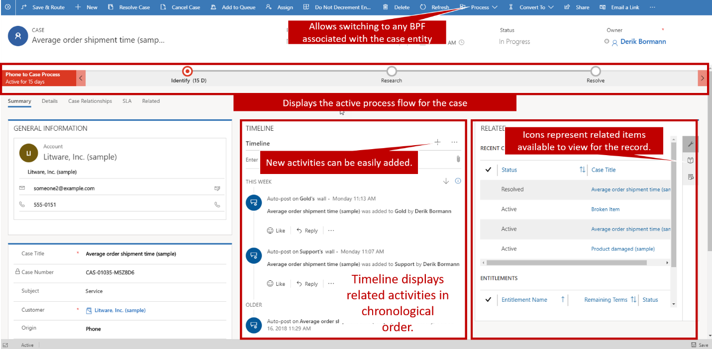

When agents are working on customer issues, it is important that they have all the necessary tools they need to resolve the issue from a single location.  Not only does not having this information greatly impact the overall efficiency of an agent, but it can also be frustrating to a  customer who needs to wait as the agent bounces around to different areas to get what they need.  Providing agents what they need directly from the case they are working on is the most effective way to ensure that agents have the tools they need.    

This might include providing the agent access to the following:
	- A list of tasks they need to be accomplished before the case can be resolved.
	- Access to the organizations knowledge base to assist in resolving the issue.
	- A complete contextual history of what has been done on the case.
	
Access to other similar issues that could be used to assist in the resolution process.  

From within the case form they can see general case information such as the case title, customer, related SLA details, related case activities and other related data.  Some of the key pieces of information agents can work with include: 

- **Timeline**: Displays related case activities.  Depending on an organizations service model, many organizations track the total time that agents spend on activities associated with a case to determine how much time to bill back to the customer.  
	- For example, if an agent placed 3 phone calls to a customer with each of the phone calls lasting 15 minutes, they might bill back a total of 45 minutes to the customer. 

- **Related**: The related section displays related information that might be either related to the case (such as a knowledge article) or related to the customer that the case is associated with (such as related support contracts, or related cases).  
	- 	Each related item type has a corresponding icon displayed in the related panel that makes it easier to switch between the related items.  

- **Business Process Flows**:  These represent guided processes that are used to guide service agents to a complete case resolution.  
	- The case entity might have multiple business process available that can be switched to depending on specific details in the case such as the case type, origin, or other business factors.

 
