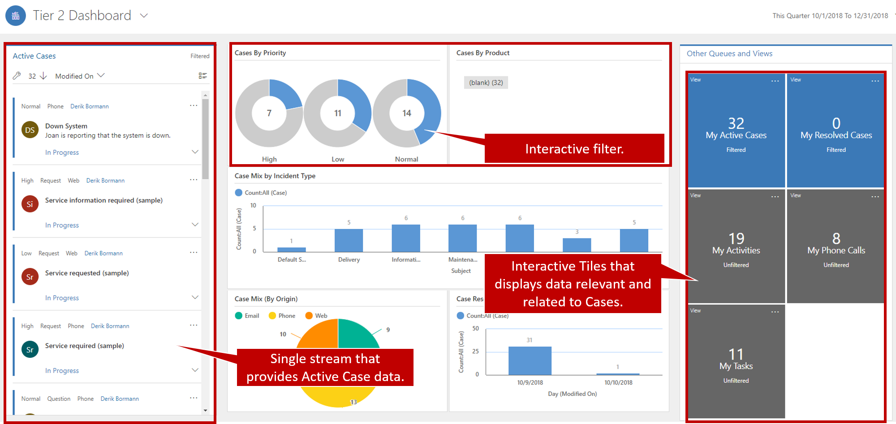
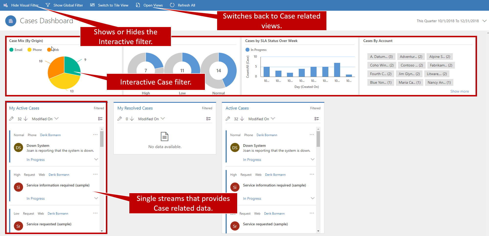

The Microsoft Dynamics 365 Customer Service Hub application was designed by using the Dynamics 365 unified interface. Customer Service Hub not only makes it easier for customer service representatives to work with and manage their cases in the application, but it also helps guarantee that all representatives have the same user experience, regardless of the platform that they're using: phone, tablet, or PC.

Customer Service Hub provides access to a series of interactive dashboards that are designed to make it easy to identify caseloads, as well as access to the specific entities that are used to manage customer service activities.  Agents can access it from the main application navigation or by going to the apps home screen.  

Dashboards make it easier for users to consume and work with data.  For example, a support agent may need to access cases in multiple queues such as gold and silver support queues.  That same agent also needs to see the cases assigned to them, and the activities they need to complete. That is four potentially different areas of the application that they may need to go to.  However, with a single dashboard the agent can easily see and interact with the data from all four of those locations without ever needing to leave the screen.   

When Customer Service Hub is first launched, agents will see a series of dashboards.  Many of these dashboards are the same ones that have traditionally been available in Dynamics 365.  Additionally, agents will be able to work with interactive dashboards that are unique to Customer Service Hub.  
There are two types of interactive dashboards available:

- Multi-Stream Dashboards
- Single-Stream Dashboards

**Multi-Stream Dashboard**
A multi-stream dashboard displays real-time data over multiple data streams.  A data stream is based on an entity view or a queue, such as My Activities, My Cases, or Cases in the Banking Queue.  A stream always contains information about only one entity, however stream on the dashboard may contain information about a different entity. 

For example, you may want to track both cases and accounts in a central location.  Since a stream can only contain data from one entity, you cannot track both in a single stream.  You can however, track cases in one stream and accounts in another stream.  Both streams could be displayed on the dashboard.   
A multi-stream dashboard could also be configured to display streams based on the same entity as well.  For example, you could have a dashboard that contains one stream displaying an agent’s active cases, and another the contains cases opened this week.  Out of the box, Customer Service Hub contains a multi-stream dashboard called the Tier 1 dashboard.  

**Single-Stream Dashboard**
Single-stream dashboards display real-time data over one stream based on a view or queue for example Active Cases.  All the charts on the dashboard are associated with the data stream.   Additionally, a single-stream dashboard contains tiles.  The tiles are positioned on the right side of the dashboard and are always shown.  Single-stream dashboards are useful to users who need to monitor fewer, but more complex or escalated cases in a single view or queue.  Out of the box Customer Service hub contains a single-stream dashboard called the Tier two dashboard.  

## Tier 1 dashboard

The Tier 1 dashboard provides several "streams" that let you work with cases and related items, like activities or email. By using visual filters, you can show interactive charts that let you filter a case based on specific criteria. In this way, you can find the most appropriate cases for agents to work on.

Date filters let you change the date range of information that agents view. There are several predefined ranges to choose from, and you can also define custom ranges.

## Tier 2 dashboard

When agents want to dive deeper into cases, they can use the Tier 2 dashboard. Instead of showing multiple streams that might be for multiple entities, it shows a single stream that's based on active cases. It also includes multiple tiles and interactive charts for working with case data.

As on the Tier 1 dashboard, the charts can be used as interactive filters to dive into specific types of cases. Additionally, interactive tiles group together relevant data that's associated with cases. You can use the tiles to view the specific records that are included in the tiles.

## Entity-specific dashboards

Another feature of the Customer Service Hub is the ability to work with entity specific dashboards.  Entity specific dashboards are just what the name describes.  They are multi-stream dashboards display data streams related to a single entity such as cases.  

When agents navigate to the case entity they will see a list of their active cases.  On the command bar there is an option to open dashboards.  This will open the case dashboard.  From within the case dashboard, agents can select the **Show Visual Filter** button to display the case visual filter to filter the case data.  This lets them perform more specific items that will assist in identifying appropriate cases to work with.  Agents can toggle back to the entity list view at any time, by selecting the **Open Views** button on the dashboard.  

