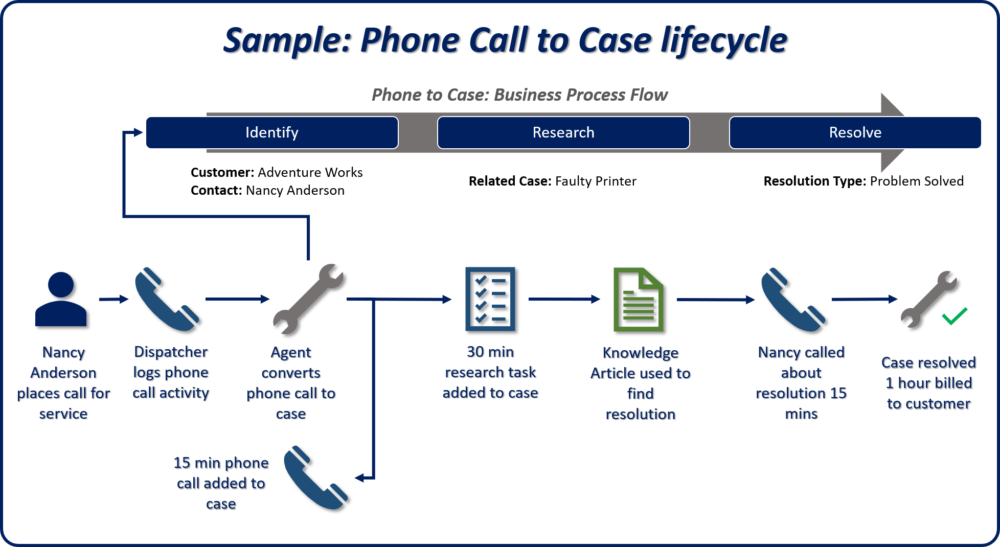
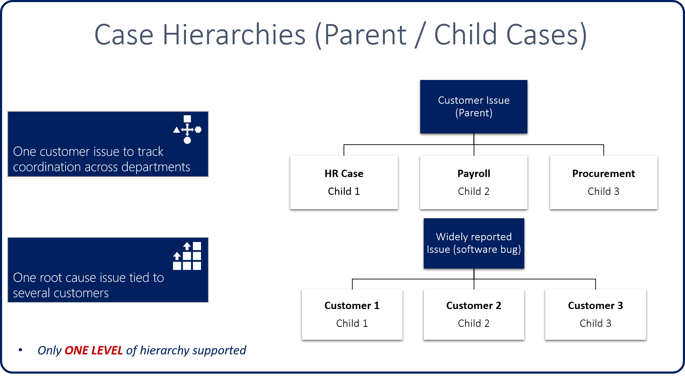
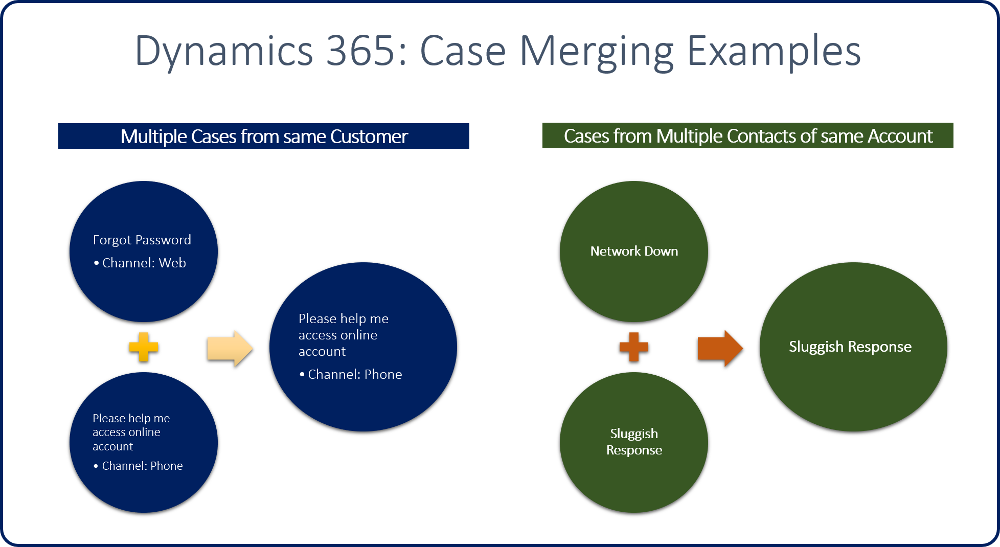

Let's see how these features can be used to resolve a case that a customer has submitted.

Nancy Anderson is a customer who works for a company named Adventure Works. She calls a central dispatcher to report an issue that the company is having. The dispatcher creates a phone call activity for the issue in Dynamics 365.

A customer support agent opens the phone call and converts it to a new case in Dynamics 365.

> [!NOTE]
> Because the case started as a phone call, the *Phone to Case* business process flow is triggered. This flow which consists of three stages: *Identify*, *Research*, and *Resolve*.

- **Identify:** The agent identifies the issue and relevant information.

    - The agent calls Nancy, who reported the issue, and identifies information like the customer, contact, and issue.
    - A phone call activity is created that describes what was done and how long the agent was on the phone with Nancy (15 minutes in this example).
    - The case is advanced to the next stage.

- **Research:** The agent researches the issue and tries to find a resolution.

    - The agent spends 30 minutes researching and working on Nancy's issue.
    - The agent finds a resolution to the issue in a knowledge article in the knowledge base.
    - The agent emails the article to Nancy and links it to the case as the resolution.
    - A task is created that describes what was done and how long it took (30 minutes total in this example).

- **Resolve:** The agent closes the case as resolved.

    - The agent calls Nancy to make sure that the proposed resolution fixed the issue. The agent spends 15 minutes on the phone with her.
    - The case is closed as resolved.
    - The total time for all activities is rolled up to reflect how much time was spent on the issue (one hour total in this example).

For more about the Customer Service Hub
application, see [User Guide (Customer Service Hub)](https://docs.microsoft.com/dynamics365/customer-engagement/customer-service/user-guide-customer-service-hub).

For more about case activities, see [Add an activity to a case](https://docs.microsoft.com/dynamics365/customer-engagement/customer-service/user-guide-customer-service#add-an-activity-to-a-case).

## Parent/child cases

Occasionally, multiple cases might be created that are all related to the same master case. Out of the box, Dynamics 365 lets you create parent/child cases by using its case hierarchy structure. For example, you work for a software company that just released an update to one of its software applications. But the update has a bug. Because many different customers might call in to report the issue, multiple cases might be created. By using case hierarchies, you can associate all the reported cases with a single master case. When the bug is fixed in the master (parent) case, all the child cases can also be resolved and closed at the same time.

The following image shows some examples of how case hierarchies can be used in a customer support organization.

### Important case hierarchy information

- No more than 100 child cases can be associated with a single master (parent) case. If you need more than 100 child cases, you might have to manually create a custom case hierarchy.
- Only one level of hierarchy is supported.

    - Case field mappings can be created to automatically fill in the fields in child case records.
    - The mapping applies only when a child case record is created in the context of a parent case.
    - Case field mappings don't keep records synced.

- The case hierarchy feature supports three cascading closure options when a parent case is closed:

> [!NOTE]
> Only one option can be defined per organization.
> **None:** Closing the parent case has no effect on child cases. Child cases must be closed individually.
> **Close all child cases when parent is closed:** Any open child cases are automatically closed when the parent case is closed.
> **Don't allow parent case closure until all child cases are closed:** All child cases must be closed before the parent case can be closed.

System admins/customizers can specify an organization's settings for parent/child cases by going to **Settings** \> **Service management** and selecting the parent and child case settings.

For more about parent and child cases, see [Create and manage parent and child cases](https://docs.microsoft.com/dynamics365/customer-engagement/customer-service/user-guide-customer-service#create-and-manage-parent-and-child-cases).

## Case merging

In some common scenarios, one or more customers might report a single case several times. For example, a customer opens a case via a web portal and reports that he can't sign in because he has forgotten his password. Later, the same customer calls your help desk to report that he's having sign-in issues. Because multiple cases might be opened for the same item, agent caseloads can be affected. The key performance indicators (KPIs) that the organization tracks for SLAs can also be affected.

In these scenarios, the case merging feature in Dynamics 365 can be used to combine the separate cases into one master case record.

The following image shows some potential use cases for this feature.

### Additional considerations for case merging

- The case merging feature in Dynamics 365 supports merges of two or more active cases. A maximum of 10 cases can be merged in a single action.

- One case can be marked as the primary case.

    - The primary case will be active.
    - All other cases will be canceled.
    - All activities, notes, and attachments that are associated with all cases in the merge will be re-parented to the primary case.

- After cases are merged, the merge can't be undone.

The ability to merge up to 10 cases is available only through the user interface (UI). Developers who need to merge cases programmatically must use the same merge software development kit (SDK) message that's available for account and contact merges. This message lets a maximum of two records be merged at a time.

> [!NOTE]
> Programmatic record merges are outside the scope of this unit.

Watch the following video about working through a case resolution.

> [!VIDEO https://www.microsoft.com/videoplayer/embed/RE2IM1e]

For more about case merging, see [Merge similar cases](https://docs.microsoft.com/dynamics365/customer-engagement/customer-service/user-guide-customer-service#merge-similar-cases).
