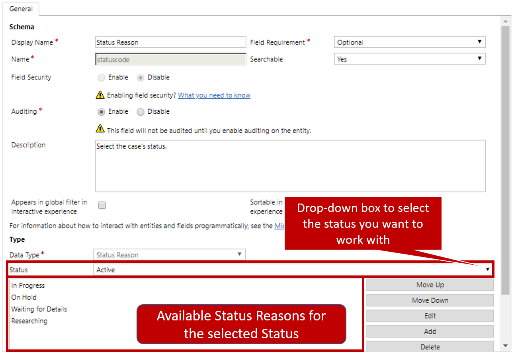
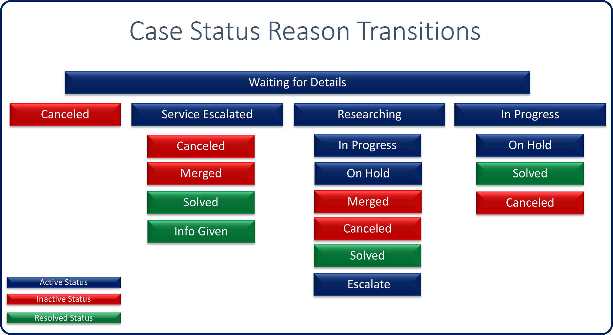

The status of a record helps identify where the record is in a specific process. For example, if you're currently working on a case in the system, the case is considered to have a status of *Active*. After the case is closed, it can be set to a status of Resolved. These statuses make it easier to sort, filter, and query specific records in the system.

Out of the box, specific statuses are available for each Dynamics 365 record, depending on the type of record. Cases have three statuses that they can be in:

- **Active:** The case is currently open and is actively being worked on in the application.
- **Resolved:** The issue for the case has been fixed.
- **Canceled:** The case is no longer active in the system, but it wasn't resolved.

You can't change the statuses that are available for a specific record type. But it's often important to have more specific information about the status of a record. For example, a case might be active in the system, but what exactly is being done on the case? Is the agent researching the problem? Is the agent waiting for the customer to provide more information? Knowing these details can be critical to effective service delivery.

Each record type has what's called a *status reason*. A status reason is associated with a specific record status and provides more information about why the record is in that status. For cases in Dynamics 365, several status reasons are available out of the box:

- **Active:**
    - In Progress:The case is currently being worked on by a customer service agent.
    - On Hold: The case is active, but it isn't currently being worked on.
    - Waiting for Details: The case is active, but you're waiting for more information from the customer.
    - Researching: The case is currently being researched.

- **Resolved:**
    - Problem Solved: A successful resolution was found for the case.
    - Information Provided: The customer was given satisfactory information, and the issue was fixed.

- **Canceled:**
    - Canceled: The case was canceled.
    - Merged: The case was canceled because it was merged with another record.

You can add, remove, or change case status reasons as needed by going to **Customizations** \> **Cases** \> **Fields** and selecting the drop-down arrow in the **Status Reason** field. Multiple status reasons are available for each status, and they can be changed.

## Status reason transitions

Often, organizations have a specific process that they follow to resolve cases. Case statuses and status reasons might play a role in that process. To help organizations more clearly define and enforce those processes, Dynamics 365 lets them create customer status reason transition paths.

Status reason transitions add an additional level of filtering to define a specific list of status reasons that can be selected for a specific status reason. For example, when a case has a status reason of *Waiting for Details*, it's technically already on hold. Therefore, letting a technician change the status reason to *On Hold* is redundant. Additionally, *On Hold* just might not be the best status reason to transition to. By using status reason transitions, you can define the specific transitions that an agent can go to from the *Waiting for Details* status reason.

The following image shows an example.

As you can see, when a case has a status reason of *Waiting for Details*, the only transition options are:

- Canceled
- Service Escalated
- Researching
- In Progress

For each of those status reasons, in turn, multiple transitions can be selected. Therefore, status reason transitions make it easier for organizations to help guarantee that agents use only valid reasons, based on the current status reason.

Status reason transitions are available only on the case entity and custom entities. You can change them by selecting the **Edit Status Reason Transitions** button on the status reason field customization page. After you turn on the status reason transitions feature, you define the specific status reasons that are available.

When you define reason options for an active status reason, there must be at least one path to an inactive status. For example, if a case has a status reason of *In Progress*, it must be possible to transition to at least one of the following status reasons: *Canceled*, *Merged*, *Problem Solved*, or *Information Provided*. If at least one path to an inactive status isn't provided, you won't be able to save the new transitions.

After the transitions are saved and published, agents will see the changes reflected in the application.

> [!VIDEO https://www.microsoft.com/en-us/videoplayer/embed/RE2IJmp]

For more about status reason transitions, see [Define status reason transitions for the Case or custom entities](https://docs.microsoft.com/dynamics365/customer-engagement/customize/define-status-reason-transitions).
