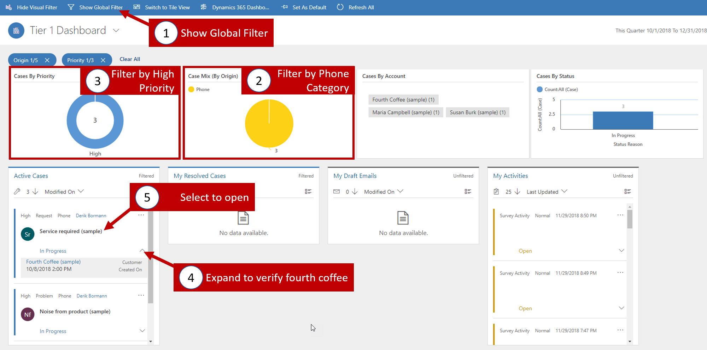
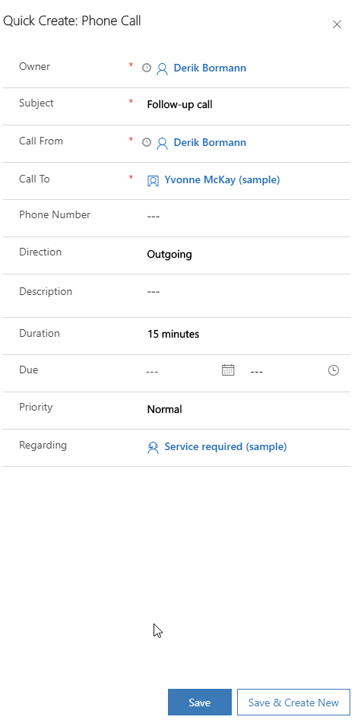
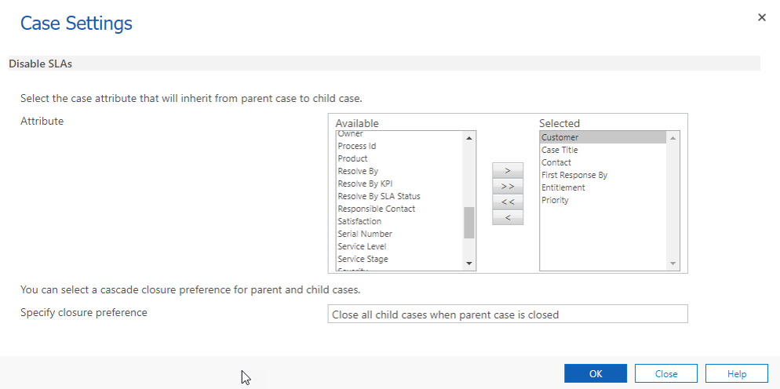
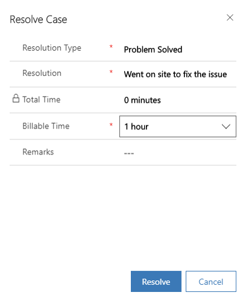
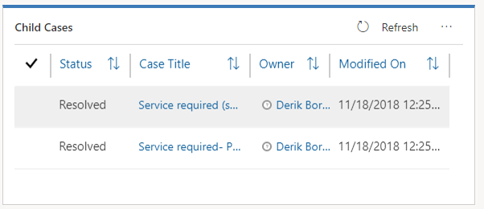

Dynamics 365 for Customer Service enables an organization to service their customers in many ways depending on the specific needs of the customer, the organizations service model, and other determining factors. One of the main features of the customer service solution is its case management capabilities.

The purpose of this hands-on-lab is to introduce working with Dynamics 365's case management features including, using Customer Service Hub, working with parent child cases, and merging cases.

### Learning Objectives

At the end of these exercises, you will be able to accomplish the
following:

-   Configure case parent / child settings

-   Use Customer Service Hub to identify any High Priority Phone cases.

-   Work with Parent/Child Cases

-   Merge two cases together.

**Estimated time to complete this exercise: *15 to 20* minutes**

### Before we Begin

The first thing that we want to do is configure Dynamics 365's parent child Case settings to allow us to be able to add some child cases. We want to ensure, that when parent cases are closed, all child cases will be closed as well. Before this can happen, we need to ensure that this behavior is configured.

***Configure parent/child Case settings:***

1. On the main application **Navigation Bar**, click the **Module Drop Down Selector** and then **Settings.**
2. From the **Settings** entity, click **Service Management**.
3. Select **Parent and Child Case** **Settings** under the **Case Settings with Record Creation and update Rules** section. 
4. From the **Available Attributes** box, verify the following attributes are selected: **Case Type, Case Title, Contact, First Response By, Entitlement,** and **Priority.**
	- Select the value then click the **\[\>\>\] button** to add it to the **Selected Attributes** list.
5. Check the **Specify closure preference** box and select the **Close     all child cases when parent case is closed** option for easily closing similar cases.
6. Click **OK** to save the parent/child case settings.

### Scenario

You work of a company that provides help desk support for its customers. Your Organization, uses Dynamics 365's Customer Service Hub to manage your daily activities and caseloads. At the beginning of your shift, you were told that the company is falling behind on the Phone Support cases lately. You need to make getting caught up a phone support cases a priority. You need to start with the high priority phone cases first.

### High Level Steps:

-   Use Customer Service Hub to identify any High Priority Phone cases.
-   Add a Phone Call follow-up activity to a case.
-   Add a child case for an existing case.
-   Use a knowledge article to resolve a case.
-   Close a parent and child case.
-   Merge two cases together.

### Detailed Steps:

#### Use Customer Service Hub to identify high priority cases:

1. In Customer Service Hub, click the Site Map icon, and select > Dashboards.
2. Click the down arrow next to the this quarter data range, and > select custom period
3. Set the period as follows:
	- Start Date: 1/1/2018
	- End Date: 12/31/2018

4. Click Apply.
5. On the command bar click the Show Visual Filter button.
6. Locate the Case Mix (By Origin) chart and select the Phone slice.
7. In the Cases by Priority chart, select the High Category.
8. Locate the Service Required (Sample) case, click the down arrow to verify the customer is Fourth Coffee (sample).
9. Select the Service required (sample) case to Open it.

10. On the record Timeline, click the Add Info and Activities button
11. Select Phone Call from the menu
12. Complete the Phone Call as follows:

- Subject: Follow-up call
- Call From: "Your user record"
- Call to: Yavonne McKey (sample)
- Direction: Outgoing
- Duration: 15 Minutes
- Priority: Normal
- Regarding: service required (sample)

13. Click Save to save the activity
14. Close the Service required (sample) case for now.

#### Create a child case from existing case:

As you are working on this case, Yvonne also mentions that she is unable to verify that any solution you work on will work, since she is unable to log in. She needs to have her password reset for this item. You need to capture this in a child case.

1. On the command bar, click Create Child Case and then click Save.
2. Complete the child case as follows: 
	- Case Title: Service required -- Password Reset 
	- Case Type: Problem 
	- Origin: Phone

3. Click Save
4. To view child cases, select Case Relationships tab.

5. Under the Child Cases sub grid, click the Service required -password reset case to open it.
6. Select Detail Tab, the parent case will be shown under the Additional Details section.
7. Navigate back to the parent case by clicking the Service required (sample) case hyperlink. 
8. On the RELATED section, select the Knowledge Base Search icon. 
9. Select an Article from the article suggestions and click the Link Icon.

10. Select the Case Relationships tab.
11. Verify the article you linked to is displayed in the Associated Knowledge Records sub-grid
12. On the Phone to Case Process flow, click Next Stage until you are at the Resolve stage.
13. On the Resolve stage, click Finish. 
14. Click the Resolve Case button to resolve the parent case. 
15. Click Confirm to reiterate your decision to resolve the case.
16. Within the Resolve Case window, type Went on site to fix the issue for the Resolution.
17.  Change Billable Time to display 1 Hour.
18.  Click Resolve to resolve the parent case along with all related child cases.

19. Click the Case Relationships tab to verify that any child cases are also resolved.

#### Merge Duplicate Cases

You are discussing some open Cases with a colleague and realize that you are both working on the same issue for the same Customer. As you do not want to have duplicate Case information in your system, you decide to merge the Cases.

1. From the site map, Select the Wrench Icon to display Cases.
2. In the Search bar type Product
3. Click the check mark and hold down the Ctrl key to select these cases:
	- Product catalog requested (sample)
	- Product question (sample)
	- In the ribbon, click Merge Cases.
5. In the Merge Cases window, click the check mark next to the case named Product catalog requested(sample) to set it as the primary case and click Merge.
6. Click OK.
