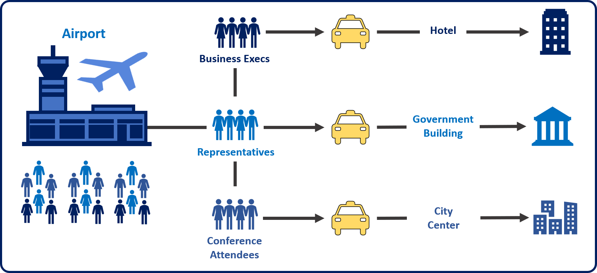
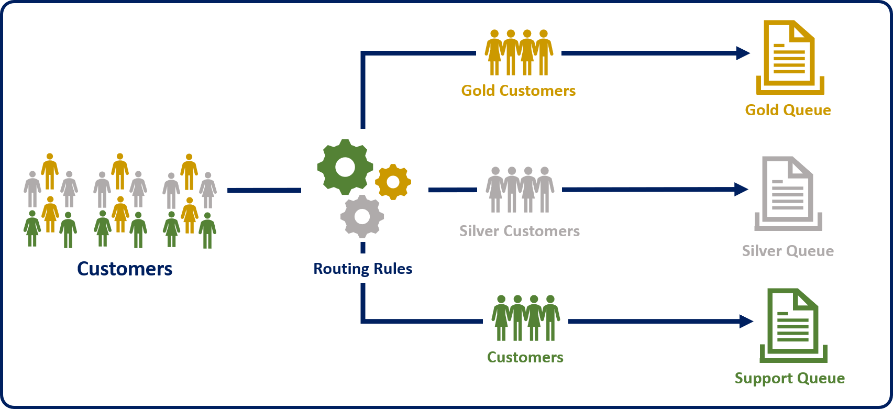
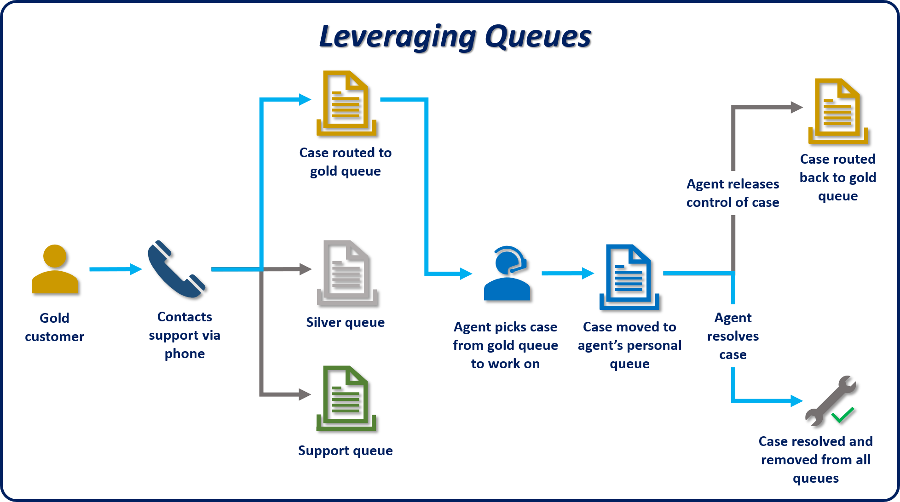

Customers expect that their requests or issues will be handled in an organized and timely manner. Imagine that you're waiting for a cab at a hotel, and there's a long line of other people who are also waiting for cabs. If everyone is competing for the same cab, the result will be chaos. Therefore, to better manage lines of cab riders, hotels often use a queue system, where an organized line is formed. As a resource (cab) becomes available, a rider or group of riders gets a cab and leaves for its destination in a timely manner.

The same concept can be applied to customer issues, questions, and requests. Many customer support centers use queues to manage the routing of cases that come in.

For example, a customer who has bought a gold support contract is typically entitled to a different level of service than a customer who hasn't bought a support contract. To help guarantee that gold customers get the level of service that they're paying for, you can use routing rules to direct cases that those customers submit to a gold service queue. That queue might be staffed by senior support agents who focus solely on gold customer support. All other customers can be sent to a standard support queue that has a larger volume of cases in it. Both types of customers are still being supported, but gold customers will probably get support faster, because they're in the higher-priority gold queue.

Microsoft Dynamics 365 uses queues to manage work items like cases, activities, or other record types.

Several types of queues are available in Dynamics 365:

- **Public:** These queues are visible to the whole organization.
- **Private:** The queues are visible only to users who have been designated as queue members.
- **Personal:** These queues are associated with a specific user or team, and are visible only to that user or team.

Public and private queues are created to support an organization's needs. By default, personal queues are automatically created when a new user or team is defined. They route important activities and records that are assigned to a specific user or team. Additional queues can also be used to support service management in a team-based collaborative environment.

Cases can be routed to queues in several ways. For example, an agent can manually put a case into a specific queue. But an organization that's taking in hundreds or thousands of cases a day might find that process too labor-intensive. Therefore, in most instances, cases are routed to queues as part of an automated service management process. This process will be covered in a later unit.

The following image shows a typical example of how queues can be used in Dynamics 365.

1. A gold customer opens a new case by calling in to support.
2. The case is routed to a gold queue.
    - Records in the gold queue are visible only to members of that queue.
3. An agent picks the item from the queue to work on it.
4. The item is put into the agent's personal queue.
5. After the agent resolves the case, it's removed from his or her personal queue.
    - If the agent can't finish the work on the queue item, he or she can release the item. It will then be put back into the gold queue, so that another agent can work on it.
Over the remaining units, we'll examine, in more detail, the role that queues play in case management. For example, you'll learn how to create queues, work with the items in them, and create automation rules that route cases to them.
