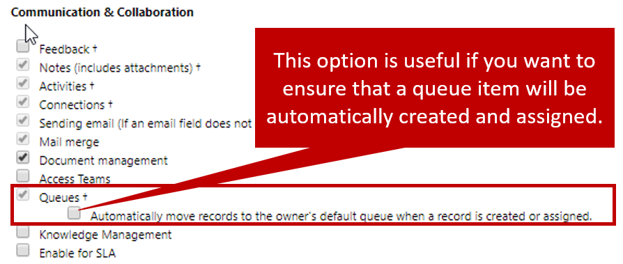

Out of the box, queues are preconfigured only for cases and activities. They provide tremendous value for specific business scenarios in Microsoft Dynamics 365. You can use queues to enhance and streamline sales-related activities, or to provide better and faster processing of inspections, paperwork, or applications.

Here are some of the scenarios where queues can be applied:

- **Sales enhancement:** A sales manager can route new leads to a public *Inquiry* queue. Each lead in that queue can then be inspected and routed to the account executive who's most qualified to work on it.
- **Claims processing:** An insurance company can route insurance claims to different queues, depending on the type of claim that's being filed (for example, home, auto, or business). A claims agent who specializes in one of those claim types can then select a claim to work on, and move it to his or her personal queue.
- **Approval processing:** A loan officer can route loan applications to a different manager's queue, depending on the type of loan that's involved. The manager can then either approve or reject the loan, and can move it back either to the loan officer's personal queue or to a public *Approved* queue.

Regardless of the business reason, the ability to route records from one queue to another helps organizations manage the operational aspects of their business as it relates to their strategy for customer relationship management.

Most record types can be routed to queues in Dynamics 365. But for entities other than cases and activities, the capability to use queues isn't turned on by default. To let other entities use queues, you must do a simple customization.

> [!IMPORTANT]
> Because system customization is required to set up other entities for queues, you must have the appropriate customization privileges in your Dynamics 365 organization.

For more about Dynamics 365 security roles, see [Security roles and privileges](https://docs.microsoft.com/dynamics365/customer-engagement/admin/security-roles-privileges).

## Set up an entity to use queues

To set up an entity to use queues, you must go to **Settings** \> **Customizations** \> **Customize the System**. After you're in the default solution, select the entity that should be able to use queues. Then, under **Communication & Collaboration**, you'll see an option to turn on queues. You can also define whether a queue item should be created automatically and moved to the personal queue of the record's owner. This functionality can be handy if you know that the person who creates the record will be responsible for it, and you want to make sure that the item won't appear in queues that it shouldn't be in.

After you've finished setting up the entity to use queues, you must save and publish your changes before records of that type can be routed to queues.

> [!VIDEO https://www.microsoft.com/videoplayer/embed/RE2IJmo]

> [!IMPORTANT]
> After you set up an entity to use queues and save your changes, you can't turn queues back off. But you can choose not to use queues for that entity.
