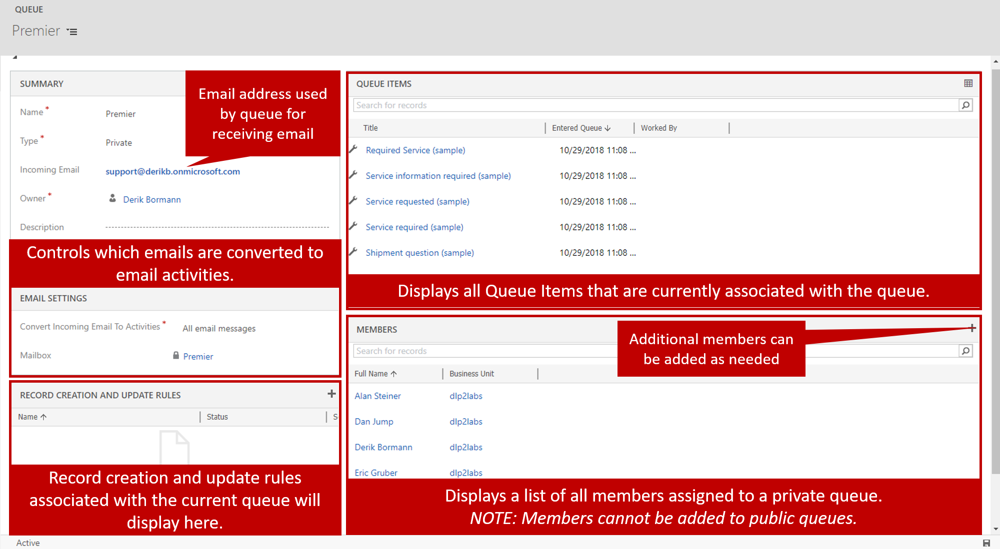

When an organization is ready to start using queues, they can be created based on specific organizational needs. Before you add queues to an organization, take some time to consider the total number of queues that will be needed and what they will be used for.

To create queues, go to **Settings** \> **Service Management**, and select Queues from case settings with record creation and update rules section. When a new queue is created, the name and queue type are required. You can specify other information too, but the queue can't be saved unless those two properties are defined.

Different types of queues are available:

- **Personal:** These queues are associated with a specific user or team. They're created by the system.

    - Personal queues are automatically created by the system when a user or team is added to Dynamics 365. They can't be created manually.
    - Membership in the queue can't be edited manually. By adding and removing team members, you adjust membership for queues that are associated with a team.

- **Public:** All users can see and access these queues, depending on their security role.

    - Users pick items from the queue. The items that a user picks are then moved to that user's personal queue.

- **Private:** Access to these queues is assigned to specific users. (Members are defined on the queue record.)

    - Users pick items from the queue. The items that a user picks are then moved to that user's personal queue.

## Email considerations

If a queue will receive email, it must have an associated email alias. That email alias must be associated with a working mailbox record in Dynamics 365. System settings can be used to specify whether a queue that has an email alias is approved to accept incoming email items.

For more about setting up Dynamics 365 mailboxes, see [Connect Dynamics 365 (online) to Exchange Online](https://docs.microsoft.com/dynamics365/customer-engagement/admin/connect-exchange-online).

In addition to specifying a mailbox record for a queue, you can define which emails that come into the queue will be converted to email activities.

You have several options:

- All email messages
- Email messages in response to Dynamics 365 email
- Email messages from Dynamics 365 leads, accounts, or contacts
- Email messages from Dynamics 365 records that are email enabled

This setting is important, because it specifies what will be defined as email activities, and email activities are what can be automatically converted to case records in the system. For example, a support queue might receive email messages from customers that are in your Dynamics 365 application, but it might also receive email from no customers. In this scenario, you might want to use the *All email messages* setting.

> [!IMPORTANT] 
> Before a queue can receive email, the mailbox that's associated with the queue must be approved and turned on. In this way, you indicate that it's OK for the mailbox to receive email, and that it's ready to do so. Select the **Open Mailbox** button on the command bar, select **Approve Mailbox**, and then select the **Test and Enable** button.

For more about approving and turning on mailboxes, see [Approve email](https://docs.microsoft.com/dynamics365/customer-engagement/admin/connect-exchange-online#approve-email).

After a queue is saved for the first time, if it has been designated as a private queue, you can define its members. Only the members that you assign to a private queue can work with it. Additionally, when items are routed to the queue, you can see which items are in the queue. You can also see any record creation and update rules that are associated with the queue.

For more about record creation and update rules, see [Set up rules to automatically create or update records](https://docs.microsoft.com/dynamics365/customer-engagement/customer-service/set-up-rules-to-automatically-create-or-update-records).

After a queue is created, it has a status of *Active*. If the queue won't be used for some reason, you can inactivate it. If you find that the queue is needed again later, you can reactivate it.

> [!IMPORTANT] 
> Queues can be deleted only if there are no queue items in them. All items in a queue must be removed (finished, deleted, or moved to another queue) before the queue can be deleted.

> [!VIDEO https://www.microsoft.com/videoplayer/embed/RE2IOG3]

For more about creating Dynamics 365 queues, see [Create a queue (Customer Service Hub)](https://docs.microsoft.com/dynamics365/customer-engagement/customer-service/set-up-queues-manage-activities-cases#create-a-queue-customer-service-hub).

After a queue is created and members are assigned to it, it's ready to be used to help organize information, and cases can be routed to it.
