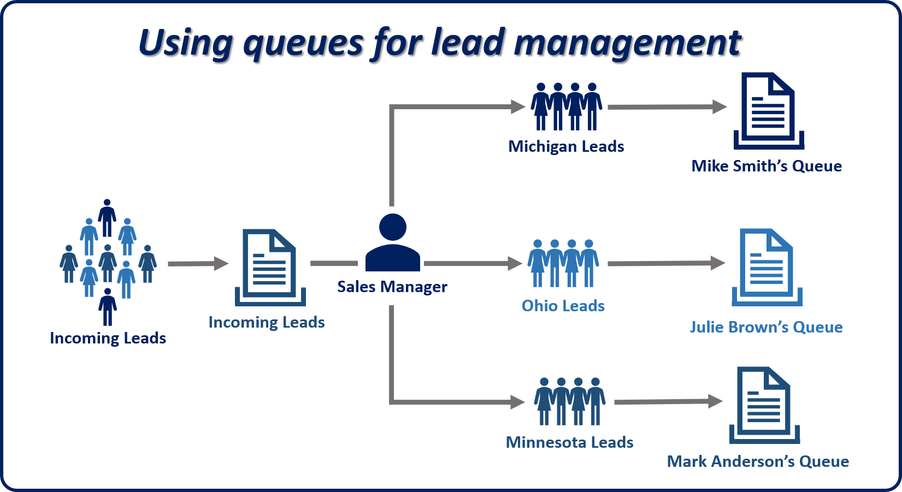
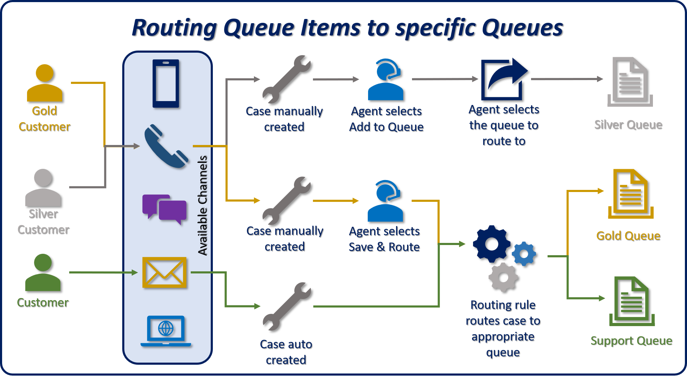
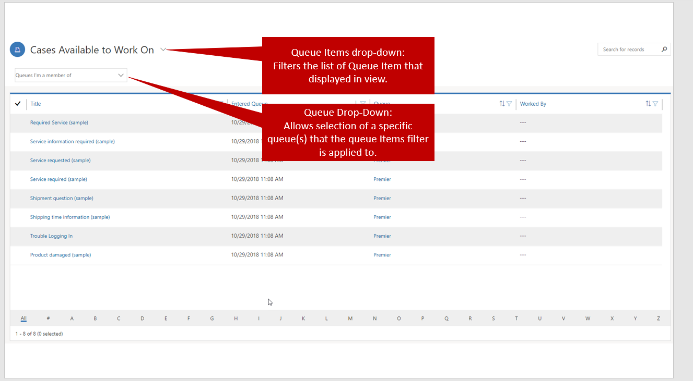
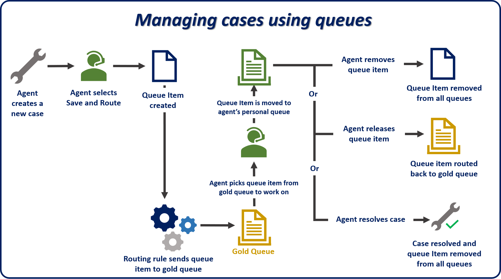

As we mentioned in Configuring Entities and Queues, most record types can be set up to use queues in Microsoft Dynamics 365. But only cases and activity record types are preconfigured to support queues. After a record type is set up to use queues, items can be put into queues.

Organizations can use personal, private, and public queues to support their sales and service processes. For example, a sales manager might route leads to a public queue, inspect the queue items, and select some of them to be routed to a user's personal queue. By routing records from one queue to another, organizations can manage the operational aspects of their business as it relates to their strategy for customer relationship management.

> [!NOTE] 
> The preceding image provides a visual for the example that's described earlier. Although the primary focus of this module is using queues for case management, remember that queues can be used to support multiple sales-related or service-related scenarios.

## Queue items

When a record like a case or an activity is routed to a queue, a separate record called a *queue item* is created. A queue item is a representation of the case, activity, lead, and so on, in the queue. Basically, there's a one-to-one relationship between the queue item and the record that it's associated with (for example, the previously mentioned case, activity, or lead).

Queue items are what agents see in the queue, and they're what agents use to select and work on specific records.

> [!IMPORTANT] 
> A record (for example, a case) can have a queue item in only one queue at a time. 

Queue items for case records can be created and put into a specific queue in multiple ways:

- **Manually:** The agent selects the **Add to Queue** or **Save & Route** button on the command bar.
    - **Add to Queue:** The agent manually selects the queue to route the record to.
    - **Save & Route:** Dynamics 365 uses predefined routing rules to evaluate details in the case and route it to an appropriate queue.

- **Automatic:** When a case is automatically created, Dynamics 365 automatically applies predefined routing rules to evaluate details in the case and route it to an appropriate queue.

> [!IMPORTANT]
> Automatic routing applies only if a case is created automatically (for example, by a workflow, a record creation rule, or Microsoft Flow).

> [!NOTE] 
> Defining routing rules will be discussed in more detail in Routing Rule Sets.

## Working with queues and queue items

To work with queues, agents must first open them. They can use either the site map or a dashboard stream that has been set up to show a queue. The site map is the most common method for opening queues.

The queue items grid behaves differently than other grids in Dynamics 365. It offers two options for filtering the data in it:

- **Queue Items drop-down list**: You can filter by the properties of queue items. For example, you can filter for cases that you're working on, cases that are available to be worked on, or all items.
- **Queue drop-down list:** You can select the queue that the filter will be applied to. For example, you can apply the filter to all queues, all public queues, or a specific queue.

These drop-down lists work together to determine which queue items will be shown in the grid. Therefore, agents have the flexibility to make sure that they see what's needed.

For example, if you select *Items I am working on* in the **Queue Items** list and *Gold* in the **Queue** list, the grid will show only cases from the gold queue that you've picked to work on.

After queue items have been put into a queue, agents have several options that they can use to manage them.

## Work on and Pick buttons

Each queue item has a **Worked By** field that's used to assign working responsibility for the queue item to a user. When a specific user or team works on a queue item, the value in the **Worked By** field refers to the queue item only. The owner of the underlying record isn't affected. The case itself keeps the same owner. If an agent can't finish the necessary work on an item, he or she can release the item.

## Removing queue items

Queue items can be *removed* from a queue at any time by users who have sufficient security permissions. When an agent removes a queue item from a queue, the associated record (for example, a case) isn't affected. Only the queue item is removed.
> [!IMPORTANT] 
> Don't confuse the remove with the delete action.
- **Remove:** This action just removes the queue item from the queue.
- **Delete:** This action removes the queue item from the queue **and** deletes the original record (for example, a case).

## Releasing queue items

Releasing a queue item from a queue removes the name of the person who's currently working on the queue item record.

For example, Connie Watson will be on vacation for two weeks. Although she can give her Coho Winery cases to a specific agent, she can also release the cases, so that other people on the Tier 1 support team that manages the queue can work on them. In this example, Connie will release the cases and remove her name as the person who works on them. Now, anyone who has access to the Tier 1 support queue will see that the cases are available and can start to work on them.

Now that we've discussed the mechanics, look at the following image to see a typical case resolution process that uses queues.

> [!VIDEO https://www.microsoft.com/en-us/videoplayer/embed/RE2IJmr]
