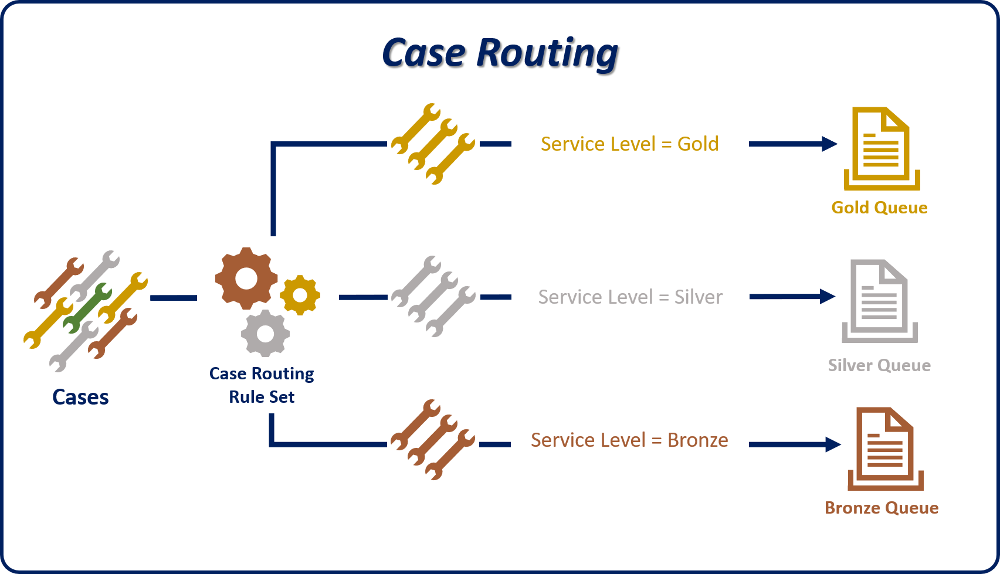
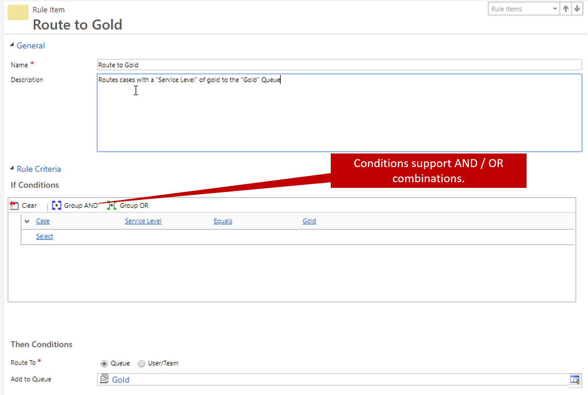
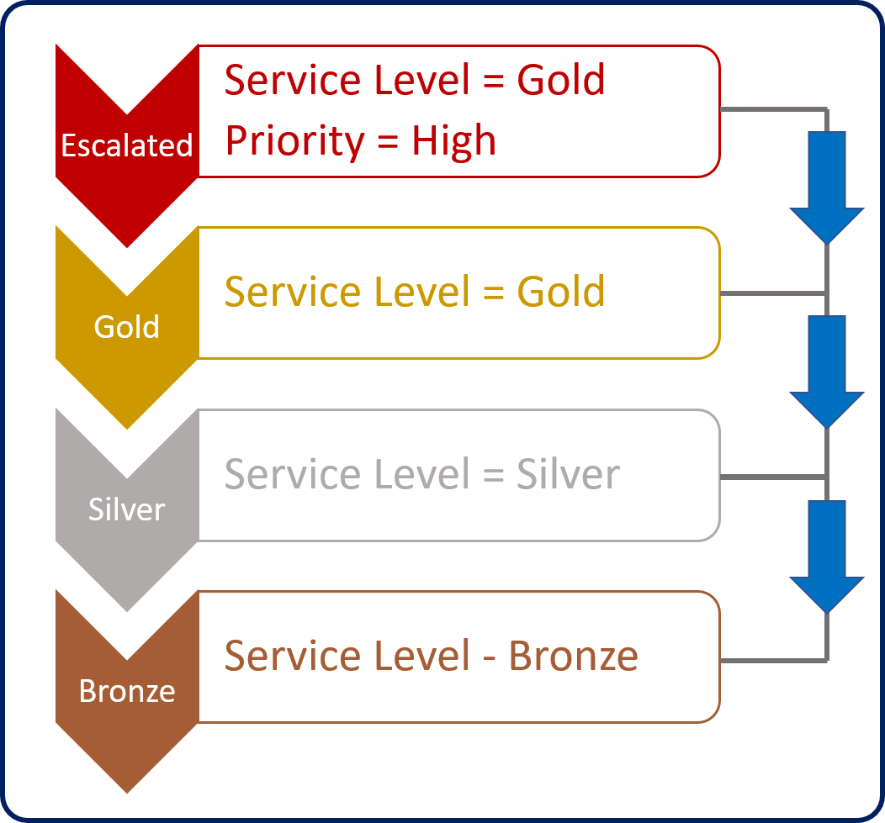
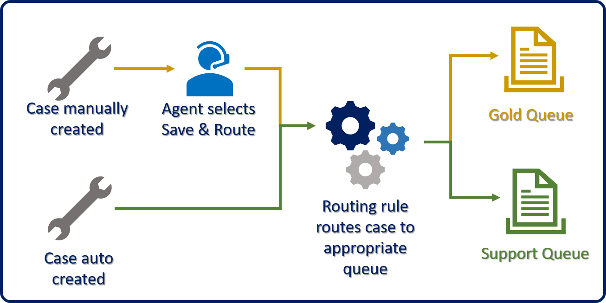

Although queue items can be manually assigned to queues, it's often more efficient to use predefined logic to put items into queues. For example, if an agent marks a case for escalation, the case should be routed to the appropriate escalation queue.

Microsoft Dynamics 365 lets you create predefined routing rule sets that route cases to different queues, based on logic that's defined in the rule set. To define routing rule sets, go to **Settings** \> **Service Management**, and select **Routing Rule Sets**.

Routing rule sets are associated with the case entity. Although you can set up the same type of behavior for other entities that are set up to use queues, that logic requires that some other automation scenario be used, like workflows or Microsoft Flow.

When a rule is first created, a rule name is required. After you define a name and save the rule, items can be added to the rule. Rule items define the "what" and "where" for the rule set. A routing rule set typically has multiple rule items that evaluate and route the case records in the system.

For example, a routing rule set named *Case Routing* might have the following rule items:
- **Gold route:** Route any case that has a service level of Gold to the gold queue.
- **Silver route:** Route any case that has a service level of Silver to the silver queue.
- **Bronze route:** Route any case that has a service level of Bronze to the bronze queue.

Each rule item has two sections: **If Conditions** and **Then Conditions**.

- **If Conditions:** Define the specific conditions that are used to determine whether the rule item applies.
    Conditions can evaluate fields from the case record, or from related records like the related account.
    Multiple AND or OR conditions can be used in a single rule item. (By default, conditions are AND conditions.)

- **Then Conditions:** Specify where the item should be routed to:
    - **Queue:** Route the item to a specific queue (public or private).
    - **User/Team:** Route the item to a specific user or team.

Rule items are applied in the order in which they're specified in the rule set. The first matching rule item that's found is applied to the case. The rule set doesn't evaluate the remaining rule items to try to find a better match. We highly recommend that you put more specific rule items higher in the rule set, so that they're checked first.

For example, in the following image, both the Escalated and Gold rule items refer to the Gold service level. Because the Escalated rule item has a priority of High, it must be evaluated before the Gold rule. Otherwise, the Escalated rule item would never be checked.

You can control the order that rule items are checked in by using the up and down arrows on the rule items sub-grid. After you've defined all the rule items for a specific rule set, you can activate the rule. After the rule is activated, you can't change it unless you first inactivate it.

> [!IMPORTANT] 
> Although you can define multiple rule sets in Dynamics 365, only one rule set can be active at a time. Make sure that enough rule items are defined in your rule set to cover all the possible routing scenarios that you need to support. 

After a routing rule set has been defined and activated, it can be applied to a case in one of two ways:

- **Manually, by using the Save & Route button:** When an agent selects the **Save & Route** button on the command bar, the routing rule set is applied, and the case is routed to the most appropriate queue.
- **Automatically when records are created:** When a case is automatically created (for example, by a workflow, a record creation rule, or Microsoft Flow), Dynamics 365 automatically applies the routing rule set, and the case is routed to the most appropriate queue.

> [!VIDEO https://www.microsoft.com/videoplayer/embed/RE2IJmA]
