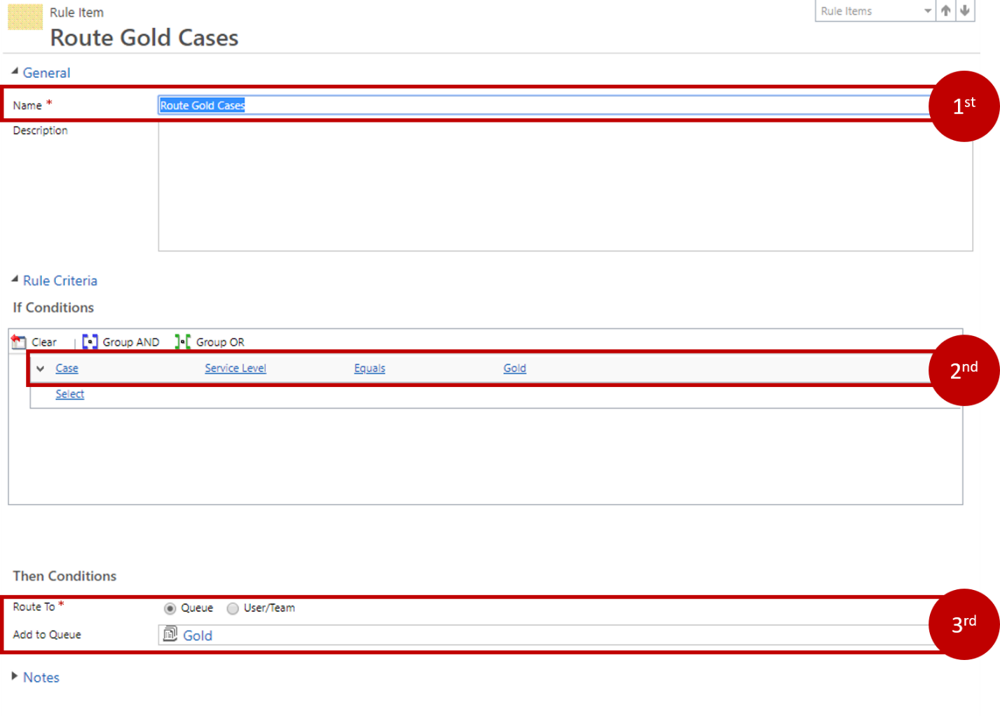
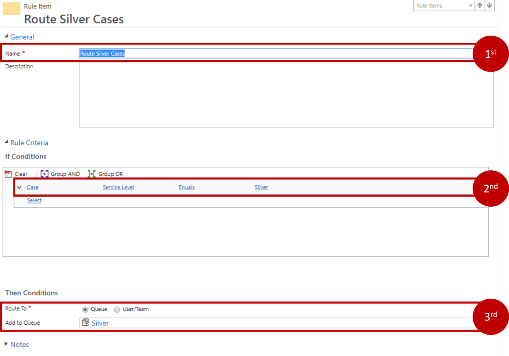
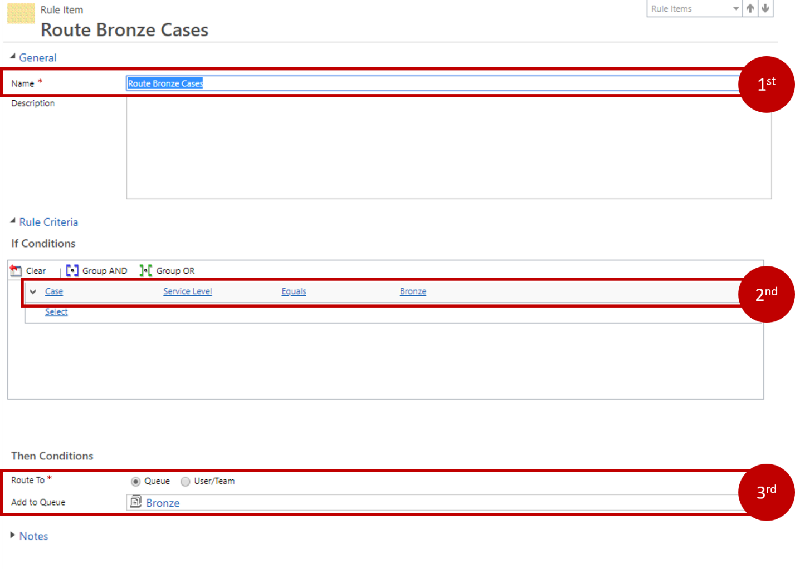
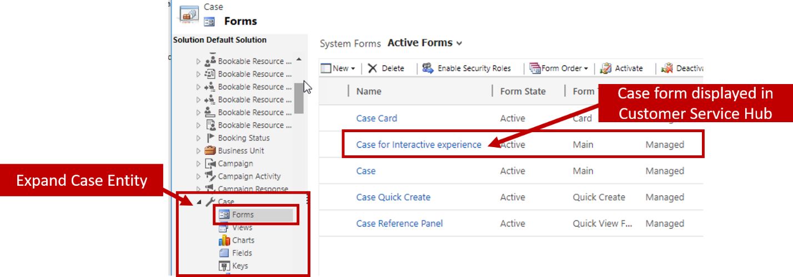
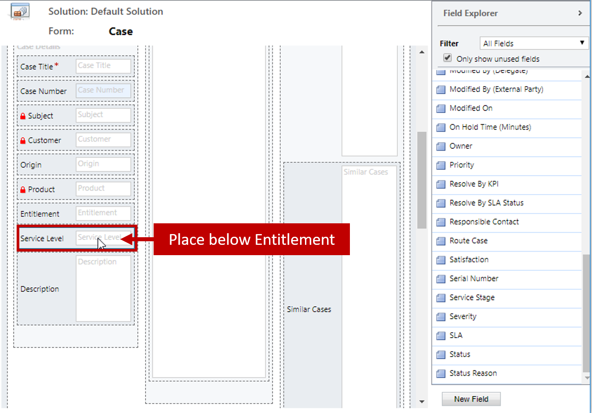
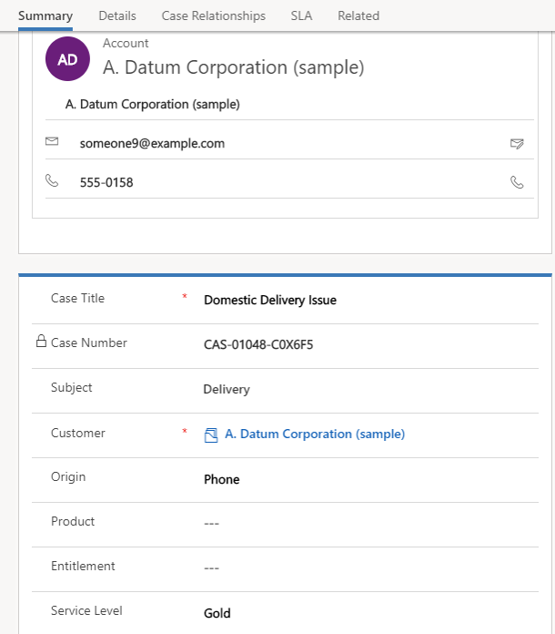
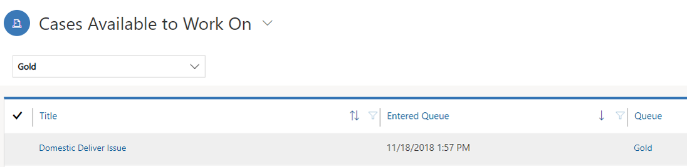

Lately there has been an influx of cases where there have been problems regarding specific cases that need to be escalated. You decide that it would be more efficient if cases were able to be routed into either the Gold, Silver, or Bronze queues based on the service level of the case.

## Learning Objectives

At the end of these exercises, you will be able to accomplish the
following:

-   Create a Routing Rule
-   Make necessary entity customizations needed
-   Consume the Routing Rule in the Application.

Estimated time to complete this lab: 15 to 20 minutes

### High Level Steps:

-   Create a case routing rule.
-   Create routing rule items by specifying criteria for:
    -   Routing gold cases to the Gold Queue
    -   Routing silver cases to the Silver Queue
    -   Routing bronze cases to the Bronze Queue
-   Verify the routing rule works properly.

### Detailed Steps:

#### Create a case routing rule:

1. If necessary, on the main application Navigation Bar, click the drop-down selector next to Dynamics 365 and then click Dynamics 365 - Custom.
2. From the Settings option, click Service Management.
3. Select Routing Rule Sets from the Case Settings with Record Creation and Update Rules section.
4. From the command bar, click New to create a new routing rule set.
5. Enter a new Routing Rule Set Name of Service Level Routing.
6. Click the Save button
7.  Under the Rules Items sub grid, click the [+] button to add a new item.
8.  For the Name field, type Route Gold Cases.
9.  Under the Rule Criteria section, add the If Conditions criteria:
    -   Select the Case entity.
    -   Choose the Service Level field.
    -   Set the operator to Equals.
    -   Set the value to Gold.
10. Under the Rule Criteria section, add the criteria for the Then Conditions:
    -   For the Route To field, click Queue.
    -   For the Add to Queue field, select the Gold queue.

Your completed rule item should resemble the image below:

11. Click Save and Close to complete the rule item.
12. Under the Rules Items sub grid, click the [+] button to add a new item.
13. For the Name field, type Route Silver Cases.
14. Under the Rule Criteria section, add the If Conditions criteria:
    -   Select the Case entity.
    -   Choose the Service Level field.
    -   Set the operator to Equals.
    -   Set the value to Silver.
15. Under the Rule Criteria section, add the criteria for the Then Conditions:
    -   For the Route To field, click Queue.
    -   For the Add to Queue field, select the Silver queue.

Your completed rule item should resemble the image below:

16. Click Save and Close to complete the rule item.
17. Under the Rules Items sub grid, click the [+] button to add a new item.
18. For the Name field, type Route Bronze Cases. 
19. Under the Rule Criteria section, add the If Conditions criteria:
    -   Select the Case entity.
    -   Choose the Service Level field.
    -   Set the operator to Equals.
    -   Set the value to Bronze.
20. Under the Rule Criteria section, add the criteria for the Then Conditions:
    -   For the Route To field, click Queue.
    -   For the Add to Queue field, select the Bronze queue.

Your completed rule item should resemble the image below:

21. Click Save and Close to complete the rule item.
22. Click Activate to confirm the activation.

#### Customize the Case for Interactive Display Form to display the cases Service Level.

1. Navigate to Settings \> Customizations \> Customize the System
2. In the Default Solution, expand Entities.
3. Expand the Case entity, and click forms
4. Open the Case for Interactive Experience Form

5. In Field Explorer, locate the Service Level field, and drag to place it below the Entitlement field on the form.

6. Click the Save Icon to save your changes to the form.
7. Click the Publish Icon to publish your changes to the form.
8. Close the bot the Case of Interactive Experience form and the Default solution.

#### Verify the routing rule works properly

1.  If necessary, on the main application Navigation Bar, click the drop-down selector next to Dynamics 365 and then click Customer Service Hub
2.  Using the Site Map, select the Wrench Icon to navigate to cases.
3.  On the command bar, click the New Case button.
4.  Complete the case as follows:
    -   Case Title: Domestic Delivery Issue
    -   Customer: A. Datum Corporation (sample)
    -   Subject: Delivery
    -   Case Type: Problem
    -   Origin: Phone
    -   Service Level: Gold

5.  Click Save.
6.  Click Save & Route button in the command bar.
7.  Click Route to confirm that you want to apply the new routing rule to that case.
8.  Using the Site Map navigate to Queues
9.  Under the Queue field, change the queue to Gold.
10. In the view selector, verify the view displays Cases available to Work On to all cases that could be selected from the queue.
11. You should see the Domestic Delivery Issue. case you just created in this queue.

