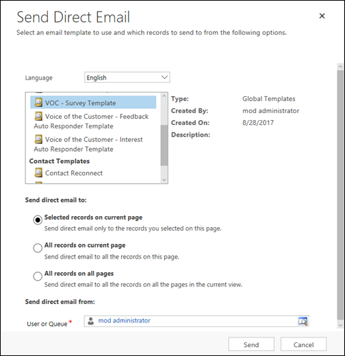
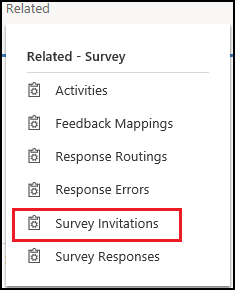
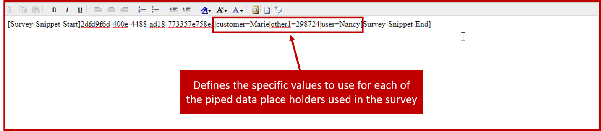
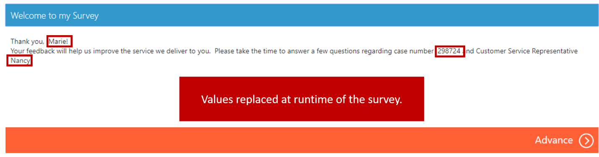

After a survey is published, it's ready for distribution. During the publishing process, Voice of the Customer creates both an anonymous survey link and an email snippet link. You can view both links in the **Invitations** section of the **Invitations and actions** tab on the **Survey** page. You'll use those links to distribute the survey to respondents.

Voice of the Customer supports the following options for distributing a survey:

- **Anonymous:** The URL for the anonymous link can be copied and pasted into any medium.

    - The survey must be set up for anonymous distribution.
    - Anonymous surveys can be set up to run in IFrames. (The functionality for running in IFrames must be turned on for the survey.)
    - The survey can be set up to automatically create leads from anonymous responses.

- **Non-anonymous:** The email snippet can be copied and pasted into an email.

    - The email snippet will create a unique link that's specific to the respondent. The link won't be visible until the email is sent.
    - The email snippet can be copied by selecting the **Copy snippet** button on the command bar.

- **Run in IFrame:** The survey can run embedded in an IFrame on another webpage.

    - You can set up this option in the **Invitations** section of the **invitations and Actions** tab.

Depending on the distribution option that you use, there are several ways to distribute a survey. The following table describes the available methods.

| Medium | Trigger | Invitation piped | Responses | Additional | Notes |
|--------|---------|------------------|-----------|------------|-------|
| Email template | Email | Direct email, workflow, campaign, email merge, manual email | Yes | Account, Contact, Lead, Regarding | An email template is required for each survey. |
| Email | Email | Workflow, campaign, quick campaign, manual email | Yes (Workflows) | Account, Contact, Lead, Regarding | |
| Invitation only | For subsequent use with any media | Any | Yes (Workflows) | Account, Contact, Lead, Regarding | This method is useful for integration with third-party email providers. |

## Distributing a survey to anonymous respondents

When you set up a survey to allow anonymous respondents, you can copy the URL for the survey's anonymous link and paste it into the medium that you want to use to send the survey. The anonymous link can be sent in an email, posted on social media sites like Twitter or Facebook, or published on your website.

Remember: When you distribute a survey anonymously, Microsoft Dynamics 365 won't associate responses from the survey with a customer record in Dynamics 365. But it's possible to create leads from an anonymous response. Just set the **Create lead for anonymous responses** field to *Yes* in the **Responses** section of the **Invitations and actions** tab on the **Survey** page.

For more information about distributing surveys to anonymous respondents, see [Distribute a survey to anonymous respondents](https://docs.microsoft.com/dynamics365/customer-engagement/voice-of-customer/distribute-survey#distribute-a-survey-to-anonymous-respondents).

## Distributing a survey to non-anonymous respondents

For non-anonymous surveys, the link that you send is unique to each respondent. Dynamics 365 generates the URLs when you create a survey invitation or embed the survey snippet in an email.

The snippet consists of the following elements:

1. A place holder the designates the start of the survey URL: [Survey-Snippet-Start]
2. The ID of the survey:  2dfd9f6d-400e-4488-ad98-973365e758ea 
3. A place holder the designates the end of the survey URL: [Survey-Snippet-End]  

An example snippet included in a survey invite might look like this: [Survey-Snippet-Start]2dfd9f6d-400e-4488-ad98-973365e758ea[Survey-Snippet-End].  

When a respondent opens the survey invitation or email that includes the snippet, the snippet will be replaced by an actual link to the survey. This link will be presented as a text-based link and will use the invitation link text that's specified in the survey.

> [!IMPORTANT]
> The snippet won't be replaced by a link until the survey invitation is sent.

For more information about distributing surveys to non-anonymous respondents, see [Distribute a survey to non-anonymous respondent](https://docs.microsoft.com/dynamics365/customer-engagement/voice-of-customer/distribute-survey#distribute-a-survey-to-non-anonymous-respondents).

## Sending an invitation by using an email template

You can also send surveys to respondents by creating an email template that includes the survey snippet. You can then use the template to send email to Dynamics 365 contacts. To [send direct email](https://docs.microsoft.com/dynamics365/customer-engagement/basics/send-bulk-email-customers) to a contact in Dynamics 365, select the survey email template in the email template list.

## Creating a survey activity or survey invitation

By creating a survey activity or survey invitation, you can create personalized invitation links that are distributed by a non-Dynamics 365 email program. These personalized invitation links have the following advantages:

- You can add piped data to the survey.
- You can provide additional information that's associated with the survey invitation by setting these fields:

    - The **Regarding** field.
    - Any out-of-box fields on the survey activity, like **Stage** or **Reminder**.
    - Any additional custom fields for the entity.

- The activity isn't an email activity. For example, the survey might be a telephone survey.

To create survey invitations, select **Survey Invitations** on the **Related** tab.

Survey invitations are also automatically created when you create an email activity that includes the survey snippet.

## Personalizing invitations by using piped data

If your survey includes piped data to personalize it, ensure that it is included in the survey by customizing the snippet to include references to the piped data contained in the survey.  To personalize your survey invitation in a Dynamics 365 email, make sure your survey snippet contains piped data, and then add a vertical bar (|) (also called a pipe), plus the parameters after the GUID, in your email invitation.

The syntax to insert piped data in a survey snippet:

`[Survey-Snippet-Start][ID]|[PIPE_NAME]=[PIPE_VALUE][Survey-Snippet-End]`

For example, a survey has piped data for *Customer*, *User*, and *Other 1*, which you use for the case number. When you create the welcome text for the survey, it might resemble this example:

`Thank you, _CUSTOMER_PIPED_DATA_! Your feedback will help us improve the service we deliver to you. Please take the time to answer a few questions regarding case number OTHER_1_PIPED_DATA_ and Customer Service Representative USER_PIPED_DATA_.`

In the email invitation, you must add the piped data field, followed by an equal sign (`=`) and then the value that should be used. You can add multiple parameters. Just separate them by pipes (`|`).

Here's what the email snippet that's included in the survey invitation will look like for this example:

`[Survey-Snippet-Start]bd3b2cc6-3597-e511-80bd-00155db50802|customer=Marie|other1=298724|user=Nancy[Survey-Snippet-End]`

Here's what the welcome text will look like when the respondent starts the survey by using the snippet link:

Thank you, Marie! Your feedback will help us improve the service we deliver to you. Please take the time to answer a few questions regarding case number 298724 and customer service representative Nancy.

> [!NOTE] 
> Only eight piped data placeholders are available:
>
> - User
> - Product
> - Service
> - Customer
> - Location
> - Date Time
> - Other 1
> - Other 2
>
> Because piped data placeholders aren't tied to specific data until the values are defined in the snippet, they don't have to be replaced by the data that they describe. For example, if you aren't using any date or time information in a survey, you can use the Date Time placeholder for different data, like location information.

For more information about personalizing survey invitations, see [Personalize survey invitations](https://docs.microsoft.com/dynamics365/customer-engagement/voice-of-customer/distribute-survey#personalize-survey-invitations).
