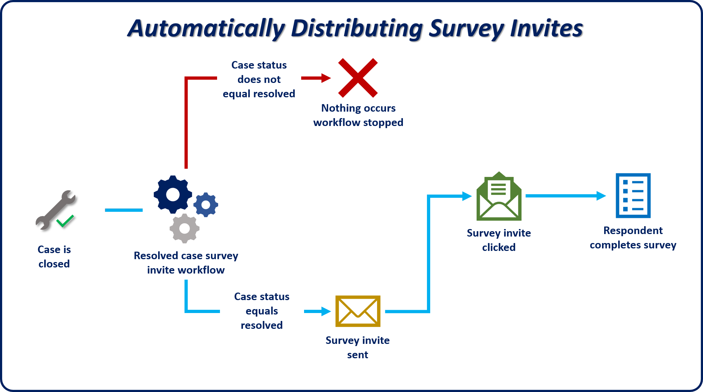
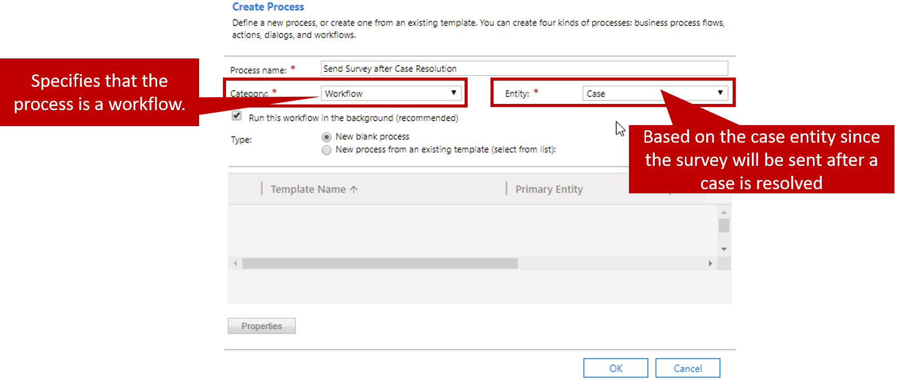
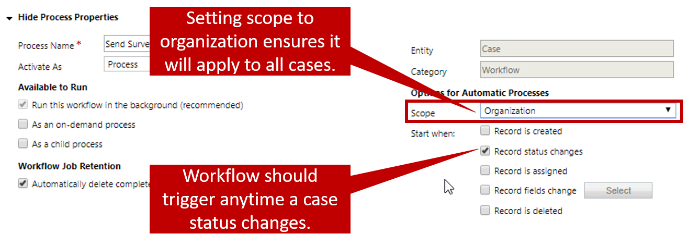
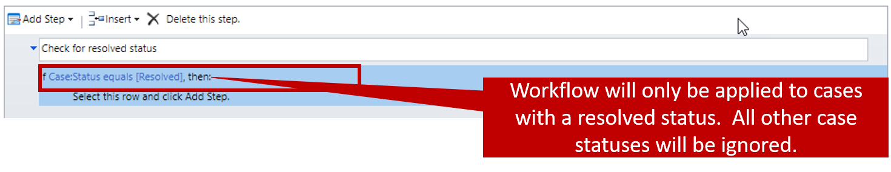
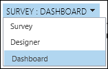
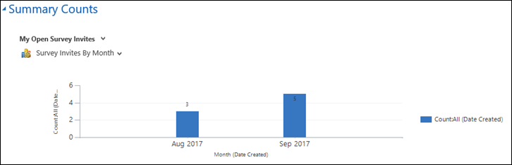

Sometimes, it might make sense to create survey invitations manually or by using a template. Often, though, it isn't viable to manually define specific values for every piped data placeholder. Instead, it might make more sense to automate the process of sending survey invitations.

For example, an organization wants to send a satisfaction survey to customers after every case is closed, to gather feedback. In this situation, the organization can use either the workflow feature in Microsoft Dynamics 365 or Microsoft Flow to automatically send an email when a customer service representative closes a case.

The first step is to define a workflow in Dynamics 365 and associate it with the case record. This workflow will be triggered whenever a case's status changes. Go to **Settings** \> **Processes**, and create a new process that belongs to the *Workflow* category and is associated with the *Case* entity.

The following image shows an example.

The next step is to define the trigger that will cause the workflow to run. For our example, we want to send the email whenever a case is closed. Therefore, set the workflow to start when the record status changes. Additionally, to help guarantee that the workflow runs every time a case is resolved, regardless of the case owner, set the scope of the workflow to *Organization*.

You might want to send the customer satisfaction survey only if a case is resolved. If a case is canceled, you might want to send a different survey. In this scenario, you can define a condition that specifies which record status the workflow should be applied to. For example, in the following image, a *Check Condition* step looks to see whether the status of the case is *Resolved*.

Because we want the email that's sent to include the survey snippet, the next step is to add a *Send Email* step to the workflow. You can select **Set Properties** to set up the email. In the body of the email, enter the message text together with the survey snippet.

If your survey includes piped data, include the piped data values in the snippet to help guarantee that they're filled in at runtime. If you want the piped data values to be filled in dynamically from Dynamics 365, you can use the Form Assistant to specify the fields that should provide the values.

After the workflow is activated, a survey link will be sent to specific customers after cases that they opened have been resolved by an agent.

For more information about automatically sending survey invitations, see [Automatically send survey invitations](https://docs.microsoft.com/dynamics365/customer-engagement/voice-of-customer/distribute-survey#automatically-send-survey-invitations).

For more information about creating workflows, see [Use Workflow processes to automate processes that don't require user interaction](https://docs.microsoft.com/dynamics365/customer-engagement/customize/workflow-processes).

## Tracking survey invitations

As you send out survey invitations to respondents, you can use the **Survey** dashboard to track them. This dashboard provides a combination of views and charts that you can use to look at the results that you're interested in. You can also create your own personal, customized view to look at the results.

On the dashboard, select a view in the view list and a chart in the chart list. For example, select My Open Survey Invites as the view and *Survey Invites By Month* as the chart. The corresponding chart is then shown.

> [!VIDEO https://www.microsoft.com/videoplayer/embed/RE2JyCH]

For more information about tracking survey invitations, see [Track survey invitations](https://docs.microsoft.com/dynamics365/customer-engagement/voice-of-customer/distribute-survey\#track-survey-invitations).
