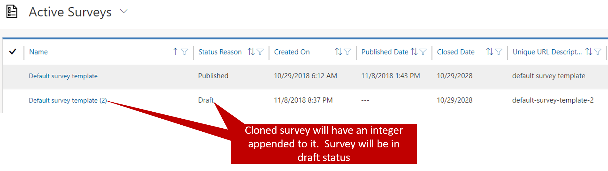
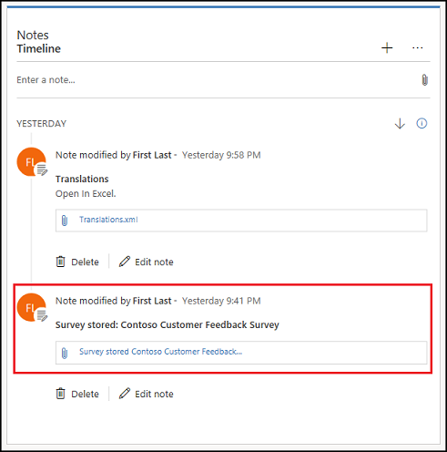
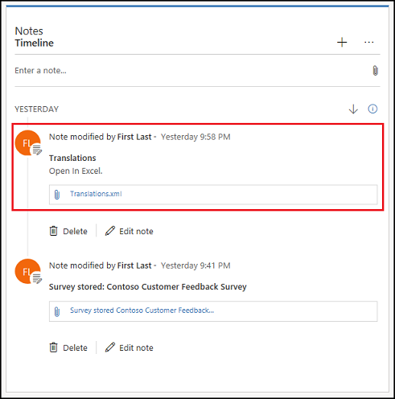

The process of designing and deploying surveys can be very time-consuming, depending on the specific data that you're capturing, the number of questions, the complexity of routing responses, and other factors. When you need a new survey, you can often save lots of time by repurposing or reusing a previous survey. For example, you recently created a survey for the launch of a new product. In three weeks, your organization will launch a similar product and wants to capture much of the same type of information. In this situation, you can clone or import the existing survey.

Another challenge that you might face is making sure that your survey is available in all the languages that the respondents who will take it require. Voice of the Customer provides several options for not only importing surveys into environments but also translating them.

## Cloning or importing an existing survey

By reusing existing questions and sections, you avoid having to create the same questions multiple times for different surveys. You have several options, depending on whether you want to include all or part of an existing survey in your new survey:

- **Import section:** Reuse only a specific section from another survey in the new survey.
- **Clone survey:** Create a survey that's exactly like another survey, except for some minor changes.
- **Import survey:** Move a survey from one environment to another.

You can use any of these three options, depending on your specific needs. But keep in mind that, regardless of whether you're importing a survey or cloning it, the size of the survey is limited to 1 megabyte (MB).

### Cloning a survey

When you clone a survey, you create a duplicate that differs from the original only in the name. To clone a survey, select the **Clone** button on the command bar. By default, the name of the new survey will be the name of the original survey with an integer appended. You can change the name as needed.

Before you can clone a survey, it must be published. You can't clone a survey that's in *Draft* status.

When the new survey is created, it will be in *Draft* status. After you've made the necessary changes, you can publish it just like any other survey.

Although the new survey will have all the same data as the survey that it was cloned from, the two surveys aren't linked to each other. Changes that you make in one survey won't be reflected in the other survey.

### Importing a survey

The ability to import a survey can be very useful when a survey is created in one environment and then needs to be available in another environment. One of the most common reasons for importing a survey is to move from a testing or development environment to a production environment.

All the survey information is stored in an XML file that's associated with the survey. This file appears in a note in the survey's timeline. Find the file, and export it by saving it to a location of your choice.

After the XML file is exported, the survey can be moved into a new environment. Sign in to the Dynamics 365 environment that you want to import the survey into, go to **Settings** \> **Imports**, and select **New**. You must provide a new name for the survey.

Set the **Overwrite survey** field to *Yes*. If you set it to *No*, the survey isn't moved. Instead, a copy is created. Finally, paste the survey XML into the **Survey XML field to import** field. The survey will be available under **Surveys**.

For more information about importing and cloning surveys, see [Clone or import an existing survey](https://docs.microsoft.com/dynamics365/customer-engagement/voice-of-customer/design-basic-survey#clone-or-import-an-existing-survey).

## Translate a survey

Sometimes, your survey might be taken by respondents whose primary language differs from the language that the survey was created in. After a survey is created, you can translate it into other languages, as required by your respondents.

Survey translations are stored in the Translations.xml file. This file appears in a note in the survey's timeline. Find the file, and export it by saving it to a location of your choice.

> [!NOTE] 
> If the Translations.xml file isn't available, you can generate it by selecting **Export translations** on the toolbar at the top of the page.

After the file is exported, you can open it in Microsoft Excel and then add translations on the **Translations** tab. Add a column to the right of the column for the base language (for example, *en* for English). In the column heading for the new column, specify the language (for example, *es* for Spanish). You can also specify a locale in the column heading (for example, *en-uk* for English in the United Kingdom).

Add a column for each language or locale that you need. Then add translations to the column for each language or locale. You can get translations from [Bing translations](https://www.bing.com/translator/).

If your text strings include HTML, you must encode the HTML tags. For example, encode `<b>Hello!</b>` as `&lt;b&gt;Hello!&lt;/b&gt;`. You can use any HTML encoder.

After you've finished your translations, save the file. Then go back to Dynamics 365, and delete the original Translations.xml file by selecting the **Delete** button next to the file. Finally, select **Attach**, browse to the new Translations.xml file, and then select **Done**.

For more information about translating surveys, see [Translate a survey](https://docs.microsoft.com/dynamics365/customer-engagement/voice-of-customer/design-basic-survey#translate-a-survey).
