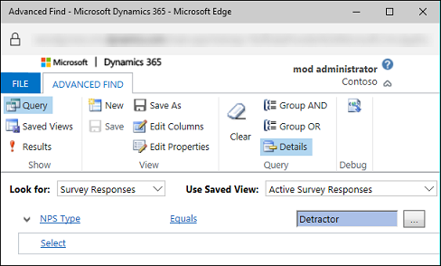
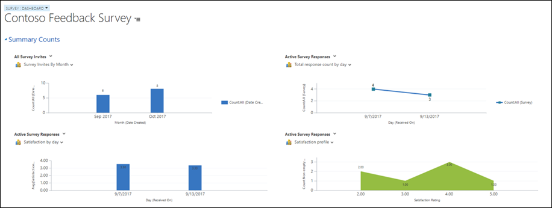

As survey respondents start taking your surveys, their responses will be captured and sent to Microsoft Dynamics 365. As data comes into Dynamics 365, you can start to analyze it to determine potential actions.

Out of the box, Dynamics 365 provides three reports that can be run from a survey:

- **Net promoter score:** This report shows the monthly net promoter score (NPS) details that the survey measures.
- **Survey export:** This report shows survey responses in a tabular format.
- **Survey summary:** This report shows a summary of survey responses.

Before we dive into the different analytical options that are available, let's review how responses can be captured and stored in Voice of the Customer. Survey results can be reported back to Dynamics 365 in one of two ways:

### Survey responses

Survey responses are best used for:

By default, all survey responses sent back into Dynamics 365 are stored in the survey responses entity. This entity stores all responses across all surveys. Each response captured contains relevant information such 
as the survey score, NPS, and related records (customer, survey). Individual question responses are visible as well.

- Surveys that have a limited shelf life (for example, surveys that are used to test new products and offerings).
- Surveys that are prone to change or updates.

Most of your surveys will probably have a limited shelf life and be prone to change. Therefore, your organization is likely to use survey responses most of the time.

### Feedback

Instead of using survey responses, you can set up surveys for feedback. Feedback differs from survey responses because it's stored in a custom entity that's created specifically for one survey. By default, the feedback feature isn't turned on for a survey. When you turn it on, you can decide whether you want the Feedback entity to be created manually or automatically when the survey is published.

The advantage to using feedback is that you can customize the entity that's created. You can do all the same customizations that you can do for other custom entities. You can create custom relationships, customize pages and views, and created dashboards as needed.

The potential disadvantage to using feedback is that it can add overhead to your environment. For customers who use Dynamics 365 online, there are limits on the number of entities that can be added. Therefore, use feedback only for longer surveys that require more detailed analytical options. For example, you might use feedback for a customer satisfaction survey that's sent to customers after cases are closed.

You can turn on feedback on the **Feedback** tab of the **Survey** page.

> [!IMPORTANT]
> A survey can use either survey responses or feedback. It can't use both.

### Survey responses

A survey response record is created after a respondent submits a survey. Based on the response that's received, out-of-box workflows are triggered, and the corresponding fields in the survey response are filled in. If you've mapped the question responses to additional fields, the mapped fields are filled in with the survey response.

You can view survey responses by selecting **Survey responses** in the **Related** section of a survey record.

Additionally, you can export survey responses to Microsoft Excel. You can then do further analysis by using Excel features.

You can also use Advanced Find to create customized queries. For example, you can create a query to fetch all the survey responses where the NPS type is equal to Detractor.

For more information about using Advanced Find, see [Create, edit, or save an Advanced Find search](https://docs.microsoft.com/dynamics365/customer-engagement/basics/save-advanced-find-search).

### Viewing survey invitations and responses

On the **Survey** dashboard, you can view a summary of survey invitations and responses. You can select a combination of a view and a chart to look at the results that you're interested in. You can also create your own personal, customized view. You can even create your own customized dashboard.

For more information about creating and editing dashboards, see [Create or edit dashboards](https://docs.microsoft.com/dynamics365/customer-engagement/customize/create-edit-dashboards).

For more information about Voice of the Customer analytical options, see [Analyze survey data](https://docs.microsoft.com/dynamics365/customer-engagement/voice-of-customer/analyze-survey-data).

### Survey analytics using Power BI

Another option that can be leveraged for more advanced survey analytics is by using the Voice of the Customer analytics for Dynamics 365 app or service content pack for Power BI. You can connect to your Voice of the Customer for Dynamics 365 instance and get insights about the surveys and their responses. As a survey administrator or survey designer, you can track metrics, such as average Net Promoter Score (NPS), average customer satisfaction (CSAT) score, and response ratio to get visibility into the surveys. You can use the dashboard and report to explore and analyze the survey data as you need.

Although the Power BI content pack is not our primary focus, it does provide several advanced features and is worth mentioning.

Additional information on using Power BI for survey analytics can be found here:
<https://docs.microsoft.com/dynamics365/customer-engagement/voice-of-customer/survey-analytics-powerbi>

