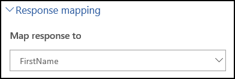
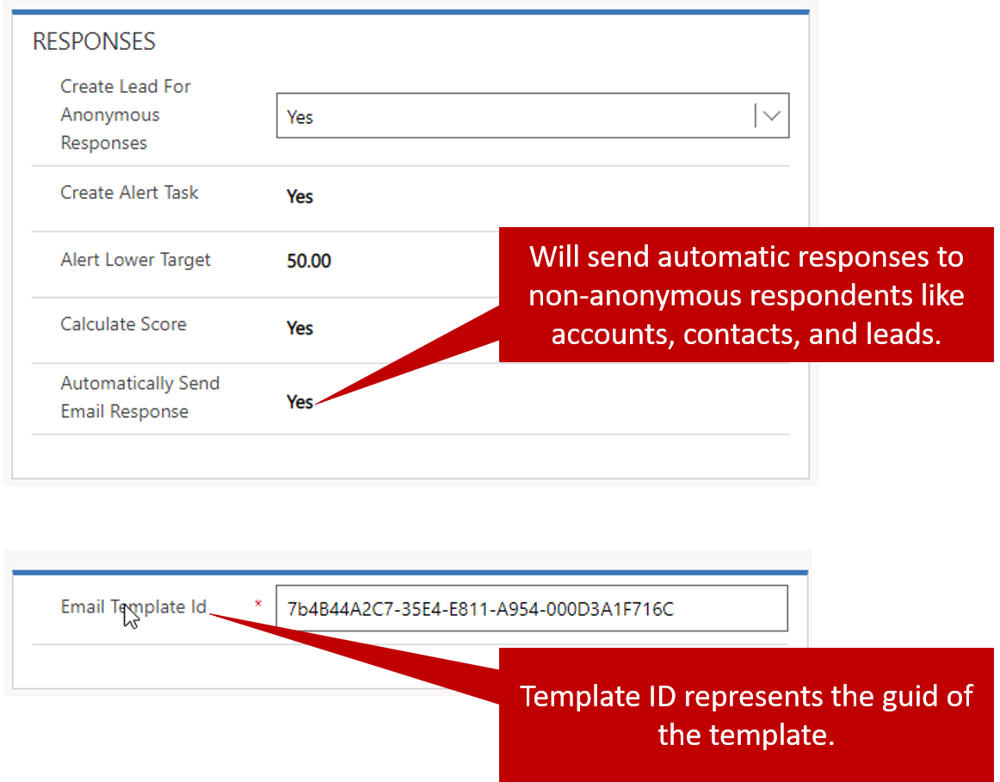

One of the main advantages of Voice of the Customer is that the creation of records in Microsoft Dynamics 365 can be triggered by the actions of current customers and non-customers. For example, you distributed a survey anonymously, and several non-customers took it. You might want to identify the respondents who aren't currently customers and, because they took your survey, create leads in Dynamics 365.

You might also find it beneficial to send an automated response to respondents who take a specific type of survey. For example, you sent a survey to everyone who attended a recent trade show that you sponsored. For every current customer who provides feedback about the event in the survey, you can send a "thank you" email that includes an electronic coupon or something similar.

## Creating leads for anonymous responses

If you want to be able to engage with anonymous respondents who take your surveys, you can set up a survey to automatically create lead records from survey responses that are provided by anonymous respondents.

The setup to generate leads from anonymous responses has two main steps:

- Set up the survey to create leads from anonymous responses.
- Map question responses to appropriate fields in the survey response table.

### Turning on automatic lead creation for a survey

1. Enabling the survey to create leads from anonymous responses.
2. Mapping question responses to the appropriate fields in the survey response table.

To set up a survey so that leads are created based on anonymous responses, set the **Create Lead For Anonymous Responses** field to *Yes* in the **Responses** section of the **Invitations and actions** tab on the **Survey** page.

To help guarantee that you capture the desired information in the lead, you need to make sure that the questions in your survey capture the correct data and put it in the correct place. Therefore, you must map question responses to survey response fields.

### Mapping responses

Voice of the Customer includes a workflow that's named VOC create lead. When a survey generates an anonymous response, if the survey is set up to automatically create leads, the VOC create lead workflow is invoked in the background and creates the lead. The workflow fills in the lead by using data that's stored in the survey response table. To help guarantee that the lead is filled in with the correct data, you need to map the question responses to the appropriate fields in the survey response table.

The following table shows how lead entities are mapped to the survey response fields.

|  Lead entity              | Survey response field |
|:--------------------------|:----------------------|
|  Job Title                | Job Title             |
|  Business Phone           | Telephone             |
|  Email                    | Email                 |
|  Company                  | Company               |
|  Website                  | Website               |
|  Country/Region           | Country               |
|  City                     | City                  |
|  Street 1                 | Street 1              |
|  Street 2                 | Street 2              |
|  Street 3                 | Street 3              |
|  State/Province           | State                 |
|  ZIP/Postal Code          | Postal Code           |
|  Fax                      | Fax                   |
|  First Name               | First Name            |
|  Last Name                | Last Name             |
|  Owner                    | Owner                 |
|  Salutation               | Salutation            |
|  \<\<Any custom field\>\> | \<\<Custom Text\>\>   |

To help guarantee that you get the data that you want, you need to set up the survey to capture that data. You then need to map the data to the appropriate place in the survey response table. For example, if you plan to create leads, the survey must include questions that capture the necessary information about the respondent, like first name, last name, phone number, and email address. Without that information, the lead will be useless.

If you have a question that is capturing the respondents first name, you need to map the response to the first name field on the survey response. The response mapping field is located on the general tab of the question editor for question types that support mapping, such as single line of text questions. Response mapping makes the question responses directly available as part of the survey response entity and, therefore, readily available to reports and workflows.

The following table lists the mapping fields that are available in the survey response.

| Mapping Fields   |                      |                                    |                  |
:------------------|:---------------------|:-----------------------------------|:-----------------|
| Salutation       | Generic Text 1       | Generic number 11                  | Linked Answer 1  |
| First Name       | Generic text 2       | Generic number 12                  | Linked Answer 2  |
| Last Name        | Generic text 3       | Generic number 13                  | Linked Answer 3  |
| Job Title        | Generic text 4       | Generic number 14                  | Linked Answer 4  |
| Street 1         | Generic text 5       | Generic number 15                  | Linked Answer 5  |
| Street 2         | Generic text 6       | Generic number 16                  | Linked Answer 6  |
| Street 3         | Generic number 1     | Generic number 17                  | Linked Answer 7  |
| City             | Generic number 2     | Generic number 18                  | Linked Answer 8  |
| State            | Generic number 3     | Generic number 19                  | Linked Answer 9  |
| Postal Code      | Generic number 4     | Generic number 20                  | Linked Answer 10 |
| Country          | Generic number 5     | Generic number 21                  | Linked Answer 11 |
| Telephone        | Generic number 6     | Date                               | Linked Answer 12 |
| Website Response | Generic number 7     | Custom Date 1                      | Linked Answer 13 |
| Email Response   | Generic number 8     | Satisfaction Rating (whole number) | Linked Answer 14 |
| Fax              | Generic number 9     | Satisfaction Rating                | Linked Answer 15 |
| Custom Number    | Generic number 10    | Customer Effort Score              |                  |

The linked information in the survey response table and the *VOC create lead* workflow are used to generate anonymous leads. You can use the same principle to generate other records in the application. For example, you can create a workflow that creates a new account, contact, or case. You can even map the data to a custom entity.

For more information about generating leads from survey responses, see [Create a lead from a survey response](https://docs.microsoft.com/dynamics365/customer-engagement/voice-of-customer/design-advanced-survey#create-a-lead-from-a-survey-response).

For more information about response mapping, see [Store responses in a custom field by using response mapping](https://docs.microsoft.com/dynamics365/customer-engagement/voice-of-customer/analyze-survey-data#store-responses-in-a-custom-field-by-using-response-mapping).

## Automatically sending an email response

As you've seen, you can generate leads for anonymous responses. But what about responses that are provided by non-anonymous respondents, like accounts, contacts, or leads? You can set up a survey to automatically send an email response to the customer (account, contact, or lead) after the survey is finished. The email is sent by using a global email template type in Dynamics 365. You can add different templates for specific types of surveys, as needed.

To set up a survey to send email responses, set the **Automatically Send Email Response** field to *Yes* in the **Responses** section of the **Invitations and actions** tab on the **Survey** page.

To define the email template that's used for the survey, enter the email template ID on the **Advanced** tab of the **Survey** page. The ID is the globally unique identifier (GUID) of the email template. You can find this value in the template URL when you edit it.

> [!NOTE] 
> After a survey is set up to automatically send email responses, you won't be able to save the survey until you specify an email template ID.

For more information about creating global email templates and sending email responses, see [Create templates for email](https://docs.microsoft.com/dynamics365/customer-engagement/admin/create-templates-email).
