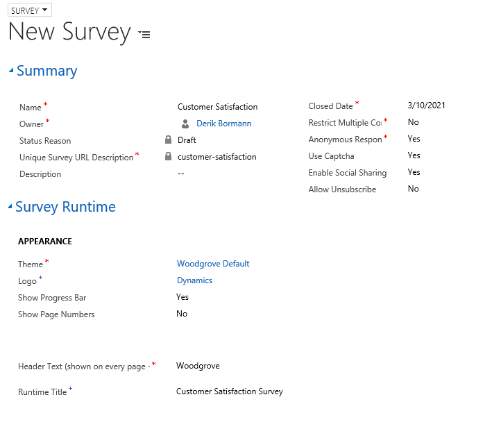
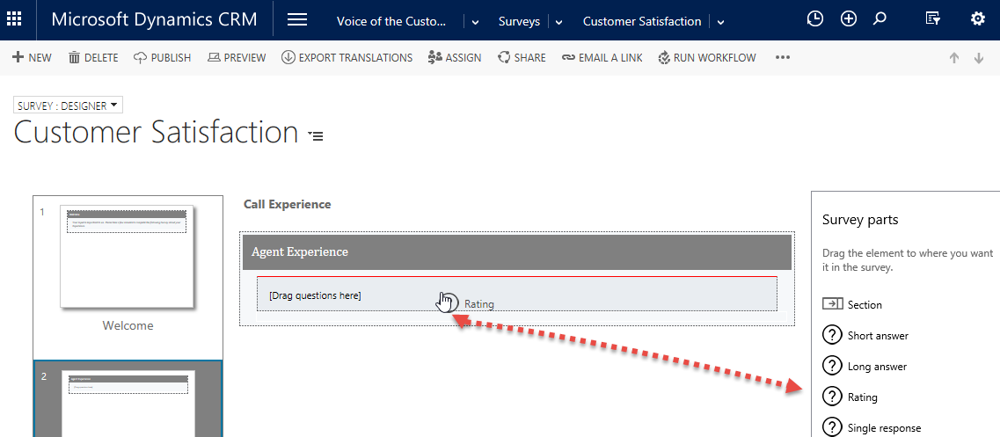
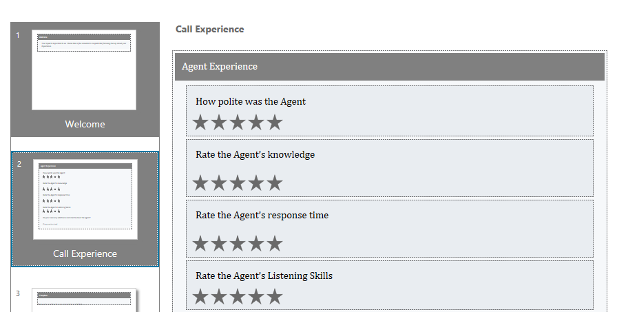
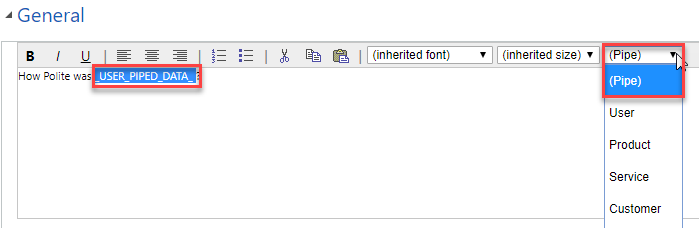
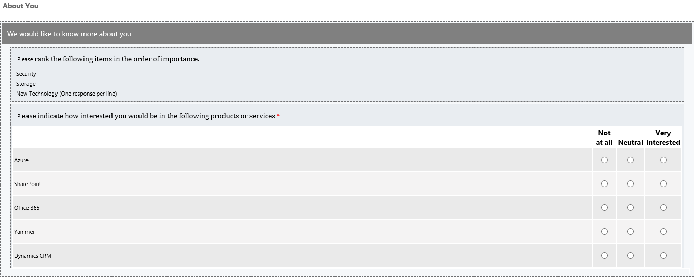
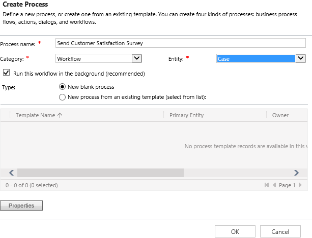
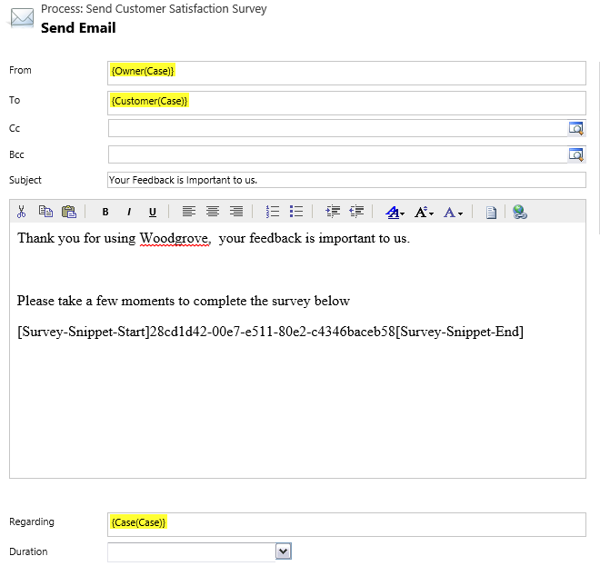

The exercises work best when you have sample data to use. Microsoft Dynamics 365 lets you add sample data as needed. If no sample data is installed in the environment that you're working in, follow these steps to install some.

1. If necessary, on the main application navigation bar, select the drop-down arrow next to **Dynamics 365**, and then select **Dynamics 365 – custom**.
2. On the navigation bar, select the drop-down arrow next to **Settings**, and then select **Data Management**.
3. Select **Sample Data**.
4. Select **Install Sample Data**.
5. Close the **Sample Data** page.

At the end of this exercise, you'll be able to perform the following tasks:

- Deploy the Voice of the Customer solution.
- Add survey collateral.
- Create surveys.
- Add survey questions.
- Set up response routing.

Estimated time to finish this exercise: 30 to 45 minutes

You work for a company that provides help desk support to its customers. Lately, the company has been concerned that customer satisfaction isn't as high as it used to be. It wants to use the Dynamics 365 Voice of the Customer solution to track customer satisfaction. You've been asked to deploy the solution.

### High-level steps

1. Deploy the Voice of the Customer solution.
2. Add an image to use with the survey.
3. Create a survey theme.
4. Create a customer satisfaction survey.
5. Set up response routing.

### Detailed steps

#### Deploy the Voice of the Customer solution

1. Go to <https://admin.powerplatform.microsoft.com>, and sign in to the Microsoft Power Platform Admin center.
2. In the Admin center site map, expand **Admin centers**.
3. Select **Dynamics 365**.
4. In the Dynamics 365 Admin center, select **Applications**.
5. Select the **Voice of the Customer** application, and then select **Manage**.
6. Select the instance to deploy Voice of the Customer to.
7. Accept the Dynamics 365 license agreement.
8. Select **Install**.

It can take 10 to 15 minutes for the solution to be installed.

9. Close the **Setup Voice of the Customer** tab.
10. In the Dynamics 365 Admin center, select **Instances**.
11. Find and select the instance that you installed Voice of the Customer to.
12. Select **Solutions**.
13. Find the Voice of the Customer solution.
14. Refresh your browser until the status is *Installed*. 

#### Add images and a custom theme
1. In your Dynamics 365 organization, go to **Voice of the Customer** \> **Images**.
2. Select **New** to add a new image.
3. Enter *Dynamics* as the name, and then select **Save** to save the image but leave it open.
4. On the **Custom Icon** tab, select the **Browse** button, and then follow these steps:
    1. Select the **dynamics\_logo** image in your student folder, and then select **Open**.
    2. Select **Submit**.
5. In the **Image Format** field, select *png*. The image will appear in the **Preview** section.
6. Go to **Voice of the Customer** \> **Themes**.
7. Select **New** to add a new theme.
8. In the **Name** field, enter *Woodgrove Default*.
9. Use the following codes:
    - **Header:** *\#0A0A2A*
    - **Section:** *\#0B2161*
    - **Navigation Bar:** *\#1C1C1C*
    - **Answer:** *\#0040FF*
    - **Answer:** *\#819FF7*
    - **Progress:** *\#1C1C1C*
    - **Progress Background:** *\#A2A8AD*
 10. Select **Save and Close**.

#### Create a customer satisfaction survey

1. Go to **Voice of the Customer** \> **Surveys**.
2. Select **New**.
3. Set up the survey as shown here.

#### Summary

   | Field                         | Value                 |
   |-------------------------------|-----------------------|
   | Name                          | Customer Satisfaction | 
   | Restrict Multiple Completions | No                    |
   | Anonymous Responses           | Yes                   |
   | Use Captcha                   | Yes                   |
   | Enable Social Sharing         | Yes                   |
   | Allow Unsubscribe             | No                    |

#### Survey Runtime

   | Field         | Value                        |
   |---------------|------------------------------|
   | Theme         | Woodgrove Default            |
   | Logo          | Dynamics                     |
   | Header Text   | Woodgrove                    |
   | Runtime Title | Customer Satisfaction Survey |

Your survey should resemble the following image.

4. Select **Save**.
5. Switch to the **Designer** page.
6. Hover over the **\[Put your welcome text here\]** text, select **Quick Edit**, and then follow these steps:
- Enter the following text: Your input is important to us. Please take a few minutes to complete the following survey about your experience.
- Select **Save**.
7. Select **Page 1**.
8. Hover over the **Page 1** Select **Quick Edit**.
9. Enter *Call Experience*, and then select **Save**.
10. Hover over the **Change this section header** text, and select **Quick Edit**.
11. Enter *Agent Experience*, and then select **Save**.
12. Under **Survey parts**, drag the **Rating** element to your survey.
13. Enter *How polite was the agent?*, and then select **Save**.

> [!NOTE]
> To make your survey more complete, you can add the following optional rating elements. Otherwise, move on to the next step.
   
- Rate the agent's knowledge
- Rate the agent's response time
- Rate the agent's listening skills
     

14. Hover over the **How polite was the agent?** question, and select **Edit Question Default Settings**.
15. Select the words **the agent**, and then, in the **(Pipe)** field, select *User*.
16. If you added the optional rating elements for the agent's knowledge, response time, and listening skills, repeat the previous step to add piped data to each of those questions.

17. Drag the **Short answer** element to your survey.
18. Enter *Do you have any additional comments about \_USER\_PIPED\_DATA\_?*, and then select **Save**.

Your finished **Call Experience** page should resemble the following image.
 

19. Under the survey pages, select **New**.
20. Enter *About You* as the name, and then select **Save and Close**.
21. Change the section header text to We would like to know more about you, and then select **Save**.
22. Drag the **Ranking** element to your survey.
23. Set up the element as described here:
    - **Question:** Please rank the following items in the order of importance.
    - **Responses:**
        - Security
        - Storage
        - New Technology (One response per line)
    - **Question Layout Type:** Question at the top, answer below
    - **Randomize Response:** Yes
    - **Pick Responses:** No
24. Select **Save and Close**.
25. Drag the **Single rating in Columns** element to your survey.
26. Set up the element as described here:
    - **Name:** *Please indicate how interested you would be in the following products or services*
    - **Question:** *Please indicate how interested you would be in the following products or services*
    - **Questions:**
        - Azure
        - SharePoint
        - Office 365
        - Yammer
        - Dynamics CRM
    - **Column Text Rotation:** Rotate 90 Degrees
    - **Column Headers:**
        - Not at all
        - Neutral
        - Very Interested
27. Select **Close**.
28. Delete the **\[Drag Questions Here\]** text.

Your finished **About You** page should resemble the following image.

29. Add a new page after the **About You** page, and name it *Final Thoughts*.
30. Change the section name to *Information moving forward*.
31. Drag the **Net Promoter Score** element to your survey.
32. Select **Save and Close**.
33. Drag the **Long Answer** element to your survey.
34. Enter *Please enter any final thought that you would like to share with us*, and then select **Save**.
35. Delete the **\[Drag Questions Here\]** text.
  
#### Preview

1. Select **Preview** to preview the survey.
   

2. Enter the Captcha text, and then select **Start Survey**.
3. Go through the survey.
4. When you've finished the survey, close the preview window.
5. After the **Final Thoughts** page, add a new page, and name it *Special Incentives*.
6. Change the section name to *We have many different incentives*.
7. Drag the **Single response** element to the bottom of the section, and set it up as described here:
    - **Question:** *May we contact you about our services?*
    - **Answers:**
        - Yes
        - No
8. Drag the **Single response** element to the section, and set it up as described here:
    - **Question:** Does your organization currently use any tablets?
    - **Answers:**
        - Yes
        - No
    - **Visibility:** Do not Show
9. Drag the **Multiple response** element to the section, and set it up as described here:
    - **Question Text:** Please list all operating systems used
    - **Answers:**
        - *Windows
        - Android       
        - IOS
    - **Visibility:** Do not Show

10. Drag the **Single response** element to the section, and set it up as described here:
    - **Question Text:** *How many tablet devices do you have?*
    - **Answers:**
        - 1–10
        - 11–25
        - 26–50
        - 51–100
        - 100+
    - **Visibility:** Do not Show
    - **Response Type:** Drop down list

11. Drag the **Single response** element to the section, and set it up as described here:
    - **Question Text:** Would you be interested in any cloud services?
    - **Answers:**
        - Yes
        - No
    - **Visibility:** *Do not Show

12. Drag the **Multiple response** element to the section, and set it up as described here:
	- **Question Text:** Select all Services that apply?
    - **Answers:**
        - Data Services
        - Network Services
        - App Services
        - Web Services

    - **Visibility:** Do not Show
 
 Your finished **Special Incentives** page should resemble the following image.

#### Distribute the survey

1. In your Dynamics 365 organization, go to **Voice of the Customer** \> **Surveys**.
2. Open the **Customer Satisfaction** survey.
3. On the command bar, select **Publish** to publish your survey to the cloud.
4. On the command bar, select **Copy Snippet**. (If you're prompted to allow access, select **Allow Access**.)

#### Email a link to the survey when a case is resolved

1. In your Dynamics 365 organization, go to **Settings** \> **Processes**.
2. Select **New**.
3. Enter the following information for the new process:
    - **Process name:** Send Customer Satisfaction Survey
    - **Category:** Workflow
    - **Entity:** Case

4. Select **OK**.
5. Set the **Workflow Scope** field to *Organization*.
6. Under **Start when**, select **Record Status Changes**.
7. In the designer, select **Add Step**, select **Check Condition**, and select the condition to set up.
8. Set the condition to *Case* \> *Status Reason* \> *Equals* \> *Problem Solved*.
9. Select **Save and Close**.
10. Select **Click to Add Step**, select **Add Step**, and then select **Send Email**.
11. Select **Set Properties**.
12. Enter the following information for the e-mail:
- **From:** {Owner(Case)}
- **To:** {Customer(Case)}
- **Subject:** Your feedback is important to us.
13. Click in the message body, and then enter the following text:
-    Thank you for using Woodgrove.
-    Your feedback is important to us.
-    Please take a few moments to complete the survey below.
14. Press **Enter** a few times, and then press **Ctrl+V** to paste the email snippet that you copied earlier.
15. Your finished email should resemble the following image.

16. Select **Save and Close**.
17. Select **Activate** to activate the workflow.
18. Confirm activation.

### Practice: Take the customer satisfaction survey anonymously

1. In your Dynamics 365 organization, go to **Voice of the Customer** \> **Surveys**.
2. Open the **Customer Satisfaction** survey.
3. Find and select the value in the **Anonymous Link** field.

4.  Enter the text in the Captcha image.
5.  Click **Start Survey**.
6.  Select the Ratings for each of the Questions and click **Next**.
7.  Navigate through the **About You** Page.
8.  Click **Next.**
9.  Select **Yes** to the **May we Contact you**
10. Click **Next**
11. Fill out the **Moving Forward Page** and click **Submit**
