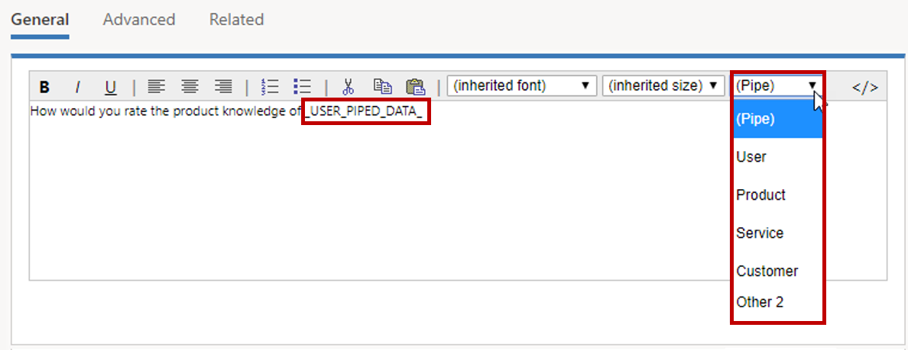
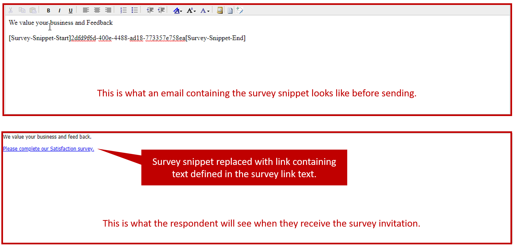
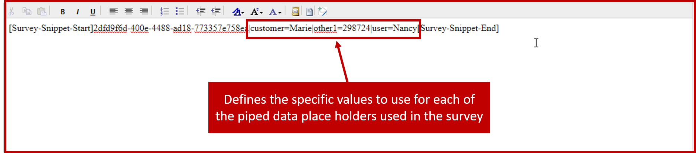
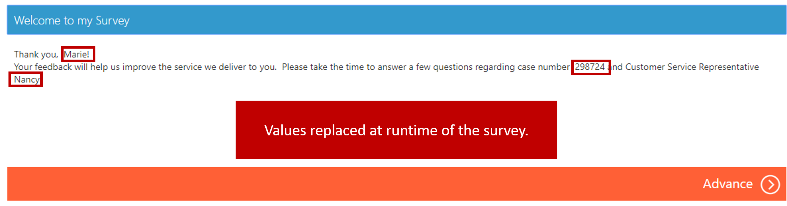
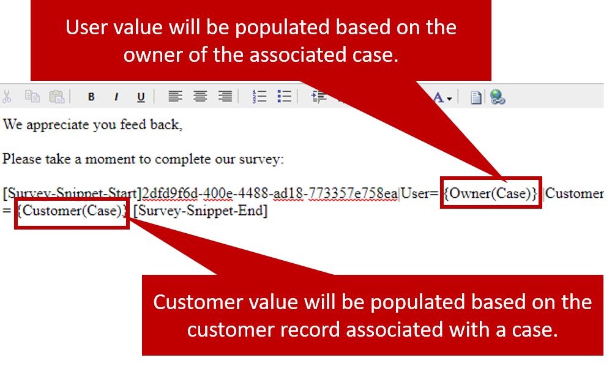

When you send out a survey to respondents, it can add a lot if the survey includes information that's relevant to each respondent. For example, instead of saying, "Your feedback is important to us" on the survey's welcome page, you can offer a much more personalized experience by saying something like, "Your feedback is important to us, Katie. Please click Next to start the survey." This approach not only helps make the survey experience more personal, but it can also help provide additional detail and context to the respondent.

Voice of the Customer lets you create personalized surveys by using specially designed placeholders that are called **piped data**.

You can insert piped data into questions in the question editor. Just select one of the predefined options on the menu:

- User
- Product
- Service
- Customer
- Location
- Date Time
- Other 1
- Other 2

For the example in the following image, you want to insert the name of the customer service rep who helped a customer with a call.

When the customer takes this survey, if the customer service rep was named Jacob Jones, the line `How would you rate the product knowledge of _USER_PIPED_DATA_?` will appear as How would you rate the product knowledge of Jacob Jones?

It's important to note that the specific value that should replace a piped data placeholder can't be determined until the survey invitation is sent to the customer from an invitation or email activity. At that point, the email link that's sent defines the value.

For more information about personalizing surveys by using piped data, see [Personalize a survey](https://docs.microsoft.com/dynamics365/customer-engagement/voice-of-customer/design-basic-survey#personalize-a-survey).

## Working with survey snippets

Voice of the Customer uses what are called ***snippets*** to generate a unique survey link to send to customers. A typical email snippet includes a placeholder for the start of the survey, the ID of the survey, and a placeholder for the end of the survey, in this format: `Survey-Snippet-Start]ID[Survey-Snippet-End]`.

Here's an example of a snippet that might be included in a survey invitation:

`[Survey-Snippet-Start]2dfd9f6d-400e-4488-ad98-973365e758ea[Survey-Snippet-End]`.

When a respondent opens the survey invitation or email that includes the snippet, the snippet will be replaced by an actual link to the survey. This link will be presented as a text-based link that uses the invitation link text that's specified in the survey.

> [!IMPORTANT]
> The snippet won't be replaced by a link until the survey invitation is sent.

## Populating piped data

To help guarantee that the necessary piped data is included in a survey, the snippet that's sent out must include references to the piped data in the survey. To personalize your survey invitation in a Microsoft Dynamics 365 email, make sure that your survey snippet includes piped data. Then, in your email invitation, add a vertical bar (`|`) (also called a pipe) after the survey ID, and add the parameters.

Here's the syntax to insert piped data in a survey snippet:

`[Survey-Snippet-Start][ID]|[PIPE_NAME]=[PIPE_VALUE][Survey-Snippet-End]`

For example, a survey has piped data for *Customer*, *User*, and *Other 1*, which you use for the case number. When you create the welcome text for the survey, it might resemble this example:

`Thank you, _CUSTOMER_PIPED_DATA_! Your feedback will help us improve the service we deliver to you. Please take the time to answer a few questions regarding case number OTHER_1_PIPED_DATA_ and Customer Service Representative USER_PIPED_DATA_.`

In the email invitation, you must add the piped data field, followed by an equal sign (`=`) and then the value that should be used. You can add multiple parameters. Just separate them by pipes (`|`).

Here's what the email snippet that's included in the survey invitation will look like for this example:

`[Survey-Snippet-Start]bd3b2cc6-3597-e511-80bd-00155db50802|customer=Marie|other1=298724|user=Nancy[Survey-Snippet-End]`

Here's what the welcome text will look like when the respondent starts the survey by using the snippet link:

Thank you, Marie! Your feedback will help us improve the service we deliver to you. Please take the time to answer a few questions regarding case number 298724 and Customer Service Representative Nancy.

> [!NOTE] 
> The eight piped data placeholders that were listed at the beginning of this unit are the only eight that are available. Because piped data placeholders aren't tied to specific data until the values are defined in the snippet, they don't have to be replaced by the data that they describe. For example, if you aren't using any date or time information in a survey, you can use the *Date Time* placeholder for different data, like location information.

## Dynamically populating piped data values

Often, it isn't viable to manually define specific values for each piped data placeholder. Instead, placeholders can be dynamically replaced with data from Dynamics 365 records. In this case, you can use the form assistant to replace the specific values with references to Dynamics 365 fields.

In the preceding image, the value of the `user` parameter will be filled in by using the **Owner** field on a case record, and the value of the `customer` parameter will be filled in by using the **Customer** field on the case record.

> [!VIDEO https://www.microsoft.com/videoplayer/embed/RE2JLBZ]

For more information about personalizing survey invitations, see [Personalize survey invitations](https://docs.microsoft.com/dynamics365/customer-engagement/voice-of-customer/distribute-survey#personalize-survey-invitations).
