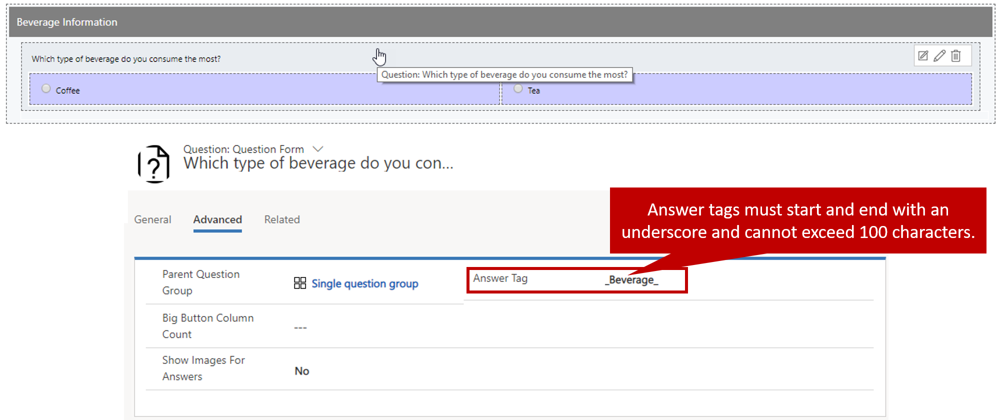
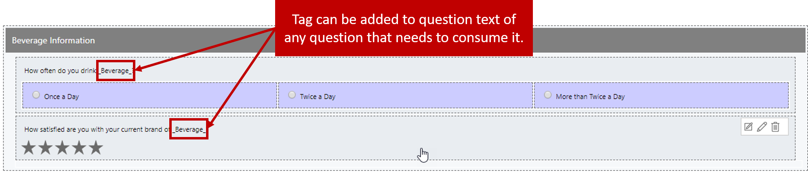
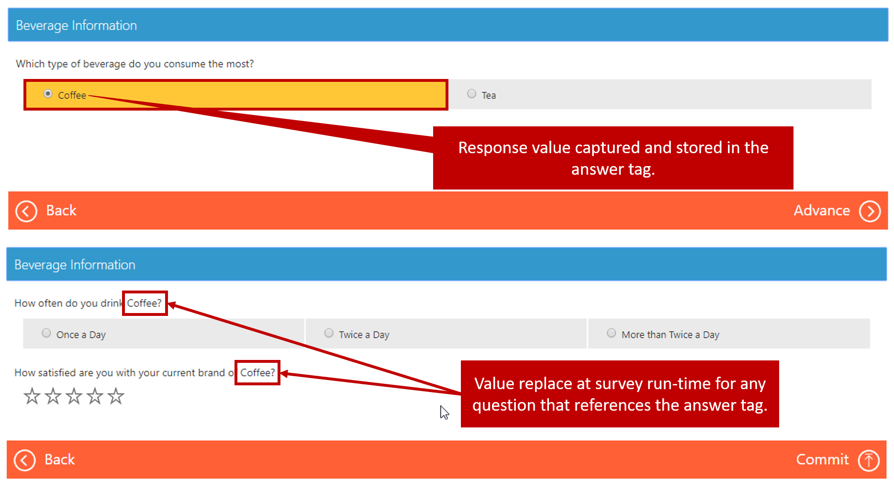

The questions on a survey will be much more meaningful if they represent information that's relevant to each respondent.

For example, if you're sending out a survey to capture information about a type of beverage that the respondent drinks, one approach is to ask a bunch of generic questions, like these:

- How many times a day do you drink a beverage?
- How happy are you with your current beverage brand?

To gather more meaningful information, though, you can ask a more specific question first, and then use the answer to that question to fill in the text for later questions.

For example, you can first ask the respondent, "Which is your beverage of choice: coffee or tea?" You can then use the response in the questions that follow. For example, if a respondent indicates that she prefers tea, later questions might look like this:

- How many times a day do you drink tea?
- How happy are you with your current brand of tea?

This approach makes the information that you capture and the overall survey experience more personal to the respondent.

To support this approach, Voice of the Customer includes a feature that's called *answer tags*. Answer tags let you insert dynamic text, based on the response to a previous survey question, in subsequent questions and answers at runtime.

When you create an answer tag, it must meet the following requirements:

- It must start and end with an underscore, and it must include only alphanumeric characters (0–9, A–Z, and a–z).
- It can't exceed 100 characters.
- It must be unique in the survey.

Answer tags can be captured in the responses for any of the following question types:

- Short answer
- Long answer
- Single response
- Net Promoter Score
- Customer Effort Score
- CSAT
- Rating
- Numerical response
- Smiles rating
- List of ratings
- Single rating in columns

After an answer tag has been captured, it can be consumed in the question text of all types of questions. It can also be consumed in the response text for all single-response and multiple-response questions except drop-down lists.

To define an answer tag for a question, in the question editor, add the value to the **Answer Tag** field for the question that will be used to capture the answer tag. For example, you want to capture an answer tag that's named Beverage for the question, "Which type of beverage do you consume most?" In this case, enter *\_Beverage\_* in the **Answer Tag** field for that question.

You can then reference the *Beverage* answer tag in any question where you want to use it.

Then, after respondents select the beverage that they consume most, the appropriate text will appear in all later questions where the answer tag is referenced.

For more information about answer tags, see [Design interactive surveys by using answer tag](https://docs.microsoft.com/dynamics365/customer-engagement/voice-of-customer/design-advanced-survey#design-interactive-surveys-by-using-answer-tag).
