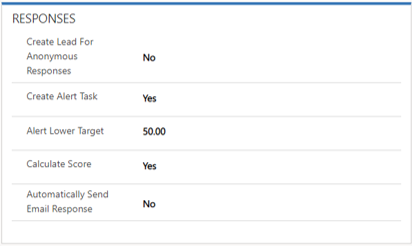

One great feature of Voice of the Customer surveys is the ability to score individual questions or a group of questions. Here are some ways that the scoring feature can be used:

- Create a custom index to measure loyalty, satisfaction, pain, happiness, or any other quality, based on more than one question or more than one methodology.

   For example, you can use Net Promoter Score as one measure, and compare its effectiveness against a combination of Customer Effort Score and a service rating.

- Take action based on the total score of the survey instead of the score for individual questions.

   For example, for one question in a survey, a customer answers that he's satisfied. But for many other questions, the customer answers that he isn't satisfied. In this case, you can schedule a follow-up appointment if the satisfaction index is less than 50 percent, regardless of the response to any single satisfaction question.

Organizations can determine the specific scenarios that they want to use the scoring feature for.

To use survey scoring, you must set it up at both the survey level and the question level.

## Setting up a survey for scoring

To set up a survey for scoring, you must define the necessary options in the **Responses** section on the **Survey** tab.

You can define the following survey scoring options:

- **Create Alert Task:** Specify whether an alert task should be created for the survey owner if the customer satisfaction score equals or is less than the value that's set in the **Alert Lower Target** field.
- **Alert Lower Target:** Enter the customer satisfaction score that will trigger an alert task. (You must set the **Create Alert Task** field to *Yes*.)
- **Calculate Score:** Specify whether the survey score should be automatically calculated based on the scoring setup of individual questions. (This field requires that scoring models be defined for individual questions on the survey.)
- **Automatically Send Email Response:** Specify whether an email response should be sent automatically.

## Setting up question scoring

Not every question in a survey will be scored. Only specific types of questions benefit from scoring. Question scoring can be set up for rating, single-response, and grouped questions. The score definition field is used to define scoring models.

The following values are available for the scoring definition field:

- **Ignore:** Don't score the question.
- **Auto (0-100):** A minimum value is assigned 0 points, and a maximum value is assigned 100 points.
- **Auto (100-0):** A maximum value is assigned 100 points, and a minimum value is assigned 0 points.
- **User Specified Range/Weight:** The value that's farthest to the left is assigned the value that you specify in the **Score Min Value** field. The value that's farthest to the right is assigned the value that you specify in the **Score Max Value** field.
- **NPS:** The Net Promoter Score scoring type is used. This scoring definition is used specifically for Net Promoter Score.

As respondents take a survey, scores are calculated and stored in the survey response table. The survey response table has four fields that store scoring details:

- **Score:** The total score for just the questions that the respondent answered.

   Remember: Logic on the client side might mean that not all questions are presented to the respondent.

- **Max Survey Score:** The maximum score that's possible for the survey if all scored questions receive their maximum value.
- **Score as a percentage**: The score percentage of the questions that the respondent answered. (This value is calculated as the actual score divided by the possible score.)

   Remember: Logic on the client side might mean that not all questions are presented to the respondent.

   For example, a survey has 10 scored questions, each of which has a maximum value of 5. (Therefore, the maximum value for the survey is 50.) If the respondent answers only five of the questions, the calculation is based on a percentage of 25, not 50.

- **Score as a percentage all routes:** The score for the questions that the respondent answered, divided by the total possible score for all questions, regardless of whether they were presented to the respondent.

Because these values are stored in the survey response table, organizations can use tools like Microsoft Dynamics 365 workflows or Microsoft Flow to design automations that control what happens when a score or score percentage falls below a specific value.

For more information about survey scoring, see [Survey scoring](https://docs.microsoft.com/dynamics365/customer-engagement/voice-of-customer/design-advanced-survey#survey-scoring).
