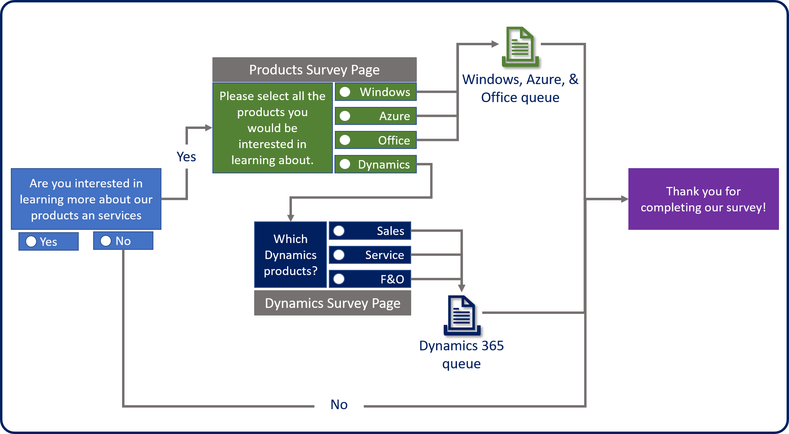
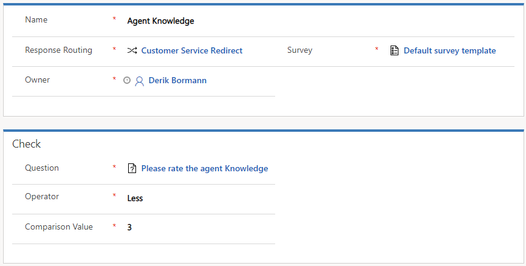
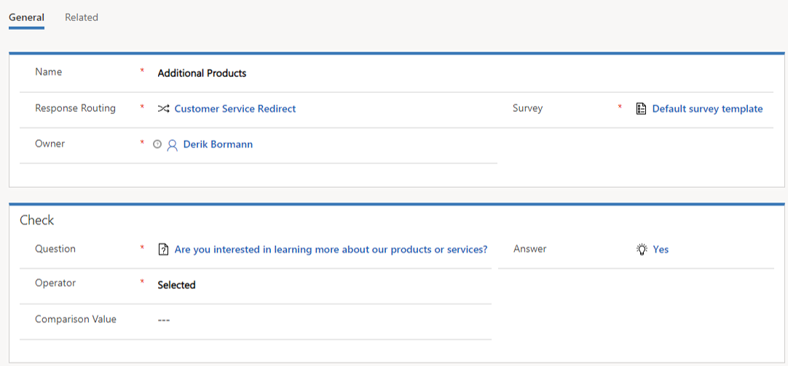

Often, you might want to ask respondents additional questions in a survey, based on previous responses. For example, your survey asks the question, "Are you interested in learning more about our products and services?" In this case, the survey can present additional questions about specific products and services if the respondent selects *Yes*, or it can skip those questions completely if the respondent selects *No*.

You can incorporate this feature by designing *response routing rules* in Voice of the Customer. A *response route* consists of conditions and actions. Responses are evaluated based on conditions that you specify. When a specific condition is met, the response route runs an action that corresponds to that outcome.

You can add response routes to any survey. On the **Related** tab, select **Response Routing**, and then select **Add New Response Routing**. A name and survey must be defined for each response routing.

The response routing has three tabs that can be used to set it up:

- **Conditions:** Define the expected response for a specific question.
- **Actions:** Define the action that's run when a specified condition is met.
- **Advanced:** Define the order that response routes are applied in. This order is used when multiple response routes are defined for a single survey.

## Defining conditions

When you define a response route, you can specify which conditions should be met. Conditions are based on responses to questions in a survey. They define the response that's expected for a specific question, like "Are you interested in learning more about our products and services?" 

To define a condition, you must first define the question that the condition will be applied to. Depending on the type of question that's selected, different setup options are available.

For example, let's say that you selected the following rating question: "Please rate the overall knowledge of the agent." In this case, you need to supply the following additional information:

- **Operator:** Define the operator that's used to evaluate the field. The following options are available:

    - Equals
    - Less
    - Greater

- **Comparison Value:** Define the actual value that the respondent's answer should be compared against.

If you want some type of follow-up action to be triggered if the respondent's answer to the question is less than *3*, here's how you'll set up the condition:

- **Question:** *Please rate the agent's knowledge*
- **Operator:** *Less*
- **Comparison Value:** *3*

Now let's say that you selected the following single-response question: "Are you interested in learning more about our products and services?" In this case, you need to supply the following additional information:

- **Operator:** The following options are available:

    - Less
    - Greater
    - Selected

- **Comparison Value:** The actual value that the respondent's answer should be compared against. This field is available only if you select *Less* or *Greater* in the **Operator** field.
- **Answer:** The specific answer that you're looking for. This field is only available if you select *Selected* in the **Operator** field.

If you want some type of follow-up action to be triggered if the respondent's answer to the question is *Yes*, here's how you'll set up the condition:

- **Question:** *Are you interested in learning more about our products and services?*
- **Operator:** *Selected*
- **Answer:** *Yes*

As you define the question that you want to apply a condition to, pay careful attention to the options that are available.

What if you need a condition to take multiple conditions into consideration? In this case, you can define more than one condition for a single response route. You can then group the conditions as either an AND condition or an OR condition. Here are some examples:

- You want to trigger a follow-up action only if respondents indicate that they currently have a specific type of product **and** they're interested in learning about additional services. 
- You want to trigger a follow-up action if respondents express dissatisfaction with either the agent's listening skills **or** the agent's product knowledge question.

> [!IMPORTANT] 
> You can group multiple conditions together as either an AND condition or an OR condition. You can't use both AND and OR groupings in a single response route.

For more information about response routing, see [Design interactive surveys by using response routing](https://docs.microsoft.com/dynamics365/customer-engagement/voice-of-customer/design-advanced-survey#design-interactive-surveys-by-using-response-routing).

> [!VIDEO https://www.microsoft.com/videoplayer/embed/RE2JJ1W]

After you've defined the specific conditions that you want to use in your response route, you must define the specific actions that should occur when those conditions are or aren't met.
