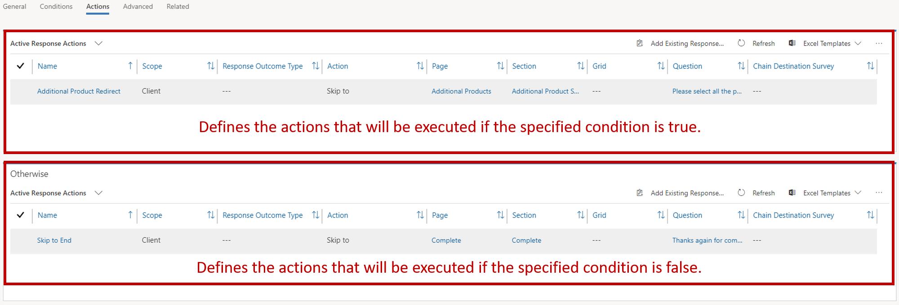
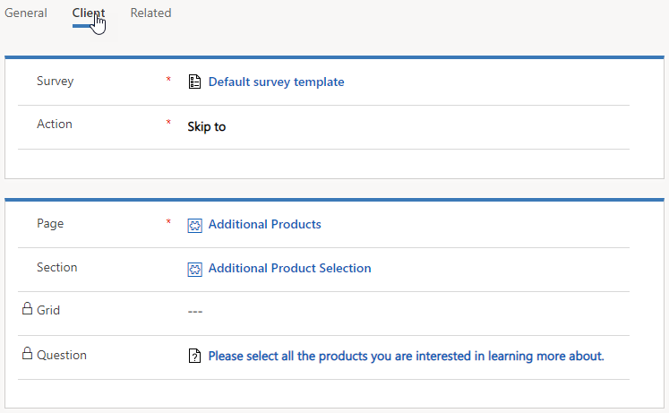
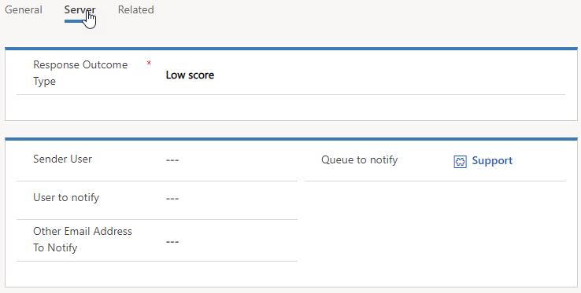
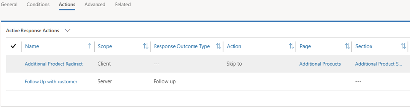

*Actions* define what should happen when a defined condition is or isn't met. On the **Actions** tab of the response route, two grids show the actions that are defined. The first grid shows the actions that should be run if the condition is met. The second grid shows the actions that should be run if the condition isn't met.

You don't have to supply actions for both outcomes. But an alternative action will often be needed to help guarantee that respondents can achieve the desired goal of the survey.

For example, one question in a survey asks respondents whether they're interested in additional products.

- If respondents answer *Yes*, an action takes them either to the **Additional products** section of the same survey or to an entirely different survey.
- If respondents answer *No*, an action takes them directly to the **Complete** page of the survey, so that they can submit their responses.

Voice of the Customer provides two types of actions:

- **Client actions:** These actions occur within the survey and affect the respondent's experience. For example, a client action might show or hide specific questions.
- **Server actions:** These actions occur outside the survey and typically involve the creation of records in Microsoft Dynamics 365. For example, a server action might be used to request contact or unsubscribe.

## Client actions

Client actions affect the respondent's survey experience and help guarantee that the questions that are asked are relevant to the respondent. For example, one question in a survey asks respondents whether they would recommend your organization to a friend. If respondents answer *Yes*, a client action might take them to a section of the survey that's named **Referral**. But if they answer *No*, the action might hide the **Referral** section completely.

When you [design an interactive survey](https://docs.microsoft.com/dynamics365/customer-engagement/voice-of-customer/design-advanced-survey#design-interactive-surveys) and select **Client** as the scope, the following actions are available:

- **Show**: Show a page, section, grid, or question, depending on the answer to a question.
- **Hide**: Hide a page, section, grid, or question, depending on the answer to a question.
- **Skip to**: Skip to a section, question, or grid, depending on the answer to a question.
- **End survey**: Go to the end of the survey. This action is useful for qualification questions.
- **Chain survey**: Open a different survey, depending on the answer to a question.
- **Toggle visibility**: Change the visibility of a control from visible to hidden, or from hidden to visible, depending on the current state of the control.

Depending on the action that you specified, additional setup options will be presented in the action. For example, if you select the *Skip to* action, you must supply the following additional information:

- **Page:** The specific page in the survey that respondents should be taken to.
- **Section:** The specific section on the page that respondents should be taken to.
- **Question:** The specific question that respondents should be taken to.

> [!IMPORTANT] 
> Be careful about the size of the logic tree that you create for a survey. A very large logic tree that has many combinations of response actions will increase your testing effort. Instead, split the survey into multiple, smaller surveys, and send invitations to different groups of people.

## Server actions

Server actions are used to create Dynamics 365 notifications based on the outcome of the condition. Whereas client actions affect the experience that respondents have as they're taking the survey, server actions notify someone about the outcome, so that appropriate action can be taken. For example, a respondent indicates dissatisfaction by providing a low score to a rating question. In this case, a notification about the low score can be sent to a Dynamics 365 queue, and the issue can be dealt with.

Several types of outcomes can be defined for server actions:

- **Complaint**: The answer to a question indicates a complaint from the respondent.
- **Low score:** The respondent provided a score that's lower than the acceptable response rating.
- **Distress:** The answer to a question indicates that the respondent might be in distress.
- **Unsubscribe:** The respondent indicated that he or she wants to unsubscribe from the survey.
- **High score:** The respondent provided a score that's higher than the expected response rating.
- **Contact request:** The respondent is interested in additional information.
- **Follow up:** Follow-up with the respondent is needed.
- **NPS Increase:** The respondent's Net Promoter Score increased.
- **NPS Decrease:** The respondent's Net Promoter Score decreased.
- **Facial Expression Increase:** The respondent's overall satisfaction increased.
- **Facial Expression Decrease:** The respondent's overall satisfaction decreased.

After you've defined the type of outcome that you want to use, you need to define what or who should be notified about the outcome. When you define the outcomes, you must supply the following information:

- **Sender User:** Specify the Dynamics 365 user that the notification is coming from.
- **User to notify:** Specify the Dynamics 365 user to send the notification to.
- **Other Email Address To Notify:** Specify the email address to send the notification to.
- **Queue to notify:** Specify the Dynamics 365 queue to send notification to.

## Working with multiple actions

You can define multiple actions for a single response route, and you can mix and match the types of actions that are defined, based on your organization's specific needs.

For example, one question in a survey asks respondents whether they're interested in additional products.

- If respondents answer *Yes*:

    - A client action takes the respondents to the **Additional products** section of the survey.
    - A server action that has an outcome type of *Follow up* is created and sent to a follow-up queue.

- If respondents answer *No*, a client action takes them directly to the **Complete** page of the survey.

> [!IMPORTANT] 
> When you design a survey, pay close attention to the actions that should be applied, and preview your survey often to make sure that the correct behavior is occurring.

> [!VIDEO https://www.microsoft.com/videoplayer/embed/RE2JyCJ]

For more information about response routing, see [Design interactive surveys by using response routing](https://docs.microsoft.com/dynamics365/customer-engagement/voice-of-customer/design-advanced-survey#design-interactive-surveys-by-using-response-routing).
