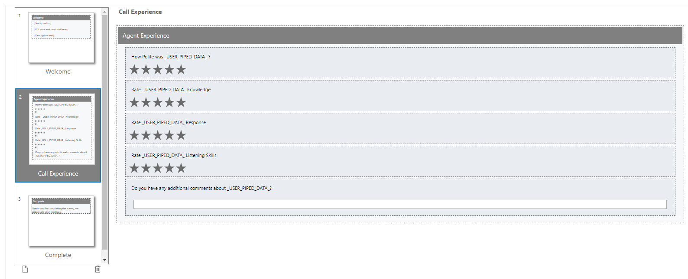
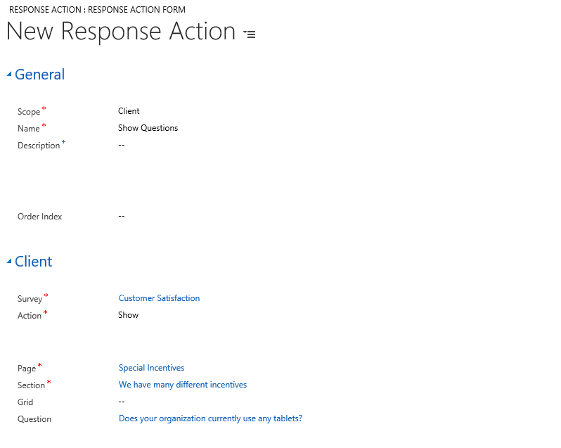
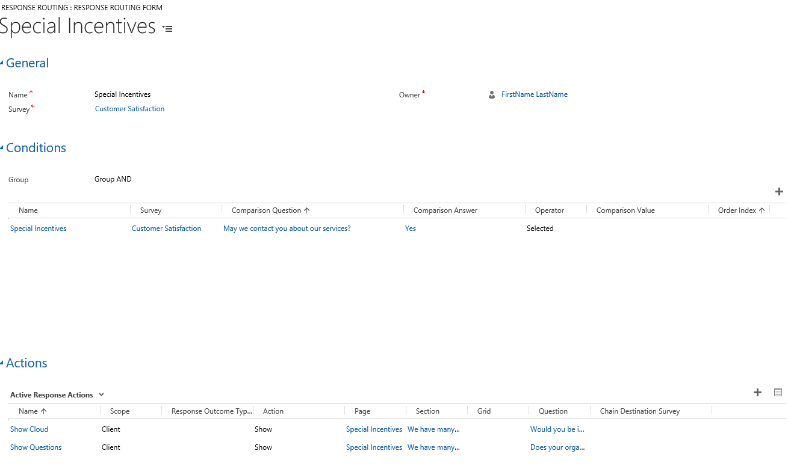
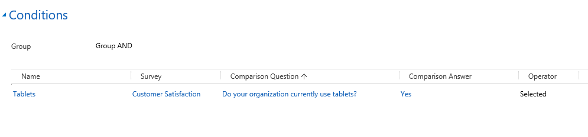
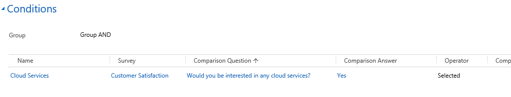
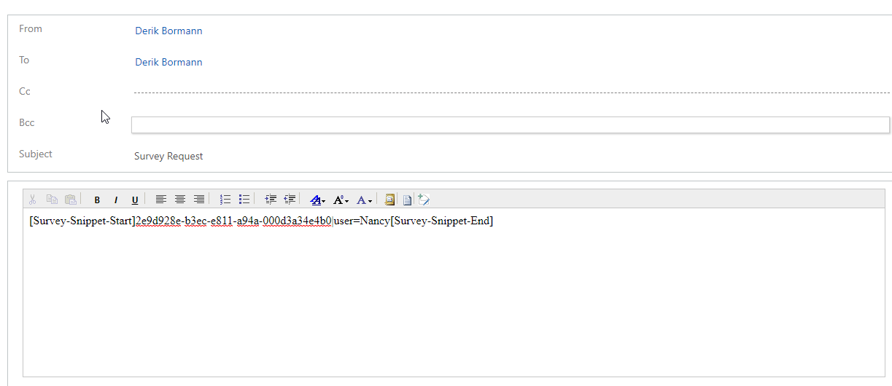
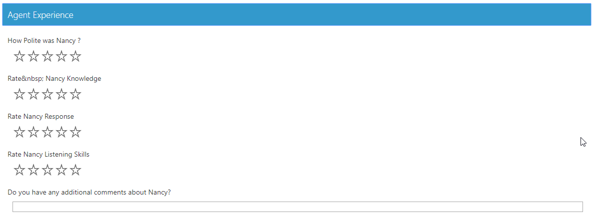

Exercise: Design a personalized survey experience

The labs and exercises in this module work best when you have some sample data to work with. Depending on if the environment you are working with, you may want to install some sample data to assist with exercises. Dynamics 365 does provide the ability to add sample data as needed. If the environment you are working in does not have any sample
data installed, follow the steps below to install the sample data into your environment.

## Enable Sample Data Detailed Steps

1.  If necessary, on the main application **Navigation Bar**, click the **drop-down selector next to Dynamics 365** and then click  **Dynamics 365 custom.**
2.  **From the navigation bar, navigate to Settings \> Data Management**
3.  Select **Sample Data**.
4.  Click the **Install Sample Data** button.
5.  Close the **Sample Data** window.

#### Learning Objectives

At the end of these exercises, you will be able to accomplish the following:
-   Deploy the Voice of the Customer Solution
-   Add Survey Collateral
-   Create Surveys
-   Add Survey Questions
-   Configure Response Routing

Estimated time to complete this lab: 30 to 45 minutes

### Scenario

You work for a company that provides help desk support for its customers. They have been concerned lately that customer satisfaction is not as high as it once was. They would like to leverage Dynamics 365's Voice of the Customer Solution to track customer satisfaction. You have been asked to deploy the solution.

## High Level Steps:
-   Deploy the Voice of the Customer Solution
-   Add an Image to use with the Survey
-   Create a Survey Theme
-   Create a Customer Satisfaction Survey
-   Configure Response Routing

### Detailed Steps

#### Deploy the Voice of the Customer Solution

1.  Sign into your **Power Platform Admin Center**: <https://admin.powerplatform.microsoft.com>
2.  In the admin center site map, expand **admin centers**.
3.  Select **Dynamics 365**.
4.  In the Dynamics 365 Administration Center, click **APPLICATIONS**.
5.  Select the **Voice of the Customer** application and click **Manage**.
6.  Using the **drop-down box**, select the instance you want to deploy Voice of the Customer to.
7.  Accept the Dynamics 365 License agreement.
8.  Click the **Install** button. It can take 10 - 15 minutes for the solution install to complete.
9.  Close the **Setup Voice of the Customer** Tab.
10. In the Dynamics 365 Admin Center, click **INSTANCES**.
11. Locate and select the instance you installed the Voice of the Customer Solution to.
12. Click **Solutions**.
13. Locate the Voice of the Customer Solution.
14. Refresh your browser until the status shows installed.

#### Add Images and a Custom Theme

1.  In your Dynamics 365 organization, navigate to **Voice of the Customer** \> **Images**.
2.  Click **New** to add a new image.
3.  Click New to add a new Image, Enter Dynamics for the name, and click Save to save the image and leave it open.
4.  Under the Custom Icon tab, click the Browse Button.
    - Select the **dynamics\_logo** Image located in your Student Folder, and click **Open**.
    - Click **Submit**.
5.  Select **png** in the Image Format Field. The Image will Display in the Preview Section.
6.  Navigate to **Voice of the Customer** \> **Themes**.
7.  Click **New** to add a new theme.
8.  In the **Name** field, enter **Woodgrove Default**.
9.  Use the following codes:
    - **Header:** \#0A0A2A
    - **Section:** \#0B2161
    - **Navigation Bar:** \#1C1C1C
    - **Answer:** \#0040FF
    - **Answer:** \#819FF7
    - **Progress:** \#1C1C1C
    - **Progress Background:** \#A2A8AD
10. Click **Save and Close**.

#### Create a Customer Satisfaction Survey

1.  Navigate to **Voice of the Customer** \> **Surveys**
2.  Click **New**
3.  Setup the Survey as noted in the table below:

| Summary                  |                  |
| :------------------- | :------------------- |
| Name:  | Customer Satisfaction |
| Restrict Multiple Completions:               | No                 |
| Anonymous Responses:                 | Yes                  |
| Use Captcha:                  | Yes                  |
| Enable Social Sharing:                  | Yes                  |
|Allow Unsubscribe:                  | No                  |
| **Survey Runtime**                  |                  |
| Theme:  | Woodgrove Default |
| Logo:               | Dynamics                 |
| Header Text:                 | Woodgrove                  |
| Runtime Title:                  | Customer Satisfaction Survey                  | 
 
4.  Click **Save**.
5.  Switch to the **Designer** form.
6.  Hover over the **\[Put your welcome text here\]** and click **Quick Edit**.
- Enter the following text: Your input is important to us. Please take a few minutes to complete the following Survey about your Experience.
- Click the **Save** button.
7.  Click on Page 1.
8.  Hover over the Page 1 Heading.
9. Click the **Quick Edits** button.
10. Enter **Call Experience** and click **Save**.
11. Hover over the Change this section header text and click **Quick Edit**.
12. Enter **Agent Experience** and click **Save**.
13. Under Survey Parts, drag the **Rating** element to your survey.
14. Enter **How polite was the Agent** and click **Save**.

> [!NOTE]
> If you want to make your Survey more complete you can add the following Optional Rating Elements below (Otherwise move to the next step)

-   Rate the Agent's knowledge
-   Rate the Agent's response time
-   Rate the Agent's Listening Skills

15. Hover over the **How Polite was the agent?** Question and click **the Edit Question Default Settings** Icon.
16. Highlight the text **"The Agent"**, click the **pipe** drop down, select **User**.

> [!IMPORTANT] 
> If you added the additional questions for the agent's knowledge, response time, and listening skills, repeat the previous step to add Piped Data to
> those questions as well (Otherwise move to the next step).

17. Under Survey Parts, drag the **Short Answer** element to your     survey.
- Enter **Do you have any additional comments about \_USER\_PIPED\_DATA\_?**
- Click **Save**.

18. Your completed Call Experience Page should resemble the page listed below.

19. Under the survey pages, click the **New** button.
20. Enter **About You** in the name, and click **Save and Close**.
21. Change the section header text to: **We would like to know more about you** and click **Save**.
22. Drag the **Ranking** element to the survey.
23. Configure it as noted below:
    - **Question:** Please rank the following items in the order of importance.
    - **Responses:** Security, Storage, New Technology (One response per line)
    - **Question Layout Type:** Question at the top, answer below
    - **Randomize Response:** Yes
    - **Pick Responses:** No
24. Click **Save and Close**
25. Drag the **Single rating in Columns** elements to the Survey.
26. Configure the following:
    - **Name:** Please indicate how interested you would be in the following products or services
    - **Question:** Please indicate how interested you would be in the following products or services
    - **Questions:**
    	- Azure
    	- SharePoint
    	- Office 365
    	- Yammer
    	- Dynamics CRM
- **Column Text Rotation:** Rotate 90 Degrees
- **Column Headers**
	- Not at all
	- Neutral
	- Very Interested

27. Click **Close**.
28. Delete **\[Drag Questions Here\]**.
29. Add a **New Page** after the About You page called **Final Thoughts**.
30. Change the **Section text** to: **Information moving forward**.
31. Drag the **Net Promoter Score** element to the Survey.
32. Click **Save and Close**.
33. Drag the **Long Answer** element to the survey.
    - Enter **Please Enter any final thought that you would like to share with us.**
    - **Save** the Question
34. Delete **\[Drag Questions here\]**

#### Test & Publish

1.  Click the Preview button to preview the Survey.
2.  Enter the Captcha Text and click Start Survey.
3.  Navigate through the Survey.
4.  **Close** the preview window when finished.
5.  After the Final Thoughts page, add a **new page** named **Special Incentives.**
6.  Edit the Section Name to read:
    - We have many different incentives:
7.  Drag the **Single Response** element to the bottom of the Section.
    - **Question:** May we contact you about our Services?
    - **Answers:** Yes and No
8.  Drag the **Single Response** element to the Section.
    - **Question:** Does your organization currently use any tablets?
    - **Answers**: Yes and No
    - **Visibility:** Do not Show
9.  Drag the **Multiple Response** element to the Section.
    - **Question Text:** Please list all Operating Systems Used
    - **Answers:** Windows, Android, IOS
    - **Visibility:** Do not Show
10. Drag the **Single Response** element to the Section.
    - **Question Text:** How many tablet devices do you have?
    - **Answers:**
          - 1 - 10
          - 11 - 25
          - 26 - 50
          - 51 - 100
          - 100+
    - **Visibility:** Do not Show
    - **Response Type:** Drop down list
11. Create a **Single Response** as follows:
    - **Question Text:** Would you be interested in any cloud Services?
    - **Answers:**
          - Yes
          - No
    - **Visibility:** Do not Show
12. Create a **Multiple Response** element.
    - Answers:**
        - Data Services
        - Network Services
        - App Services
        - Web Services
- **Visibility:** Do not Show

#### Setup and Configure Response Routing

Many times, you want participants taking your survey to be directed to specific areas based on their answers. In this task we are going to route users who are completing the survey to different sections of the survey based on their answers.

1.  If necessary, open the Customer Satisfaction survey.
2.  Click the **About You** page.
3.  In the Navigation bar, click the arrow next to Customer Satisfaction, and select **Response Routing.**
4.  Click **Add New Response Routing.**
5.  Enter **Special Incentives** for the name
6.  Click **Save** to save the record and leave it open.
7.  Under Conditions, click **New** and configure as follows
    - **Name:** Special incentives
    - **Response Routing:** Special Incentives
    - **Survey:** customer Satisfaction
    - **Question:** May we contact you about our Services?
    - **Operator:** Selected
    - **Answer:** Yes
8.  **Save and Close** the Condition.
9.  Under Actions, click the **New** button to add a new action, select the **lookup** icon, and click **New**.

10. Configure the Response Action as noted below.
    - **Scope:** Client
    - **Name:** Show Questions
    - **Survey:** Customer Satisfaction
    - **Action:** Show
    - **Page:** Special Incentives
    - **Section:** We have Many Different Incentives
    - **Question:** Does your organization currently use Tablets?

11. **Save and Close** the Action.
12. Under **Actions**, click the **New** button to add a new action, select the **lookup** icon, and click **New**.
13. Configure the Response Action as noted below. 
    - Scope:** Client
    - **Name:** Show Cloud
    - **Survey:** Customer Satisfaction
    - **Action:** Show
    - **Page:** Special Incentives
    - **Section:** We have Many Different Incentives.
    - **Question:** Would you be interested in any cloud services?

14. **Save and Close** the Action.
15. You completed Special Incentive Response Route should match the one below.

16. Click **Save and Close.**
17. Under **Response Routings**, click Add **New Response Routing** called **Tablets**.
18. **Save** the Response Routing to leave it open:
19. Under Condition add the Following Condition
    - *Name:** Tablet
    - **Survey:** Customer Satisfaction
    - **Comparison Question:** Does your organization currently use tablets?
    - **Comparison Answer:** Yes
    - **Operator:** Selected

20. You Condition should resemble the image below.

21. **Click Save and Close**.
22. Add two actions defined as follows:

| Name                  | List OS                 | List Tablet Count          |
| :------------------- | :------------------- |:----------------|
| Scope  | Client | Client |
| Action                 | Show                | Show            |
| Page                  | Special Incentives                | Special Incentives             |
| Section                   | We have many different incentives                   | We have many different incentives              |
| Question                   | Please list all the Operating Systems Used                | How Many Tablet devices do you have?              |

23. Under Otherwise Add two actions defined as follows:

| Name                  | Hide                 | Hide Tablet Count          |
| :------------------- | :------------------- |:----------------|
| Scope  | Client | Client |
| Action                 | Hide                | Hide            |
| Page                  | Special Incentives                | Special Incentives             |
| Section                   | We have many different incentives                   | We have many different incentives              |
| Question                   | Please list all the Operating Systems Used                | How Many Tablet devices do you have?              |

24. You Response Routing actions should look like the images below.

25. Click **New**.
26. Name it **Cloud Services**, set the Survey to **Customer Satisfaction**, and click **Save**.
27. Under **Condition** add the Following Condition
    - **Name:** Cloud Services
    - **Survey:** Customer Satisfaction
    - **Question:** Would you be interested in any cloud services? 
    - **Comparison Answer:** Yes
    - **Operator:** Selected

28. You Condition should resemble the image below.

29. Add an **Action** as defined below:
    - **Name:** Show Cloud Services
    - **Scope:** Client
    - **Action:** Show
    - **Page:** Special Incentives
    - **Section:** We have many different incentives
    - **Question:** Select all Services that apply

30. Under **Otherwise**, add an action defined as follows:
    - **Name:** Hide Cloud Services
    - **Scope:** Client
    - **Action:** Hide
    - **Page:** Special Incentives
    - **Section:** We have many different incentives
    - **Question:** Select all Services that apply

31. Your Response Routing actions should look like the one below.

32. **Save and Close** the Response Routing

#### Distribute the Survey

1.  In your Dynamics 365 organization, navigate to **Voice of the Customer** \> **Surveys**
2.  Open the Customer Satisfaction Survey.
3.  On command bar, click the **Publish** button to publish your survey  to the Cloud.
4.  On command bar, click the **Copy Snippe**t button. (If prompted, click Allow Access.)
5.  Navigate to **Service** \> **Activities**
6.  On the Command bar, click the Email button.
7.  In the **To:** field Select you user record.
8.  Enter **Survey Request** into the Subject field.
9.  Click in the body of the email, and paste the survey snippet you copied earlier.
10. In the Survey Snippet you just pasted add **\|user=Nancy** before **\[Survey-Snippet-End\]**
11. Your completed email should resemble the following:

12. Click the **Send** button to send your Email.
13. Under **My Activities**, click the drop-down arrow, and select **Email** \> **All Emails**.
14. Open the **survey request** email and click the **survey link**.
15. Navigate through the survey. Notice that Nancy has been inserted into the Agent Section.

