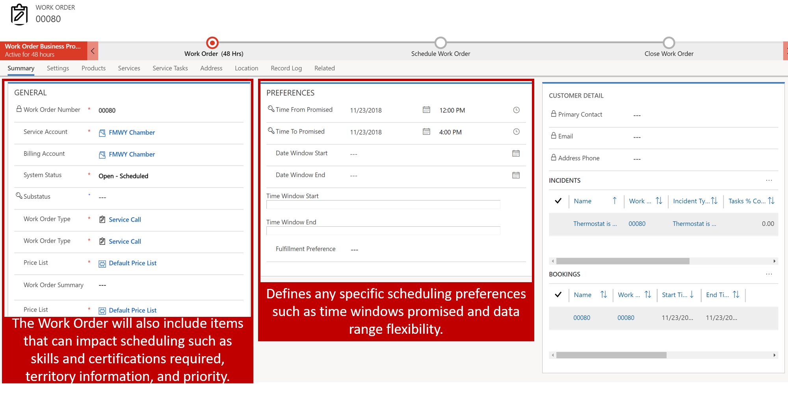
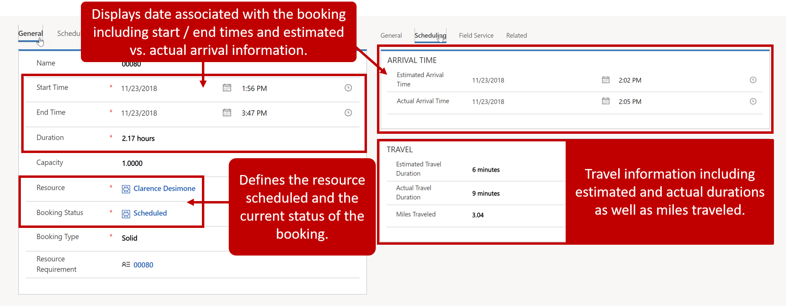

Scheduling in Microsoft Dynamics 365 is built on Universal Resource Scheduling (URS), providing organizations with the ability to schedule resources for items like work orders, projects, or any scenario where a resource needs to be scheduled to complete a work or have items noted on their schedule. For example, let's say you have your employees request time off in Dynamics 365 using a custom entity. Once the request has been approved, the resources time off should be displayed on the schedule board dispatchers use, so it can be taken into consideration when dispatchers attempt to schedule resources for other items.

Universal Resource Scheduling is the base scheduling solution that allows organizations to schedule and dispatch items. It is included for organizations that are using Dynamics 365's Field Service or Project Service Automation solutions. It provides the core scheduling functionality; the Field Service and Project Service Automation solutions leverage that functionality to schedule resources for specific items like work orders.

### How URS works

There are three primary record types that are used to schedule an item. 
Those records are:

-   Item to be scheduled *(Ex. Work Order)*
-   Resource Requirement
-   Bookable Resource Booking

When an item that needs to be scheduled such as a work order is created in Dynamics 365, it typically includes information that will affect how it is scheduled.

For example, a work order typically includes items such as:

-   The work order type, priority, and location.
-   Tasks to be done, products and services included, and skill needed by people completing the job.
-   Preferences for service delivery such as time windows, preferred technician, etc.

After the record is created, a record called a resource requirement record is created. The resource requirement record is used to schedule the item in the system. It defines the specifics that are required to schedule the record. The requirement record is what is used to locate qualified resources to meet the requirement.

A resource requirement for a work order might include:
-   The customer and duration information pulled from the work order.
-   Any date and time windows, or resource preferences.
-   Additional relevant scheduling information, such as skills and territories.

After a resource requirement is scheduled, and record called a bookable resource booking is created that provides the specific details around the resource who is responsible for completing the item. It provides additional details such as estimated and actual arrival times, and status of the booking.

A resource booking for a resource requirement would include:
-   The resource (person) responsible for completing the work order.
-   Estimated and actual time and status related information.
-   Travel information such as miles and duration can also be populated.

As relevant information such as the booking status is updated, relevant information on the Work Order such as the status of the work order will be updated as well.

### URS component overview

URS components are broken out into three types of items:

-   **Scheduling**: Used to setup and configure items like resources, skills, proficiency models, and fulfillment preferences.
-   **Tools**: Represents the schedule board that it used for manual scheduling of resources.
-   **Settings**: Used to configure supporting scheduling components such as booking statuses, priorities, and mapping preferences.

### Scheduling Components

-   **Resources**: Define the specific people, facilities, or equipment that can be scheduled to work on items. Resources could represent Internal employees, third part contractors, facilities, equipment, crews, or resource pools.
-   **Resource Roles**: Define the roles that resources might have in an organization. For example, an organization might create roles for positions like developer, consultant, or project manager.
-   **Resource Skills**: Define specific skills or certifications that resources can possess. They could designate specific programs, credentials, as well as certifications. For example, you might define a resource skill for a specific platform like Azure, or you might define a resource skill that specifies a security clearance level.
-   **Proficiency Models**: Define how proficient a resource is. Proficiency models are used in conjunction with skills to locate the most qualified resource. For example, a project might require a resource that is very proficient in a product, while another project may just need a resource that is familiar.
-   **Resource Requirements**: Define the specific resource requirements that are needed for a specific item that needs to be scheduled. For example, a resource requirement may specify that a resource is needed that is proficient in .net, belongs to the west coast territory, and is available on Tuesday from 9:00 AM to 11:00 AM.
-   **Resource Bookings**: Define which resource is scheduled for which item and which time. They also include statuses that define where the resource is at in the process. For example, a resource booking would be created if John is scheduled to work on a broken printer issue tomorrow from 8:00 AM to 11:00AM. When John arrives on site his status can be changed from in progress to completed as he completes work.
-   **Resource Groups**: Used to group together multiple resources that can be used to work on items.
-   **Resource Group Templates**: Used to quickly define resource groups.
-   **Fulfillment Preferences**: Help to specify how items can be scheduled. For example, a fulfilled preference, might define that when attempting to schedule an item, it should use intervals of 60 minutes, and that they should be scheduled at the top of every hour.

### Tools

-   **Schedule Board**: The interactive calendar that can be used to schedule specific resources for different items. The schedule board can be filtered as needed and can be viewed as a map to make it easier to schedule items.

### Settings

-   **Organizational Units**: Represent containers that can be used to group resources together. Organizational Units might represent a location that resources can be dispatched out of, or they could be used to group together resources based on a region or service center.
-   **Work Hour Templates**: Used to create templates that can be assigned to specific resources to define the hours that they are available to work on items. For example, let's say that you have multiple technicians in a specific time zone that work from 8:00 AM to 5:00 PM. A work hour template can be created and associated with each of those resources.
-   **Booking Statuses**: Used to define the status of bookings. Booking statuses can be changed by dispatchers or technicians as they are working on a specific item. For example, and organization might define the booking statuses of scheduled, traveling, in progress, and completed.
-   **Requirement Statuses**: Used to define the status of a requirement that is waiting to be booked. For example, you might have a requirement status of unscheduled that specifies they specific requirement has yet to be scheduled.
-   **Priorities**: Used to note the priority of the requirement. Priorities can be taken into consideration to ensure that items with higher priorities are scheduled with items that are considered lower priorities.
-   **Business Closures**: Specifies when an organization is not open such as holidays.
-   **Administration**: Used to configure specific settings for URS such as mapping providers, default statuses and enabling specific entities for use with URS.
