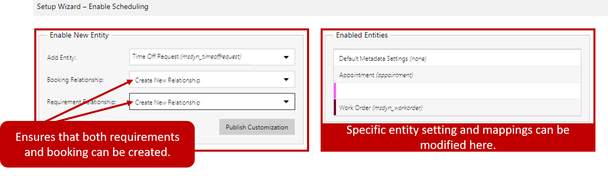
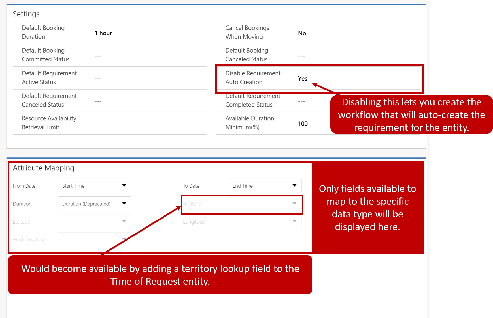
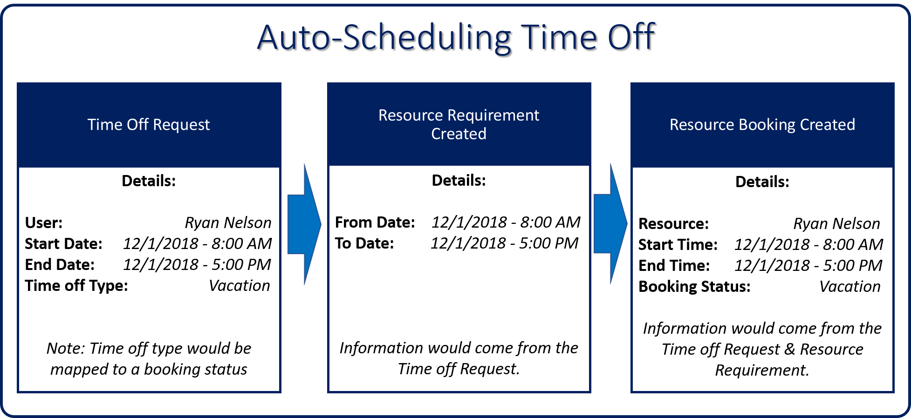
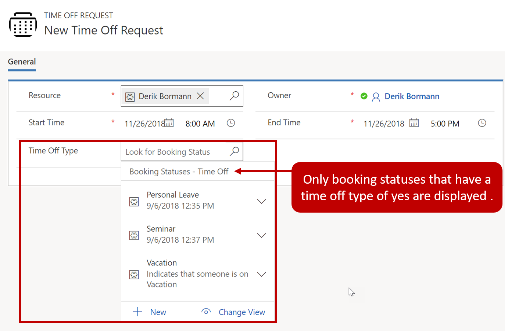

One key advantage of Universal Resource Scheduling (URS) is the ability to 'schedule anything'. This means that most entities can be configured for Universal Resource Scheduling. For example, employees may submit time off requests for items like vacation, personal appointments, and sick leave etc. After the   requests are approved, if they are not presented on the scheduling board dispatchers use, schedulers have no way of knowing if they are scheduling someone for a time when they are not available.

This is only one example of where enabling items for use with Universal Resource Scheduling could be beneficial.

Some other examples where this functionality could be leveraged include:

-   **Training Centers**: Defining course offerings and using URS to schedule the class, book a room, and find a trainer to teach the course.
-   **Sales Scenarios**: Many times, technicians also act as technical sales consultants. When assistance is needed on a sales opportunity, it could be scheduled using URS.
-   **Medical Consultations**: Medical centers, often need to book doctors, rooms, and equipment for specific type of consultations.

### Enabling an entity for URS

Universal Resource scheduling provides the foundation functionality that is used to schedule items. Organizations will need to define the specific entities they want to schedule using URS functionality. Depending on the solutions that an organization has deployed some entities may already be enabled for URS:

-   **Work Orders**: Setup and enabled when you install Dynamics 365 for Field Service.
-   **Projects**: Setup and enabled when you install Dynamics 365 Project Service Automation

> [!NOTE]
> Work Orders and Projects are **only** configured, if configured Field Service and/or Project Service Automation.

Additional entities can be configured for URS by navigating to **Settings** > **Administration** > **Enable Resource Scheduling for entities** using the Universal Resource Scheduling sitemap. For an entity to be scheduled using Universal Resource Scheduling, requirements and bookings need to be able to be created for it. The entity needs to have relationships with the following entities:

-   **Requirement Entity**: Defines the specifics that are required for the item to be scheduled.
-   **Booking Entity**: Defines the specifics about the scheduled item.

When you select the entity that you want to use, you can elect to have > Dynamics 365 automatically create the relationships with the Bookable Resource Booking and the Resource Requirement. After you select > Publish Customization the entity will appear in the Enabled Entities
Section.

### Configuring an entity for URS

There are several URS settings that can be defined for an entity. This can range from what specific booking statuses the entity can have to how the specific requirements and booking will be created. By default, URS will use msdyn\_fieldservicestatus field to populate the booking statuses available to the entity. You can leave it blank to use the default booking status field, or you can change it to a different field. The field you select will define which booking statuses are available for the entity.

> [!NOTE]
> If you intend to let Dynamics 365 create the booking for you automatically, the Booking status field will need to have a value defined.

In addition, other settings used to populate items like default statuses, and durations can also be modified. These options are available under the settings area when you define the metadata for the entity.

The settings that you can modify are:

-   **Default Booking Duration**: Defines the default booking duration to use when a duration is not provided.
-   **Default Booking Committed Status**: The default booking committed status to use when a user can't select a status
-   **Default Requirement Active Status**: The default requirement active status to use when a user can't select a status
-   **Default Requirement Canceled Status**: The default requirement Canceled status to use when a user can't select a status
-   **Resource Availability Retrieval Limit**: The maximum number of resources to retrieve a show in the schedule assistant
-   **Cancel Bookings when Moving**: Select whether, when moving open slots to the next day, to leave the old slots and change their status to Cancel
-   **Default Booking Canceled Status**: The default booking canceled status to use when a user can't select a status
-   **Disable Requirement Auto Creation**: Defines if you want the system to create the requirement automatically.
	-   Disabling auto creation provides the ability to configure how the requirement is created using a workflow *(recommended)*
-   **Default Requirement Completed Status**: The default requirement completed status to use when a user can't select a status
-   **Available Duration Minimum %**: Defines the minimum duration available

> [!VIDEO https://www.microsoft.com/en-us/videoplayer/embed/RE2KmlA]

### Attribute mapping

Attribute mapping lets you specify which fields on the entity will be mapped to which specific fields on the Requirement record. 

For example, on the time off entity we have a start time and End time. Those fields can be mapped to the To Date and from date on the Requirement record respectively.

> [!NOTE]
> Not all fields will be available for mapping. The field needs to exist on the entity before it can be mapped to the requirement record. 

For example, if a territory lookup field is added to the time off request entity, the Territory field will be available to define in
the attribute Mapping.

### Additional considerations when configuring an entity for URS:

When you are setting up an entity to be used with URS. It is more than just enabling the functionality and creating some relationships. There can also be many different customizations that may be needed to the entity and the supporting entities that will be used to help schedule it.

For example, to auto-schedule a time off request:

-   A resource requirement needs to be generated for the request. It needs to include:

    -   The start and end date of the time off.

    -   The booking status of the time off.

-   A booking record needs to be generated using the data from the resource requirement.

### Booking status customization

The booking status is used to define the status of the booking that was created. To ensure that we have the necessary time off statuses
required, we would need to do the following to the booking status entity:

-   Adding a Time Off field to the Booking Status entity: This will specify if the booking status is considered a time off status.

-   Booking Status entity form customization: The Time Off field needs to be added to the booking status form so when a new booking status is created, we can specify if it is a time off status or not.

-   Booking Status entity view customization: Create a booking status view that only shows time off statuses. This will be used by lookups on the time of request.

The image below shows what the booking status form would look like after the customization:

Additionally, we need to ensure that booking statuses defined as Time Off can be associated with Time Off Requests as they are created.

To accomplish this, we would need to do the following:

-   Add a Lookup field to the Booking Status entity: Lets the person requesting time off select the time off booking status for the request.

    -   Limiting options displayed: We would want to add a filter to the lookup that only links to the booking status view we created so only booking statuses considered time off are available to select.

The image below shows what the Time off Request form might look like after the customization:

Create a Workflow that will auto-schedule the booking:

Finally, we want to ensure that the resource requirement and booking are created automatically when a time off request is created. This could be
done by either a workflow or using Microsoft Flow to create and define the records.

The image below provides a high-level example of what this might look like:

The automated process that you create will need to:

-   Create the resource requirement based on data captured in the time off request such as the to and from dates that are needed.

-   Create the booking based on the data in the both the time off request and resource requirement record.

The booking created will be the record that would be displayed on the schedule board.

Scheduling a time off request represents only one example of something that could potentially be scheduled. It helps to illustrate everything that needs to be considered for entities that will be scheduled using URS. The actual customization and automation needed may vary depending on the scenarios and conditions that would need to exist in the record that is to be scheduled.

> [!VIDEO https://www.microsoft.com/en-us/videoplayer/embed/RE2KmlA]