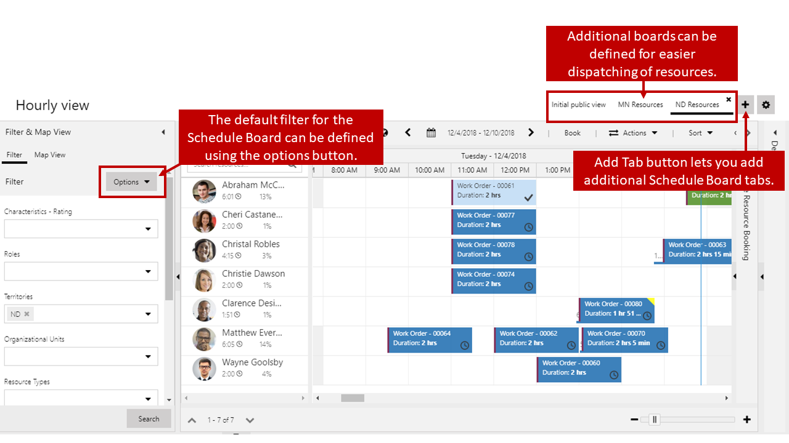
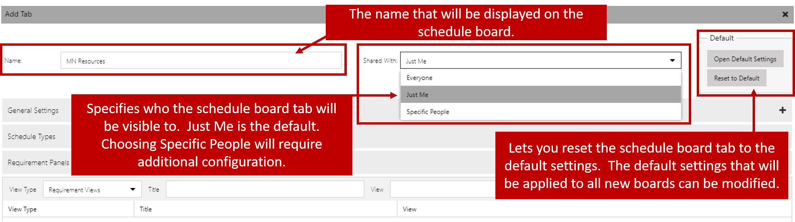

It is common for a single dispatcher to schedule large amounts of resources across multiple regions or service centers. Even though the schedule board does provide the ability to filter the resources displayed based on factors like skills and territories, it can be a painstaking and error prone undertaking to use the right filter criteria to dispatch a large amount of resources efficiently.

For example, let's say that a dispatcher schedules resources for three different territories; North Dakota, South Dakota, and Minnesota. They could filter the schedule board to the display resources for each individual territory as needed to be scheduled, but if they are scheduling hundreds of items a day they would be constantly changing the filters. It would be easier and more efficient if the dispatcher had multiple schedule boards that were pre-filtered for each of the territories (North Dakota, South Dakota, and Minnesota) they schedule for. In this instance, the dispatcher could simply select the schedule board for the territory they want to work with.

Additional schedule board tabs can be created by clicking the Add Tab button located in the upper right corner of the schedule board. After the board is created, the default criteria could be modified for that
board to reflect the resources that should be displayed. For example, a Minnesota resource board could be filtered to only show resources assigned to the Minnesota territory.

By default, a schedule board tab will only be visible to the person who created it but can be made visible to other users if needed. By using the Shared With field, a board can be made available to the following:

-   **Just Me**: The schedule board tab will be visible only to the person who created it. (Default)
-   **Everyone**: The schedule board tab will be accessible to anyone in the organization who has schedule board access.
-   **Specific People**: The schedule board tab will only be available to specific users that have been provided read access to that specific schedule board record. (Additional configuration is required)

### Sharing a Schedule Board

Universal Resource Scheduling includes an entity called Schedule Board Settings. Each schedule board tab that is created will have a corresponding Schedule Board Settings record created for it. Most of the settings for a schedule board tab can be modified by opening the tab settings and double clicking the schedule board tab. However, when a schedule board tab is set to be shared with specific people, the specific people to share it with cannot be modified from the tab settings. The actual Schedule Board Settings record needs to be shared with the specific people that require access.

This can initially be done by using Advanced Find and changing the look for field to be Schedule Board Settings entity. When you click the results button, every schedule board tab that has been created will display. Once you have located the schedule board you want to provide access to, click the share button, and the standard Dynamics 365 sharing screen will display. You can provide read access to any users or teams that should have access to the board. The specified schedule board tab will now be available to anyone it was shared with.

> [!VIDEO https://www.microsoft.com/videoplayer/embed/RE2Kewx]

### Helpful hints

If an organization has many schedule board tabs created, additional filter criteria could be added to the advanced find criteria to display only the schedule boards that meet those conditions such as only displaying the schedule boards for a specific record owner.

To make the process of sharing boards easier, teams could be created in Dynamics 365. Schedule Board tabs could be shared to those teams. For example, a MN dispatchers team could be created, and the Minnesota schedule board could be shared with that team. When a dispatcher requires access to that board, they could simply be added to the MN Dispatchers team.
