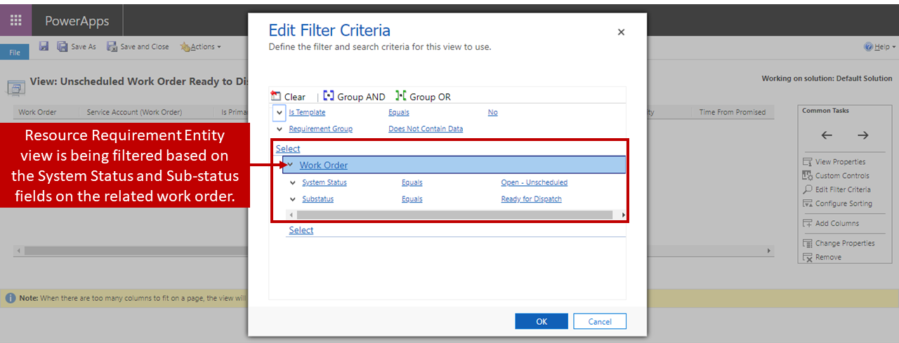
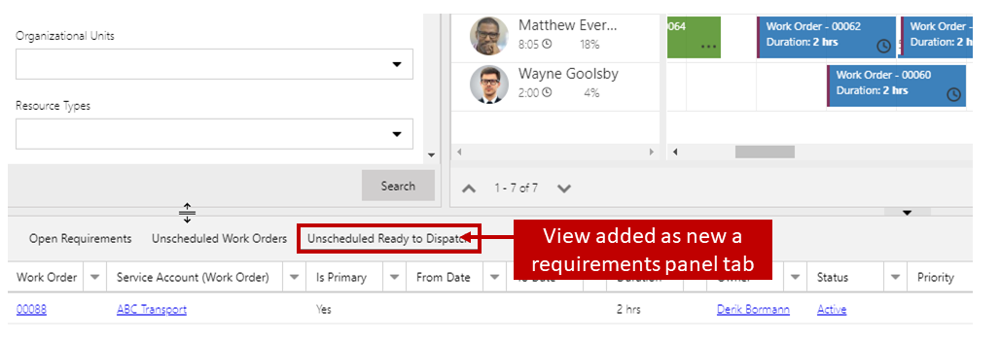
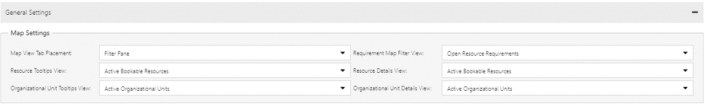
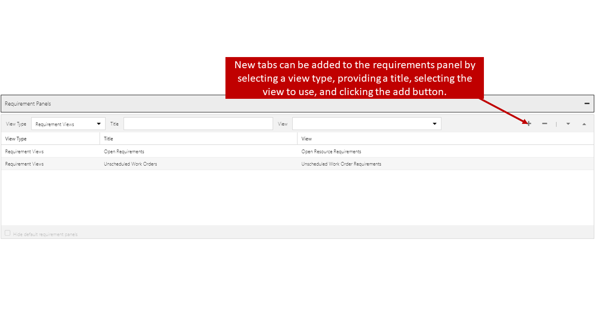

The schedule board uses Dynamics 365 entity views to assist with filtering and displaying the data that is presented on the board. For example, in the image below, a dispatcher is using the Map View to help schedule items.

-   As the dispatcher hovers over a specific booking, a tooltip pop-out is displayed that provides high-level overview information about the booking.
    -   The data in this tooltip is populated data from a Dynamics 365 view associated with the Bookable Resource Booking entity called Resource Booking Map Tooltips.
-   When the dispatcher selects the booking, the details pane is populated with a more detailed look into the booking.
    -   The booking details presented is using a different Bookable Resource Booking entity view called Active Bookable Resource Bookings.

Organizations may want to control the specific data that is presented when dispatchers hover over and interact with schedule board objects. To do this, they can customize views associated with specific entities and use those views on the schedule board.

Not only can views be helpful when presenting data to dispatchers, they can help to determine when an item is ready to be scheduled. By default, when a new work order is created, a resource requirement record associated with the work order is also created. The requirement record is displayed in the requirements panel on the schedule board, so it can be scheduled. Many times, more may be required before the item can be scheduled.

For example, maybe the item cannot be scheduled because the parts that are needed to execute the work order have not arrived. We can prevent it from showing up on the schedule board until the parts arrive and the work order has been marked as ready to dispatch. In Dynamics 365 we would create a custom view that only shows resource requirements for unscheduled work orders with a ready to dispatch.

The new view could be used in the Requirements panel to limit the resource requirements displayed to only the requirements returned in that view.

There are five entities that are typically used to display, and filter data displayed on the schedule board. Editing or creating new views in Dynamics 365 associated with these entities allows an organization to ensure that the data being presented is exactly want is needed for effective scheduling.

The list below defines the Dynamics 365 entity that is used, and
provides an overview of how it is used on the schedule board:

-   **Bookable Resources Entity**: Bookable Resource views are used to:
    -   Provide tooltip data when a resource is hovered over.
    -   Display detailed resource data when a resource is selected.
-   **Organizational Units Entity**: Organizational Unit views are used to:
    -   Provide tooltip data when an organizational unit is hovered over.
    -   Display detailed data about an Organization Unit when it is selected.
-   **Resource Requirements Entity**: Resource Requirement views are used to:
    -   Populate the requirement details displayed in the Requirements panel.
    -   Filter the open requirements that are displayed in the Map View.
    -   Provide tooltip data when a requirement is hovered over.
    -   Display detailed information when a requirement is selected.
    -   Display open requirements when using the schedule assistant.
-   **Bookable Resource Bookings Entity**: Bookable Resource Booking views are used to:
    -   Provide tooltip data when a booking unit is hovered over.
    -   Display detailed booking data when a booking is selected.
-   **Booking Alert Status Entity**: Used to provide information about booking alerts that have been created.

Each entity has views that are used by default for each of the scenarios mentioned above. The views used for those settings can be modified as needed. The list below explains where the views can be changed, and which view is used by default:

> [!VIDEO https://www.microsoft.com/videoplayer/embed/RE2Ku4w]

### Map settings
Located under General Settings
- **Requirement Map Filter View**: Open Resource Requirements
- **Resource Tooltips View**: Active Bookable Resources
- **Resource Details View**: Active Bookable Resources
- **Organizational Unit Tooltips View**: Active Organizational Units
- **Organizational Units Details View**: Active Organizational Units

  

### Schedule types
Each entity enabled for Universal Resource Scheduling will have views defined. The views that are defined for the work order entity are noted below:

- **Booking Tooltips View**: Work Order Booking Map Tooltips View
- **Booking Details View**: Schedule Board Details Pane Field Layout
- **Schedule Assistant Requirement View**: Open Resource Requirements
- **Schedule Assistant Requirement View**: Open Resource Requirements
- **Requirement Details View**: Active Resource Requirement
- **Requirement Map Pin Tooltips View**: Work Order Requirement Map Tooltips

  

### Requirements panel
Defines the views that will be used to populate the records displayed in the different tabs of the Requirements panel at the bottom of the schedule board. The Requirements panel supports two types of views:
- **Requirement Views**: Displays requirements where a single resource is needed.
	-  **Requirement Group Views**: Displays requirement groups where multiple resources are needed.
	-   A requirement group contains multiple related single requirements under it.
	-   Each requirement is updated when the requirement group is scheduled.
	-   Resource requirement group entity views are used to populate the requirement groups displayed. By default, the requirement panel includes the following views:
-  **Open Requirements**: Open Resource Requirements
-  **Unscheduled Work Orders**: Unscheduled Work Order Requirements
	- (Only present when Field Service in installed)
-  **Projects**: Unscheduled Project Requirements
	- (Only present when Project Service Automation is installed)

The default views for each of the above-mentioned areas can be found by clicking the Open Default Settings button on any schedule board tab. You can replace any of the default views with another view from that entity if needed. Any new schedule board tabs that are created will use the default views, but those view can be modified as needed. If you need to revert to the default views for any reason, you can select the Reset to Default button.

Modifying or adding views to use with a schedule board is a powerful way to tailor specific schedule boards to meet the needs of your organization. At the same time, if the views that are being leveraged are not appropriate and sufficient, they can create issues.

For example, remember when we created that custom view that only displayed resource requirements for unscheduled work orders with a sub-status of ready to dispatch? What happens if we forget the
unscheduled part in the view? Now even after the item has been scheduled, it is still going to remain in the unscheduled requirements on the schedule board. That may seem like an overly simplified example,
but little things like that can happen often. Make sure you are looking at things from all angles and using good Dynamics 365 view creation practices when you design those views.

For additional information, see [Creating Dynamics 365 views](https://docs.microsoft.com/dynamics365/customer-engagement/customize/create-edit-views).

