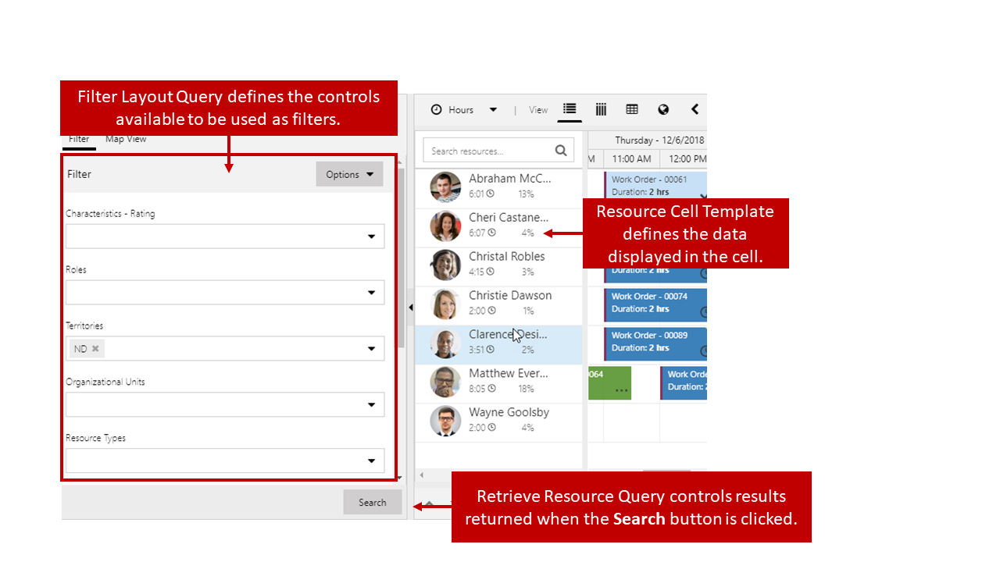
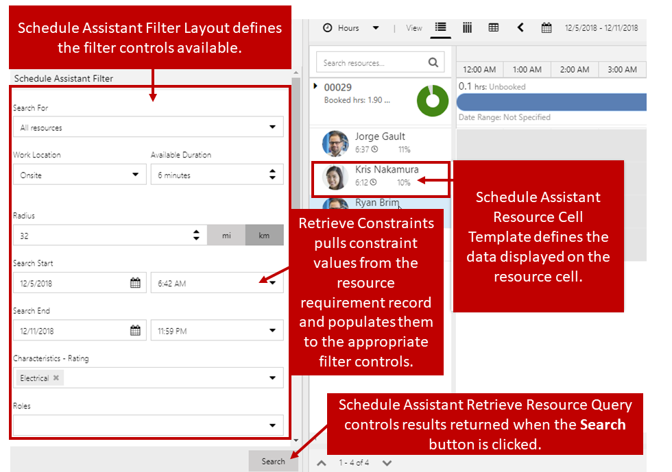

One of the many advantages to working with the schedule board is the ability to filter and search for resources. Searching can be done manually by using filter criteria in the Filter & Map View pane, or with the help of the schedule assistant.

Out of the box, the following controls can be used as filters:

-   **Characteristics:** Can be used to model skills a resource has. It also supports optional rating values to rate how proficient a resource is at each skill.
-   **Categories**: Resources can be associated with categories.
-   **Territories**: To assign resources to territorial regions.
-   **Organizational Units**: To model an organization hierarchy.
-   **Resource Type**: Defines the type of the resource.
-   **Pool Type**: Defines the type of the resource pool.
-   **Teams**: The teams a resource is a member of.
-   **Business Units**: Which business unit the resource is part of.

For example, a dispatcher may need to locate a sub-contractor that is a certified electrician and works in a specific region. When using the
filters available they could do the following:

-   Set the characteristics filter to show resources that are certified electricians.
-   Set the territory filter to the specific territory region they want.
-   Set the resource type to only show resources that are contacts or accounts.

For more about how resources are matched, see [Understanding and customizing resource matching in Universal Resource Scheduling (URS)](https://docs.microsoft.com/dynamics365/customer-engagement/common-scheduler/developer/understanding-and-customizing-resource-matching-in-urs).

The out of the box filters provide enough filter criteria to handle a wide range of requirements. Sometimes, organizations may have specific needs that cannot be met with the out of the box filters. For example, they may support customers who speak many different languages. To ensure the beset experience for those customers, they might need to find resources based on the language(s) that they speak. This can be accomplished through Dynamics 365 entity customizations and making updates to the queries used by the schedule board to locate resources.

Each schedule board tab will have three queries that can be modified:

-   **Filter Layout Query**: Defines the types of controls available to use as filters on the board.
-   **Retrieve Resource Query**: Controls the results that are returned when the search button is clicked.  
-   **Resource Cell Template**: Controls what is displayed in the resource cell on the schedule board.

    

Modifying the filters and queries that are used to control these components is done using Universal FetchXML (UFX). UFX is an advanced query language that allows you to query data using dynamic FetchXML, shape and prepare the resulting data for consumption by the **Universal Resource Scheduling (URS)** solution. This query language enables you to create custom queries to customize and extend the schedule board, and schedule assistant filters to meet the unique business needs of the organization.
 
Designing queries using UFX is beyond the scope of this module, however users who are looking to extend the capabilities of the schedule board may want to familiarize themselves with it.

For more about UFX, see [Universal FetchXML](https://docs.microsoft.com/dynamics365/customer-engagement/common-scheduler/developer/universal-fetchxml).

In addition to being able to use UFX to modify schedule board filters and queries, it can also be used to modify filters and queries that are used by the schedule assistant. The schedule assistant provides many of
the same options. The queries used by the schedule assistant can be accessed by selecting the Open Default Settings button and navigating to the schedule types section.

Schedule Assistant Query settings can be defined for each entity that is enabled for scheduling.

The schedule assistant queries that are available to modify include:

-   **Schedule Assistant Filter Layout**: Controls only the types of controls that are available to use as filters on the board. The filter screen will change based on the items included in the Fetch XML query.
-   **Schedule Assistant Resource Cell Template**: Control what is shown in the resource cell that is displayed on the schedule board.
-   **Schedule Assistant Retrieve Resource Query**: Controls the results that are returned with the search button is clicked in the application.
-   **Schedule Assistant Retrieve Constraints Query**: Retrieves any constraints from the resource requirement record and populates them to corresponding filter controls.

    

Modifying the queries used by the schedule board and schedule assistant represents one part of extending the schedule board functionally. The items attributes and relationships that are going to be leveraged in the queries need to exist in the application as well.

Let's go back to the language example we mentioned earlier. To effectively deliver that functionality on the schedule board we would need the following:

### Dynamics 365 Entity customization

-   **Create a custom entity called Language**: This would be used to  store all the needed languages
-   **Define a many-to-many relationship with the Bookable Resource entity**: Provides the ability to associate multiple resources with multiple languages.
-   **Add a language lookup field(s) to the Resource Requirement entity**: Provides the ability to add a language to a requirement record.
    -   In some cases, you may consider using two lookup fields such as primary and secondary language.
-   **Add the lookup fields to the Resource Requirement form**: Ensures the language information can be provided on the requirement.

### Schedule Board modifications

-   **Update the Filter Layout Configuration**: Creates a configuration record that stores filter layouts and queries used by the schedule board.
-   **Update the Schedule Board Retrieve Resource Query**: This will ensure that the new filter will be included when retrieving resources.

### Schedule Assistant modifications

-   **Update the Schedule Assistant Filter Layout Configuration**: Creates a configuration record that stores filter layouts and queries used by the schedule assistant.
-   **Update the Schedule Assistant Retrieve Constraints Query**: Ensures that the language information from the requirement record is
-   **Update the Resource Cell Template**: Provides the ability to indicate that the resource matched the language constraint in the resource cell.

To try this example on your own, see [Extending URS: Find resources by language—a step by step guide](https://docs.microsoft.com/dynamics365/customer-engagement/common-scheduler/developer/extending-urs-step-by-step).
