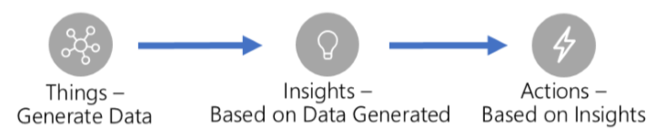
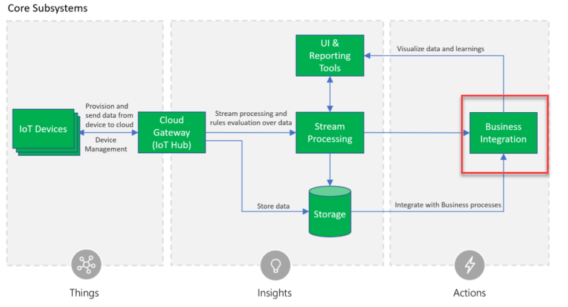

Connected Field Service is an add-on solution to Dynamics 365 for Field Service that connects IoT (Internet of Things) telemetry to business actions. In many cases, this allows businesses to become proactive instead of reactive, and transform their business model of how they work with their customers.  

[!VIDEO https://www.microsoft.com/en-us/videoplayer/embed/RE2DQPr]

In this module, we look at how Connected Field Service works with Azure IoT capabilities to implement a complete IoT solution.

A simple way of thinking of a complete IoT solution would be to cover the following three key areas:

With all of the hype about Internet of Things, it is easy to focus on the low-level details of ingesting telemetry and forget about how to handle a problem that was detected and get a technician on site to resolve it.  

Connected Field Service is an important part of the Actions Based on Insights.  By connecting an IoT device to a customer as a customer asset this will allow work orders to be created and a technician dispatched.  This creates the ability to detect and diagnose problems before customers are even aware of an issue.   This can include proactively scheduling an on-site visit, or simply an automated command to the device to reset.  When technicians do visit on site, they have a Field Service mobile application that has the customer details connected to the work order.  Their visits are scheduled, and routes optimized using the Dynamics 365 for Field Service scheduling capabilities.

The following diagram is from the Microsoft Azure IoT Reference Architecture with a highlight around Business Integration which is where Connected Field Service fits in with the reference architecture.

As part of building an overall Connected Field Service solution, you may also be involved in the generation of Insights as well.  For example, you might modify the stream processing to detect an anomaly in the telemetry.  Take a scenario where you are monitoring a temperature-controlled room.  Detecting the room suddenly has too high of a temperature is easy.  The higher business value is if you could detect and generate the insight as the temperature was slowly rising over a period of eight hours.  This would allow you to have a technician dispatched before the temperature reaching a point where it is a crisis for the customer.

When you install the Connected Field Service add-on, which you will be doing in a later unit, it installs two solutions into your environment that builds on the Dynamics 365 for Field Service application.  The following entities are included in these solutions and are a key subset of entities that support the integration with Azure IoT; you will be working with these as you perform customizations:

<table>
	<thread>
      <tr>
            <th>
                Entity Name
            </th>
            <th>
                Description
            </th>
        </tr>
  	</thread>
	<tbody>  
        <tr>
            <td>IoT Alert</td>
            <td>
                An event sent because of a notable event from the IoT Hub telemetry
            </td>
        </tr>
        <tr>
            <td>IoT Device</td>
            <td>A connected device that can be registered with IoT Hub</td>
        </tr>
        <tr>
            <td>IoT Device Category</td>
            <td>
                A grouping of devices
            </td>
        </tr>
        <tr>
            <td>IoT Device Command</td>
            <td>An outgoing message to a device connected to IoT Hub</td>
        </tr>
        <tr>
            <td>IoT Device Registration History</td>
            <td>Tracks the history of device registration activities</td>
        </tr>       
     </tbody>  
    
</table>

The solution also installs a number of workflows and actions that can be used to automate work as you customize your Connected Field Service solution.  Additionally, it installs a template solution for how to detect anomalies and raise alerts into Dynamics 365 for Field Service.

In the next unit, we will look at the deployment options and how to choose what is appropriate for your solution.

