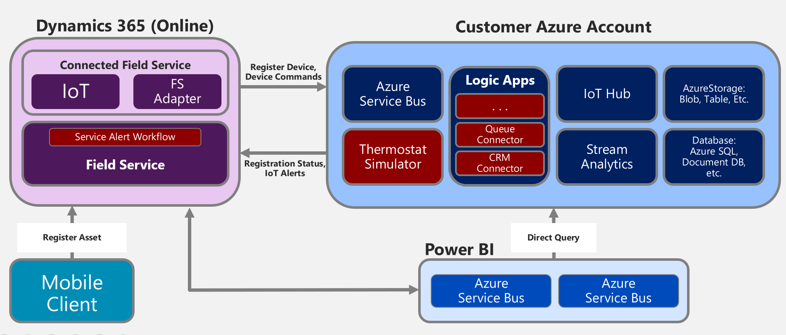

## Choosing a Deployment Type

An important part of architecting your Connected Field Service solution is choosing the underlying deployment approach.  There are currently three primary approaches to choose from.  All of them utilize Azure IoT Hub for the secure bidirectional communication with the connected IoT devices.  The following are the approaches and a brief description:

-	**Connected Field Service Template** - This is the default setup when you install Connected Field Service, it includes a template application based on a generic temperature scenario.  The default deployment creates an Azure IoT Hub and automation using Logic Apps for registering devices and raising alerts into Dynamics 365 for Field Service.  Stream Analytics is used for anomaly detection. The components can be customized and tailored to your scenario.

-	**Azure IoT Solution Accelerators** – These are a collection of ready-to-deploy IoT solutions for common scenarios such as remote monitoring and predictive maintenance.  The source code for the solution is open source and on GitHub.  You can customize the accelerator to meet your requirements.  Currently, none of these accelerators directly work with the Connected Field Service components but could be adapted by customizing it to be like the Connected Field Service Template application in how it talks to Dynamics 365 for Field Service.

-	**Azure IoT Central** – This is a Software-as-a-Service (SaaS) solution that abstracts many of the low-level components of an IoT solution into a customizable model-based approach.  The solution is configured in IoT Central in a similar level of abstraction as it is done in Dynamics 365’s applications.  Today, IoT central can be used with Connected Field Service by implementing some of your own Microsoft Flows.  In the upcoming release Dynamics 365 will be a directly supported action from the rules you build in IoT Central. 

To better understand the tradeoffs the following table offers a comparison between the approaches.  Because Connected Field Service Template and Azure IoT Solution accelerators share many of the same characteristics we are comparing, we have included them in the same column.

<table>
    <thead>
        <tr>
            <th>
                Characteristic
            </th>
            <th>
                Iot Central
            </th>
			<th>
				Connected Field Service Template/Azure Solution Accelerators
			</th>
        </tr>
    </thead>
    
        <tr>
            <td>Primary Usage</td>
            <td>
                To accelerate time to market for straightforward IoT solutions that don’t require deep service customization.
            </td>
			<td>To accelerate development of a custom IoT solution that needs maximum flexibility.
			</td>
        </tr>
        <tr>
            <td>Access to underlying PaaS services</td>
            <td>SaaS. Fully managed solution, the underlying services aren't exposed.</td>
			<td>You have access to the underlying Azure services to manage them or replace them as needed.</td>
        </tr>
        <tr>
            <td>Skill level</td>
            <td>
                Similar to Dynamics 365 Customization
            </td>
			<td>Requires developer skills to customize many of the components that generate the insights.</td>
        </tr>
        <tr>
            <td>Pricing</td>
            <td>Simple, predictable pricing structure</td>
			<td>Can be fine-tuned at the component level to manage cost</td>
        </tr>
            
        
   
</table>

When you deploy the Connected Field Service add-in, which you will do in the next unit, the following diagram shows the components that are configured as part of the Connected Field Service template.

These components are pre-configured to support a temperature-based scenario.  When the temperature is outside the acceptable range an IoT Alert is generated and sent to Dynamics 365 for Field Service.  As part of using this template, you would likely customize the Logic Apps and Stream Analytics jobs to support your unique requirements.  If you were using it with an Azure IoT solution accelerator you would deploy that first and then connect to the existing IoT hub during the deploy.  If you were using Azure IoT Central you would delete the Azure resource group as they would be provided by Azure IoT central.  In the near future there will be a deploy option tailored to Azure IoT Central so you don’t have to delete the Azure assets after the deploy.

In the next, unit you will be deploying Connected Field Service using the default template.
