## Exercise – Installing Connected Field Service

In this exercise, you'll set up your environment, install the Connected Field Service app, and create a deployment.

### Set up the environment

Create a trial environment or reset an existing test environment, and set it up for Microsoft Dynamics 365 for Field Service. This installs the Field Service application. To this base deployment, you'll add the Connected Field Service add-on. Make sure that sample data is enabled in your lab environment.

It's important that you not do this exercise in your production environment. Always do exercises in a demo or sandbox instance.

> [!NOTE]
> To learn about the onboarding options for getting an environment, see [Onboard your organization and users](https://docs.microsoft.com/en-us/dynamics365/customer-engagement/admin/onboard-your-organization-and-users-to-dynamics-365-online "Getting an Environment").

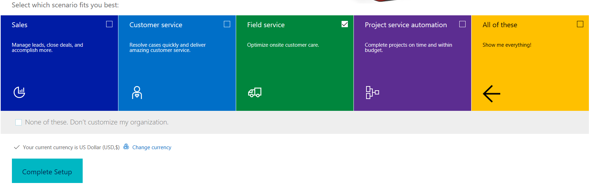

### Install the Connected Field Service app

1. Go to your Microsoft Dynamics 365 organization, and select the drop-down arrow to switch to another app.

    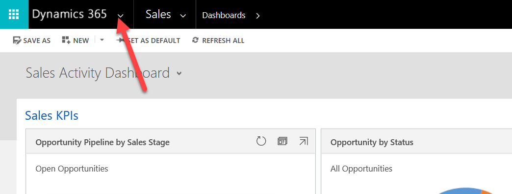

2. Select **Get more apps**.

    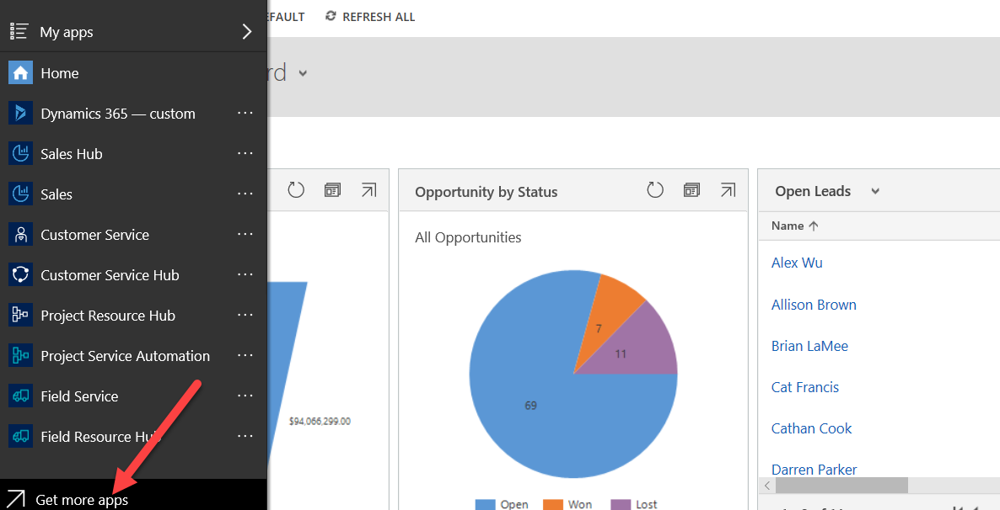

3. Search for *Connected Field Service*, and select it.

    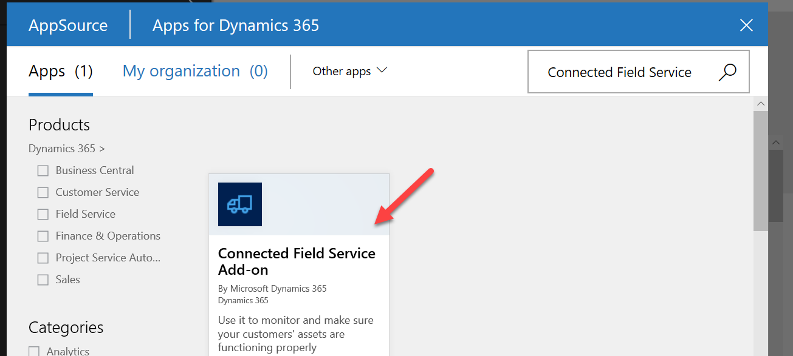

4. Select **Get it now**.

    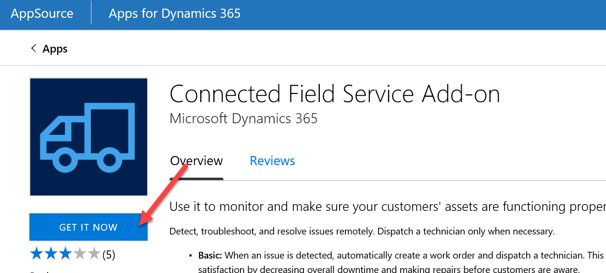

5. Select **Continue**.

    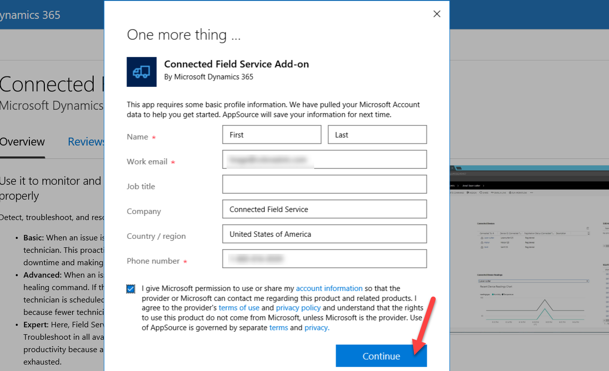

6. Select the organization, and then select **Agree** to continue.

    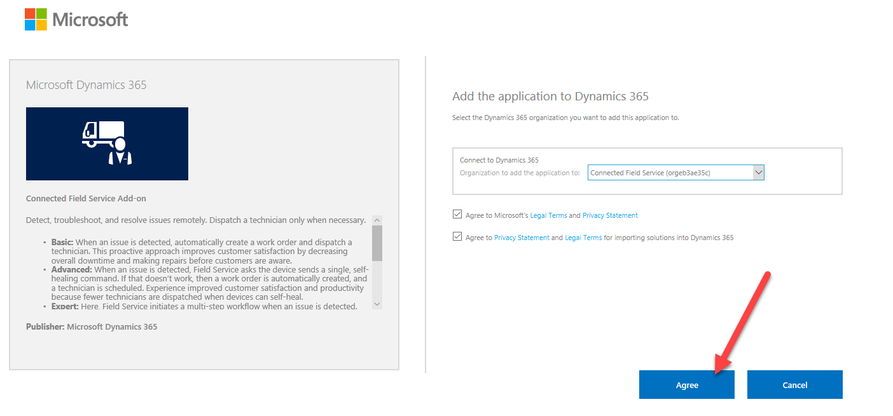

7. Select **Accept**.

    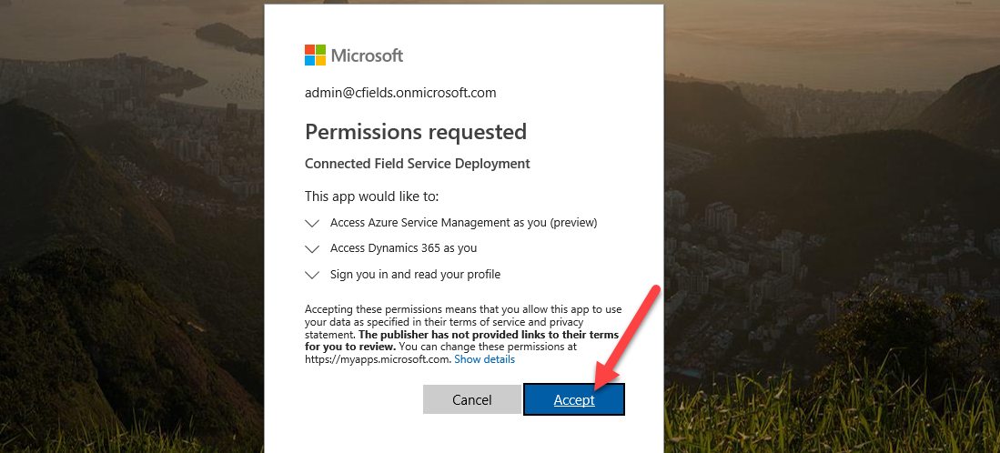

8. Read the Terms of service, and then select **Next**.

    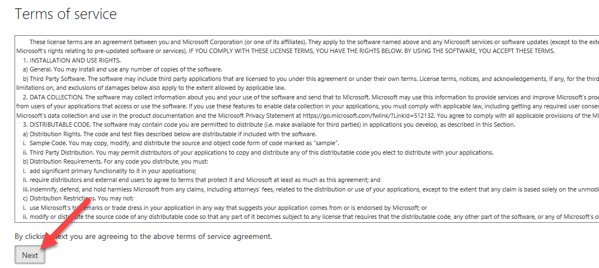

9. Select **Next** again.

    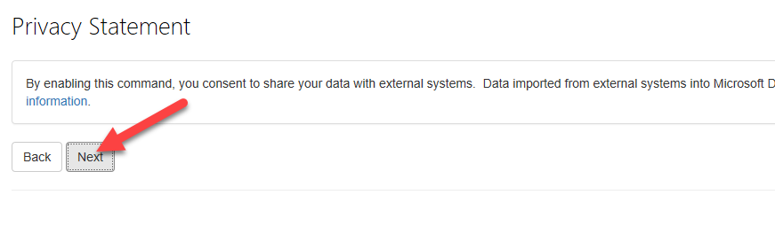

### Create a deployment

1. Select your organization, and then select **New Deployment**.

    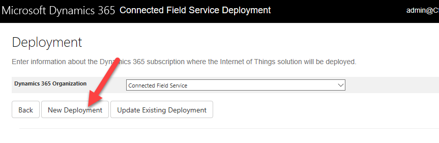

    If your Microsoft Azure subscription is in the same Azure Active Directory (Azure AD) as your Dynamics 365 environment, this step isn't required. If it's in a different environment, select **Use Different**, and then sign in by using those credentials. After sign-in, you should see the correct Azure subscription in the subscription list.

2.	Select the subscription, enter the name of the resource group, select your region, and then select **Deploy**.

    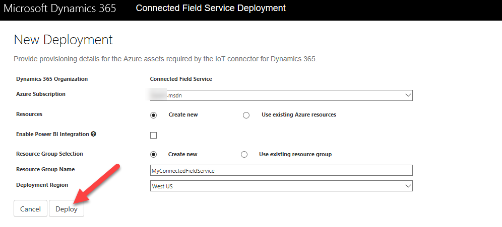

3. Select **Show deployment status**.

    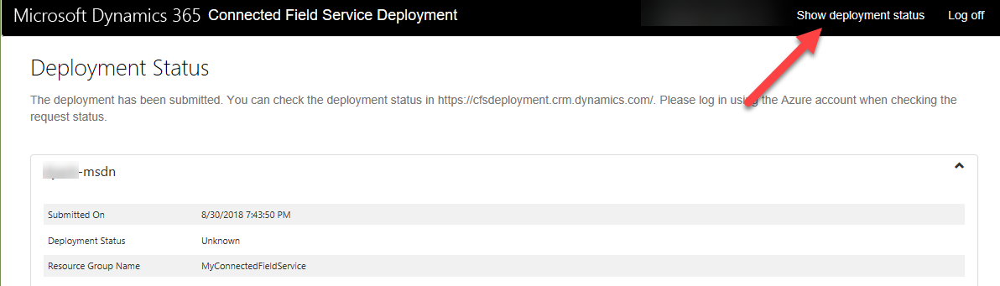

4. Wait for the deployment to finish. The **Deployment Status** section will be updated to show the progress of the deployment.

    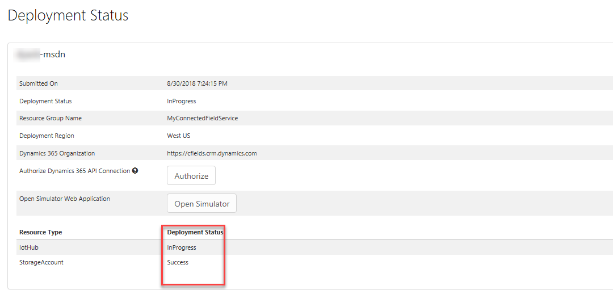

5. Confirm that the deployment was successful before you continue.

    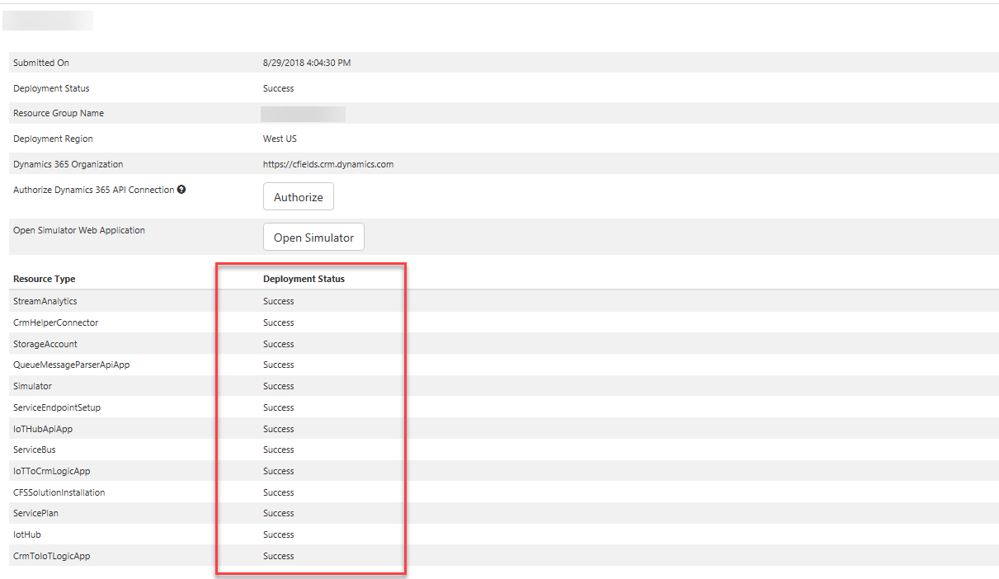

6. Select **Authorize**.

    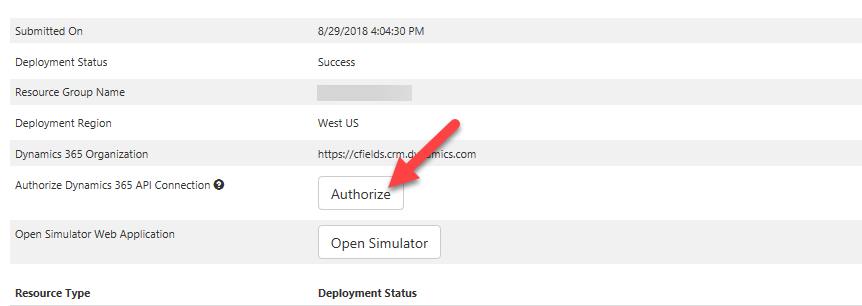

7. Sign in by using your Azure credentials.
8. Select **This connection is not authenticated**.

    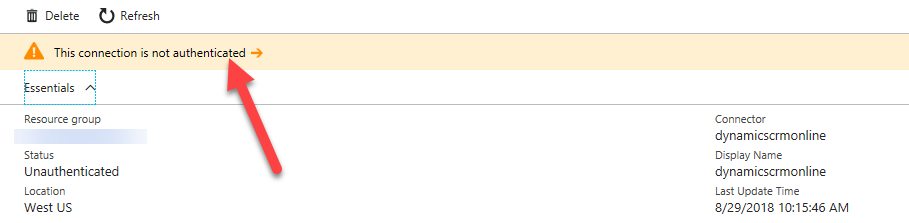

9. Select **Authorize**.

    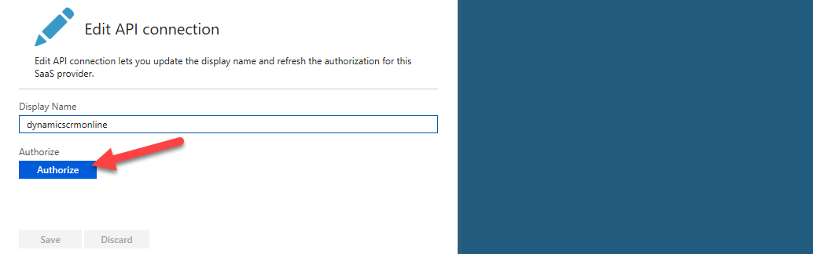

10. Sign in by using your Dynamics 365 credentials.
11. Select **Save**.

    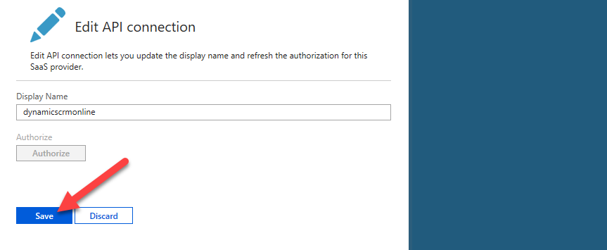

12.	You've now finished installing Connected Field Service. If you want to install some demo data, you can download and deploy it from [https://www.microsoft.com/en-us/download/details.aspx?id=55320](https://www.microsoft.com/en-us/download/details.aspx?id=55320 "Demo Data").
