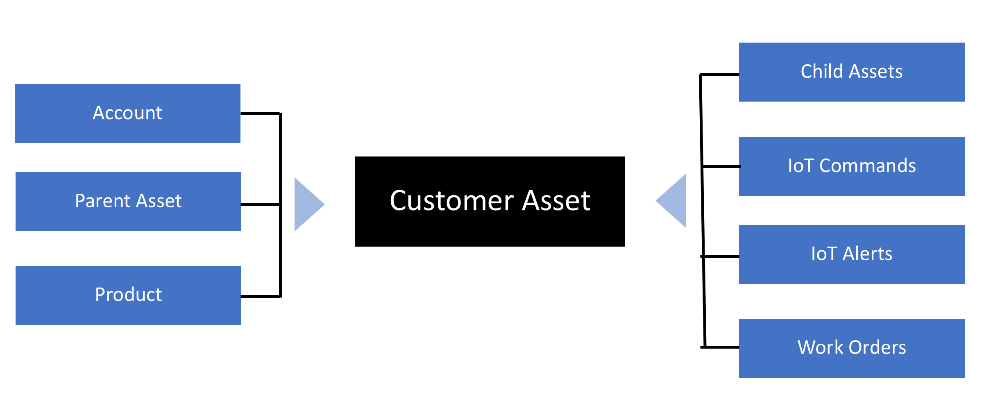
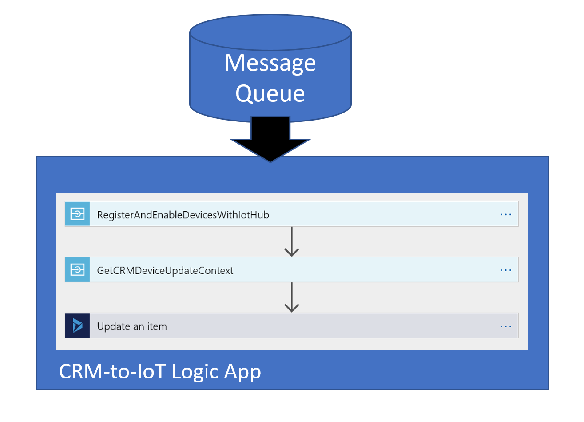
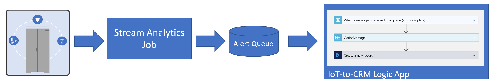
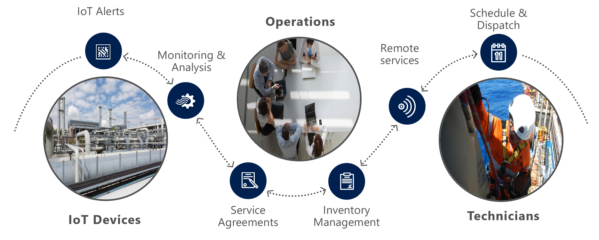

## Processing Telemetry

Now that you have completed your deployment of the Connected Field Service add-in, the next step is to look at how you register a device and integrate the Dynamics 365 data with Azure IoT Hub’s devices.  

This is done by creating a customer asset record in Dynamics 365 and then triggering the registration process.  The following diagram visualizes how the customer asset is at the center of integrating a connected device into the Dynamics 365 for Field Service process. 

When you define the customer asset you can handle a variety of scenarios including assets that contain multiple parts.  These can be wired up using connections to establish the relationship to the customer asset.  Customer assets can also be categorized allowing easier management and bulk sending of commands.

Once you create the customer asset and click the Register button a message is sent to an Azure Service Bus queue to request registration with the associated Azure IoT Hub.  This triggers a Logic App that is provided as part of the Connected Field Service template that is deployed.  The Logic App talks to the Azure IoT Hub and registers the device and then goes back to Dynamics 365 to update the registration status 

With the device registered, telemetry can now be ingested and evaluated for anomalies.  The Connected Field Service template application does this using a Stream Analytics job that processes the raw telemetry.  The job evaluates the incoming data for temperatures that are in excess of the reference temperature.  Remember this is just the starting rules in the template that you can customize to include any detection logic that is appropriate for your scenario. For some scenarios you may even find these to be a good example to inspire you to create your stream jobs and associated Logic Apps.  In fact, these could be replaced with a micro service that does the heavy lifting like you see in some of the Azure IoT solution accelerators.

The following diagram shows the overall flow of telemetry as it gets evaluated and turned into an IoT Alert in Dynamics 365. When the temperature is exceeded, a message is queued in the Service Bus Alert Queue.  This is picked up by a Logic App that creates the actual IoT Alert record in Dynamics 365.

Once the IoT Alert is received within Dynamics 365 it can be evaluated either manually by queuing it up for human review or automated by first attempting a corrective command on the device.  Commands sent to the device can perform actions such as Reset, send a notification or any other custom command the device is expecting to receive.  Device settings can also be adjusted to accommodate for changing environments at the remote device. From there a custom business process can be established for triaging and dispatching a technician as needed.  The technician would be matched and allocated using the standard Dynamics 365 for Field Service scheduling board.

In the next unit, you will be registering a simulated device and interacting with the simulator to see an alert be generated and sent to Dynamics 365.